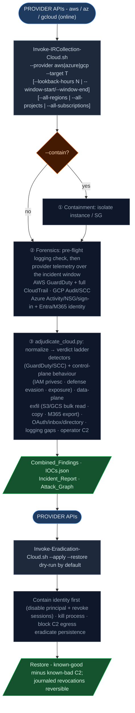

# Cloud Workflow (AWS / Azure / GCP)

Driven by Python 3 + bash using the provider CLIs (`aws` / `az` / `gcloud`). Unlike the Windows/Linux host workflows (offline, read-only), cloud is inherently online - it calls provider APIs. Provider auto-detected from `--provider`.

See [readme.md](./) for the cross-platform overview and adjudication philosophy.

***

## Pipeline



`adjudicate_cloud.py` normalizes provider telemetry into the common finding schema and assigns a verdict on the same ladder the Windows/Linux adjudicators use.

**Trust model:** provider-native detections (GuardDuty/SCC) at HIGH/CRITICAL severity are true-positive class; cloud-log/detector tampering and operator-supplied C2 are true-positive class; identity privesc and public-exposure changes are likely-true-positive when unambiguous, otherwise Indeterminate for analyst follow-up; informational/low provider findings are Indeterminate.

### Incident window (`--lookback-hours` / `--window-start` / `--window-end`)

Cloud intrusions surface days or weeks after the fact, so the collection window is configurable rather than a fixed couple of hours. Default look-back is **7 days** (`168h`); pass `--lookback-hours N` to widen/narrow it, or pin an exact window with `--window-start/--window-end` (ISO-8601). The window bounds every time-scoped pull (CloudTrail, Activity log, Cloud Audit logs, flow logs, GuardDuty/SCC).

**Multi-scope sweep:** attackers pivot to the region/project/subscription nobody watches. Each provider has a flag to widen collection beyond the single target scope, merging results into single artifacts:

* **AWS** `--all-regions` - every enabled region for GuardDuty + CloudTrail.
* **GCP** `--all-projects` - every accessible project for Cloud Audit logs + SCC (`gcloud projects list`).
* **Azure** `--all-subscriptions` - every accessible subscription for the Activity log + Defender alerts (`az account list`).

The default is the single `--region` / `--project` / `--subscription`.

### Pre-flight: is the logging even on?

Before pulling telemetry, the forensics phase records whether each control-plane log source is enabled (`logging_status.json`): AWS CloudTrail / GuardDuty / VPC Flow Logs, Azure diagnostic settings + Activity log, GCP Cloud Logging sinks. A disabled source becomes a **`Cloud Logging Disabled`** finding (T1562.008, Indeterminate) - it both bounds what the rest of the investigation can possibly see and flags a source an adversary may have switched off to evade detection.

### Telemetry collected (`playbooks/cloud/00_collect_forensics.sh`)

| Provider  | Collected                                                                                                                                                                                                                                                                                                                                                                                                          |
| --------- | ------------------------------------------------------------------------------------------------------------------------------------------------------------------------------------------------------------------------------------------------------------------------------------------------------------------------------------------------------------------------------------------------------------------ |
| **AWS**   | GuardDuty findings, **full CloudTrail management events** (paginated over the window, no event-name filter, optionally all regions), **S3 data events** (object-level, from the trail's CloudWatch data-event sink - set `IR_S3_DATAEVENT_LOG_GROUP`), **IAM credential report + Access Analyzer**, EC2 instance + security groups, **public-bucket exposure sweep**, **VPC Flow Logs**, logging-enablement status |
| **Azure** | Activity log, **Entra sign-in logs**, NSG rules + **NSG flow-log config**, Entra risky users, **OAuth consent grants**, **Entra directory audit**, **mailbox inbox forwarding rules**, **M365 unified audit** (download/export events, best-effort), logging-enablement status                                                                                                                                     |
| **GCP**   | Cloud Audit logs (admin + **data-access** + system-event), Security Command Center findings, **project IAM policy + user-managed SA-key inventory**, firewall rules, **VPC Flow Logs**, logging-enablement status                                                                                                                                                                                                  |

### Control-plane behavioral analysis

Provider-native detectors (GuardDuty/SCC/Entra) catch _known_ patterns, but the attacker's actual API-level TTPs live in the **raw control-plane logs**. The adjudicator analyzes those logs directly and emits findings on the shared ladder:

| Source                                          | Detections                                                                                                                                                                                                                                                                                                                     | ATT\&CK                                                                  |
| ----------------------------------------------- | ------------------------------------------------------------------------------------------------------------------------------------------------------------------------------------------------------------------------------------------------------------------------------------------------------------------------------ | ------------------------------------------------------------------------ |
| **AWS CloudTrail** (`normalize_cloudtrail`)     | IAM privesc (`CreateAccessKey`, `AttachUserPolicy` w/ admin, `UpdateAssumeRolePolicy`…), root-account use, console login **without MFA**, cloud-log/detector tampering (`StopLogging`/`DeleteTrail`/`DeleteFlowLogs`/`DeleteDetector`), snapshot/AMI shared externally, public S3 bucket, security group opened to `0.0.0.0/0` | T1098/T1098.001/.003, T1136.003, T1078.004, T1562.008/.007, T1537, T1530 |
| **GCP Cloud Audit** (`normalize_gcp_audit`)     | user-managed SA-key creation, `SetIamPolicy` to `allUsers`/`allAuthenticatedUsers`, log-sink/bucket deletion, world-open firewall, startup-script/metadata change                                                                                                                                                              | T1098.001, T1530, T1562.008/.007, T1136.003, T1059                       |
| **Azure Activity** (`normalize_azure_activity`) | diagnostic-settings deletion, NSG rule opened to the internet, role-assignment write, VM Run Command / Custom Script Extension                                                                                                                                                                                                 | T1562.008/.007, T1098.003, T1059                                         |
| **Entra sign-in logs** (`normalize_signins`)    | successful legacy/basic-auth (bypasses MFA), sign-ins from multiple countries (atypical travel), failed-then-successful from one IP (spray/brute then access)                                                                                                                                                                  | T1078.004, T1078, T1110                                                  |

Every adjudication run also emits **`Attack_Coverage_<stamp>.md`** - the ATT\&CK Cloud matrix auto-filled from the findings, so the analyst sees which tactics the evidence touched and which are blank (gaps to go back and check).

**Flow-log C2 confirmation:** when `--c2-ips` are supplied, `normalize_flow_logs` searches the collected flow logs for each C2 IP. A match upgrades the indicator from _asserted_ to _observed on the wire_ - a `Cloud Network Flow to C2` finding (True Positive, T1071). Format-agnostic across all three providers (an IP is the same string in any flow schema).

### Data-plane / SaaS exfil analysis

Control-plane analysis answers _who changed what_; data-plane analysis (`cloud_dataplane.py`) answers _who read how much_ - the Collection/Exfiltration end of the kill chain. It works over **data events** (object-level access), not management events, and emits the `Cloud Data Exfiltration` finding type.

| Source                                              | Detections                                                                                                               | ATT\&CK                 |
| --------------------------------------------------- | ------------------------------------------------------------------------------------------------------------------------ | ----------------------- |
| **AWS S3 data events** (`normalize_s3_data_events`) | bulk `GetObject` per principal (tiered by volume + bucket spread), cross-account/`CopyObject` transfer to another bucket | T1530, T1537            |
| **GCP data-access** (`normalize_gcp_data_access`)   | bulk `storage.objects.get`/`list` per principal (reads the same data-access audit stream)                                | T1530                   |
| **M365 unified audit** (`normalize_m365_audit`)     | mass SharePoint/OneDrive `FileDownloaded`, mailbox / compliance export request                                           | T1213, T1567, T1114.002 |

**FP discipline (downgrade, never blind):** bulk reads by an _automation_ identity (service account / assumed role) are routine (ETL/backup/analytics), so on their own they are **Indeterminate** (verify). The same volume by a _human_ principal, any **cross-account object copy**, and any **mailbox export** are **Likely True Positive**. Below-threshold reads simply do not fire - nothing is suppressed. These findings light up the **Collection** and **Exfiltration** tactics on the coverage grid.

### Disk-snapshot acquisition (opt-in: `--snapshot-disks`)

Evidence preservation **before** any eradication. Disabled by default because it creates billable snapshots. When enabled, the forensics phase resolves the target instance's disks and snapshots each, recording the IDs:

| Provider  | Action                                                                     | Artifact                    |
| --------- | -------------------------------------------------------------------------- | --------------------------- |
| **AWS**   | `ec2 create-snapshot` for every attached EBS volume (tagged `ir:incident`) | `ebs_snapshots.json`        |
| **Azure** | `az snapshot create` for the VM's OS + data managed disks                  | `azure_disk_snapshots.json` |
| **GCP**   | `gcloud compute disks snapshot` for every instance disk                    | `gcp_disk_snapshots.json`   |

```bash
./Invoke-IRCollection-Cloud.sh --provider aws --target 10.0.0.5 --snapshot-disks
```

### SaaS / identity analysis (Entra / M365)

Beyond Entra risky-users, the Azure path collects and adjudicates the high-value identity-attack artifacts (via `az rest` to Microsoft Graph):

| Artifact                                        | Detection                                                                                             | Verdict logic                                                                                                      | ATT\&CK                                           |
| ----------------------------------------------- | ----------------------------------------------------------------------------------------------------- | ------------------------------------------------------------------------------------------------------------------ | ------------------------------------------------- |
| OAuth consent grants (`oauth2PermissionGrants`) | Grants carrying mailbox/file/tenant scopes (illicit consent grant)                                    | tenant-wide (`AllPrincipals`) or `Mail.*`/`full_access_as_user` → Likely TP; other high-risk scope → Indeterminate | T1528 / T1550.001                                 |
| Mailbox inbox rules (`messageRules`)            | Auto-forward/redirect, especially to external domains or with a hide action (delete/move)             | external target or hide action → Likely TP; internal-only → Indeterminate                                          | T1114.003                                         |
| Entra directory audit (`directoryAudits`)       | SP credential adds, app consents, privileged role grants, MFA/CA policy changes, domain-trust changes | high-impact ops → Likely TP                                                                                        | T1098.001 / T1528 / T1098.003 / T1556 / T1484.002 |

Inbox-rule collection is best-effort across the first page of users; a full-tenant sweep is an analyst follow-up. These normalizers are pure functions covered by pytest (`test/test_09_cloud_analysis.py`).

***

## Step 1 / 4 / 5 - Collection, eradication, restoration

```bash
# 1. Collection (cloud telemetry + report generation, in the project dir)
./Invoke-IRCollection-Cloud.sh --provider aws --target 10.0.0.5 \
    --c2-ips 45.66.77.88 --c2-domains evil.test [--contain]

# widen the window for a late-discovered intrusion (default look-back is 7 days)
./Invoke-IRCollection-Cloud.sh --provider aws --target 10.0.0.5 --lookback-hours 720
./Invoke-IRCollection-Cloud.sh --provider aws --target 10.0.0.5 \
    --window-start 2026-06-01T00:00:00Z --window-end 2026-06-08T00:00:00Z

./Invoke-IRCollection-Cloud.sh --provider azure --target vm-name      # Entra/M365 identity path

# 4/5. Eradication + restoration (dry-run by default)
./Invoke-Eradication-Cloud.sh --provider aws --target 10.0.0.5 \
    --host-folder ./aws-10_0_0_5 --apply --restore
```

* Playbooks: `playbooks/cloud/` (forensics, host + identity containment, eradicate process/persistence, block C2, restore).
* Known-bad C2 supplied via `--c2-ips/--c2-domains` (or read from `IOCs.json`) stays blocked by `04_block_c2.sh` across restoration.
* Adjudicator: `playbooks/cloud/adjudicate_cloud.py` (CLI) over the analyzer modules `cloud_findings/detectors/controlplane/dataplane/identity/iam/posture/coverage.py`; collection is the `00_collect_forensics.sh` dispatcher over `collect/{lib,aws,azure,gcp}.sh`.

### Identity-first containment + session revocation

The eradication orchestrator runs `01_contain_identity.sh` **first** - in the cloud the stolen credential is what re-creates everything else, and deactivating a key does not kill already-issued sessions. Implicated principals (from `Principals.json` / `IR_CONTAIN_PRINCIPALS`) are neutralised and their live sessions revoked, dry-run-first and journaled so `05_restore_host.sh` can reverse it on an overturned verdict:

| Provider  | Action                                                                                                                   |
| --------- | ------------------------------------------------------------------------------------------------------------------------ |
| **AWS**   | attach `AWSDenyAll` + put an `IRRevokeOlderSessions` inline policy (denies any token issued before now) on the user/role |
| **Azure** | disable the user / service principal + Graph `revokeSignInSessions`                                                      |
| **GCP**   | disable the service account (invalidates its tokens)                                                                     |

**Persistence eradication breadth** (`03`, resource targets via `IR_MALICIOUS_PATHS` prefixed tokens):

| Provider  | Removable persistence                                                                                                                        |
| --------- | -------------------------------------------------------------------------------------------------------------------------------------------- |
| **AWS**   | `function:<name>` (Lambda) · `rule:<name>` (EventBridge) - deleted after backup; IAM keys/roles                                              |
| **Azure** | `app:<appId>` (SP disabled) · `logicapp:<id>` (disabled) · `runbook:<acct>/<name>` (deleted after export)                                    |
| **GCP**   | `function:<name>` (Cloud Function) · `scheduler:<name>` (Cloud Scheduler) - deleted after backup; `binding:<member>=<role>` removed; SA keys |

Reversible actions are journaled and undone by `05_restore_host.sh` on an overturned verdict; irreversible deletes are backed up first and flagged for manual recreate.

**DNS-based C2 blocking** (`04`, when `--c2-domains` supplied): AWS Route 53 Resolver DNS Firewall (block list + rule group, VPC-associated) · GCP Cloud DNS response policy (sinkhole) · Azure Private DNS zone per domain (`A → 0.0.0.0`). Creation is dry-run-first (`IR_DRY_RUN`).

### Identity posture + blast radius

Beyond events, the workflow reads the identity **state** the investigation lands in and maps what a compromised principal could reach:

| Source                                                        | Detections                                                                                            | ATT\&CK   |
| ------------------------------------------------------------- | ----------------------------------------------------------------------------------------------------- | --------- |
| **AWS credential report** (`normalize_iam_credential_report`) | root account with an active key / MFA off, console users without MFA, stale (>90d) active access keys | T1078.004 |
| **AWS Access Analyzer** (`normalize_access_analyzer`)         | resources reachable by an external/public principal                                                   | T1530     |
| **GCP IAM policy** (`normalize_gcp_iam_policy`)               | bindings granting `allUsers`/`allAuthenticatedUsers`                                                  | T1530     |
| **GCP SA keys** (`normalize_gcp_sa_keys`)                     | user-managed service-account keys (long-lived credential / persistence risk)                          | T1098.001 |

`principal_reachability.py` then builds the **blast radius** (`Blast_Radius_<stamp>.{json,md}`): per implicated principal (from `Principals.json`), the GCP roles it holds (privileged flagged), the CloudTrail actions it was observed making, and the adjudicated findings attributable to it - answering "what could they touch" and prioritising which principal to contain first.

### Posture / exposure snapshot

`cloud_posture.py` reads the point-in-time attack surface that explains how the breach was reachable - mostly from telemetry already collected:

| Source                                                | Detections                                                | ATT\&CK   |
| ----------------------------------------------------- | --------------------------------------------------------- | --------- |
| **AWS security groups** (`normalize_security_groups`) | ingress from `0.0.0.0/0` (admin port SSH/RDP → Likely TP) | T1562.007 |
| **Azure NSGs** (`normalize_nsg_rules`)                | inbound Allow from Internet                               | T1562.007 |
| **GCP firewall** (`normalize_gcp_firewall`)           | `0.0.0.0/0` ingress allow                                 | T1562.007 |
| **Public buckets** (`normalize_public_buckets`)       | S3 bucket reachable by anyone (sweep)                     | T1530     |

### Findings feed the same reports as the host workflows

Cloud adjudications flow through the shared reporting layer exactly like Linux/Windows: `Combined_Findings_*.json` → `Incident_Report.md` (verdict table), `Attack_Graph.md` (ATT\&CK kill chain), `IOCs.json`, `Retrospective.md`, plus the cloud-specific `Attack_Coverage_*.md`. A control-plane behavioral finding and its verdict land in the report body and on the attack graph, not just in the raw findings file.

## Locked-down evidence storage

Collections can be large; ship them to a WORM, encrypted, private bucket provisioned by [`terraform/`](terraform/) (S3 Object Lock / Azure container immutability / GCS locked retention). The collector uploads the per-host folder automatically:

```bash
# Use an existing evidence bucket
./Invoke-IRCollection-Cloud.sh --provider aws --target 10.0.0.5 \
    --evidence-bucket my-ir-evidence --c2-ips 45.66.77.88

# Or terraform-apply the locked-down bucket first, then collect + upload into it
./Invoke-IRCollection-Cloud.sh --provider aws --target 10.0.0.5 \
    --evidence-bucket my-ir-evidence --provision-evidence --evidence-retention-days 365
```

## Ephemeral container (no trace on the launching host)

Run the whole cloud collection inside a throwaway `alpine:edge` container that bundles the AWS/Azure/GCP CLIs + Terraform + Python. Evidence goes to the locked-down bucket; the local scratch is wiped on exit, so the initiating host keeps nothing. See [`docker/`](docker/):

```bash
podman build -t ir-cloud:latest -f docker/Dockerfile .
cp docker/ir-cloud.env.template docker/ir-cloud.env   # fill in provider/target/bucket/creds
podman run --rm --env-file docker/ir-cloud.env --tmpfs /work ir-cloud:latest
```

`IR_DRY_RUN=1` previews the exact collector command without running it.

## AI incident review (provider-native, optional)

`--llm-review` runs an AI incident review using the **provider's own LLM** - advisory only:

| Provider | Backend                            | Default model                                        |
| -------- | ---------------------------------- | ---------------------------------------------------- |
| `aws`    | Bedrock (Claude) via `aws` CLI     | `anthropic.claude-opus-4-8`                          |
| `gcp`    | Vertex (Gemini) via `gcloud` token | `gemini-2.0-flash` (set `IR_GCP_PROJECT`)            |
| `azure`  | Azure OpenAI                       | your deployment (`IR_LLM_BASE_URL` + `IR_LLM_MODEL`) |

```bash
./Invoke-IRCollection-Cloud.sh --provider aws --target 10.0.0.5 --llm-review
```

All models are configurable (`IR_LLM_MODEL`). Output: `LLM_Incident_Review.{md,json}` (`source=LLM`, redaction-first, never overrides the verdict ladder). Cross-cutting `_clock.json` and the `evidence_custody.py` manifest seal are written here too.

## Tests

```bash
cd test/
pytest -v -k "cloud or flow or snapshot or terraform or docker or llm or custody or clock"   # cloud collection,
# adjudication, control-plane behaviour, SaaS/identity, flow-log C2 confirmation, disk snapshots,
# evidence storage, logging pre-flight, and the ephemeral-container entrypoint
```

Cloud CLIs are exercised against recording mocks in `test/mocks/` (assert exact calls + idempotency); the SaaS/identity and control-plane normalizers are unit-tested directly against synthetic provider JSON. The control-plane analyzers + window/preflight collection changes are covered by `test/test_27_cloud_controlplane.py`; SaaS/identity by `test/test_09_cloud_analysis.py`.
