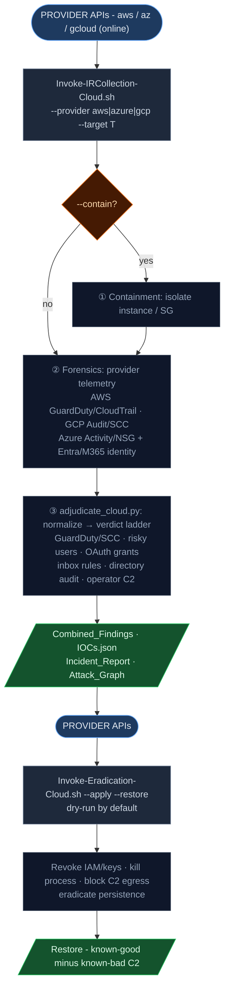

# Cloud Workflow (AWS / Azure / GCP)

Driven by Python 3 + bash using the provider CLIs (`aws` / `az` / `gcloud`). Unlike the
Windows/Linux host workflows (offline, read-only), cloud is inherently online - it calls
provider APIs. Provider auto-detected from `--provider`.

See [readme.md](readme.md) for the cross-platform overview and adjudication philosophy.

---

## Pipeline



`adjudicate_cloud.py` normalizes provider telemetry into the common finding schema and
assigns a verdict on the same ladder the Windows/Linux adjudicators use.

**Trust model:** provider-native detections (GuardDuty/SCC) at HIGH/CRITICAL severity are
true-positive class; operator-supplied C2 is true-positive class; informational/low provider
findings are Indeterminate.

### Telemetry collected (`playbooks/cloud/00_collect_forensics.sh`)

| Provider | Collected |
|---|---|
| **AWS** | GuardDuty findings, CloudTrail events (incident window), EC2 instance + security groups, **VPC Flow Logs** |
| **Azure** | Activity log, NSG rules + **NSG flow-log config**, Entra risky users, **OAuth consent grants**, **Entra directory audit**, **mailbox inbox forwarding rules** |
| **GCP** | Cloud Audit logs, Security Command Center findings, firewall rules, **VPC Flow Logs** |

**Flow-log C2 confirmation:** when `--c2-ips` are supplied, `normalize_flow_logs` searches the
collected flow logs for each C2 IP. A match upgrades the indicator from *asserted* to
*observed on the wire* - a `Cloud Network Flow to C2` finding (True Positive, T1071). Format-agnostic
across all three providers (an IP is the same string in any flow schema).

### Disk-snapshot acquisition (opt-in: `--snapshot-disks`)

Evidence preservation **before** any eradication. Disabled by default because it creates
billable snapshots. When enabled, the forensics phase resolves the target instance's disks
and snapshots each, recording the IDs:

| Provider | Action | Artifact |
|---|---|---|
| **AWS** | `ec2 create-snapshot` for every attached EBS volume (tagged `ir:incident`) | `ebs_snapshots.json` |
| **Azure** | `az snapshot create` for the VM's OS + data managed disks | `azure_disk_snapshots.json` |
| **GCP** | `gcloud compute disks snapshot` for every instance disk | `gcp_disk_snapshots.json` |

```bash
./Invoke-IRCollection-Cloud.sh --provider aws --target 10.0.0.5 --snapshot-disks
```

### SaaS / identity analysis (Entra / M365)

Beyond Entra risky-users, the Azure path collects and adjudicates the high-value
identity-attack artifacts (via `az rest` to Microsoft Graph):

| Artifact | Detection | Verdict logic | ATT&CK |
|---|---|---|---|
| OAuth consent grants (`oauth2PermissionGrants`) | Grants carrying mailbox/file/tenant scopes (illicit consent grant) | tenant-wide (`AllPrincipals`) or `Mail.*`/`full_access_as_user` → Likely TP; other high-risk scope → Indeterminate | T1528 / T1550.001 |
| Mailbox inbox rules (`messageRules`) | Auto-forward/redirect, especially to external domains or with a hide action (delete/move) | external target or hide action → Likely TP; internal-only → Indeterminate | T1114.003 |
| Entra directory audit (`directoryAudits`) | SP credential adds, app consents, privileged role grants, MFA/CA policy changes, domain-trust changes | high-impact ops → Likely TP | T1098.001 / T1528 / T1098.003 / T1556 / T1484.002 |

Inbox-rule collection is best-effort across the first page of users; a full-tenant sweep is
an analyst follow-up. These normalizers are pure functions covered by pytest
(`test/test_09_cloud_analysis.py`).

---

## Step 1 / 4 / 5 - Collection, eradication, restoration

```bash
# 1. Collection (cloud telemetry + report generation, in the project dir)
./Invoke-IRCollection-Cloud.sh --provider aws --target 10.0.0.5 \
    --c2-ips 45.66.77.88 --c2-domains evil.test [--contain]

./Invoke-IRCollection-Cloud.sh --provider azure --target vm-name      # Entra/M365 identity path

# 4/5. Eradication + restoration (dry-run by default)
./Invoke-Eradication-Cloud.sh --provider aws --target 10.0.0.5 \
    --host-folder ./aws-10_0_0_5 --apply --restore
```

- Playbooks: `playbooks/cloud/` (forensics, contain, eradicate process/persistence, block C2, restore).
- Known-bad C2 supplied via `--c2-ips/--c2-domains` (or read from `IOCs.json`) stays blocked by
  `04_block_c2.sh` across restoration.
- Adjudicator + normalizers: `playbooks/cloud/adjudicate_cloud.py`.

## Locked-down evidence storage

Collections can be large; ship them to a WORM, encrypted, private bucket provisioned by
[`terraform/`](terraform/) (S3 Object Lock / Azure container immutability / GCS locked
retention). The collector uploads the per-host folder automatically:

```bash
# Use an existing evidence bucket
./Invoke-IRCollection-Cloud.sh --provider aws --target 10.0.0.5 \
    --evidence-bucket my-ir-evidence --c2-ips 45.66.77.88

# Or terraform-apply the locked-down bucket first, then collect + upload into it
./Invoke-IRCollection-Cloud.sh --provider aws --target 10.0.0.5 \
    --evidence-bucket my-ir-evidence --provision-evidence --evidence-retention-days 365
```

## Ephemeral container (no trace on the launching host)

Run the whole cloud collection inside a throwaway `alpine:edge` container that bundles the
AWS/Azure/GCP CLIs + Terraform + Python. Evidence goes to the locked-down bucket; the local
scratch is wiped on exit, so the initiating host keeps nothing. See [`docker/`](docker/):

```bash
podman build -t ir-cloud:latest -f docker/Dockerfile .
cp docker/ir-cloud.env.template docker/ir-cloud.env   # fill in provider/target/bucket/creds
podman run --rm --env-file docker/ir-cloud.env --tmpfs /work ir-cloud:latest
```

`IR_DRY_RUN=1` previews the exact collector command without running it.

## AI incident review (provider-native, optional)

`--llm-review` runs an AI incident review using the **provider's own LLM** - advisory only:

| Provider | Backend | Default model |
|---|---|---|
| `aws` | Bedrock (Claude) via `aws` CLI | `anthropic.claude-opus-4-8` |
| `gcp` | Vertex (Gemini) via `gcloud` token | `gemini-2.0-flash` (set `IR_GCP_PROJECT`) |
| `azure` | Azure OpenAI | your deployment (`IR_LLM_BASE_URL` + `IR_LLM_MODEL`) |

```bash
./Invoke-IRCollection-Cloud.sh --provider aws --target 10.0.0.5 --llm-review
```

All models are configurable (`IR_LLM_MODEL`). Output: `LLM_Incident_Review.{md,json}` (`source=LLM`,
redaction-first, never overrides the verdict ladder). Cross-cutting `_clock.json` and the
`evidence_custody.py` manifest seal are written here too.

## Tests

```bash
cd test/
pytest -v -k "cloud or flow or snapshot or terraform or docker or llm or custody or clock"   # cloud collection,
# adjudication, SaaS/identity, flow-log C2 confirmation, disk snapshots, evidence storage,
# and the ephemeral-container entrypoint
```

Cloud CLIs are exercised against recording mocks in `test/mocks/` (assert exact calls +
idempotency); the SaaS/identity normalizers are unit-tested directly against synthetic Graph JSON.
