# Linux Workflow

Driven by Python 3 (stdlib) + bash - both present on Linux targets. Collection is
read-only; eradication is dry-run by default with a reversible rollback journal.
Run as root for full visibility (shadow, all `/proc`, every cron); it degrades
gracefully as a normal user.

See [readme.md](readme.md) for the cross-platform overview and adjudication philosophy.

---

## Pipeline

```mermaid
flowchart TD
    A1["Build-OfflineToolkit-Linux.sh
    [--include-memory]"]:::prep
    A1 --> A2[/"tools/ staged: AVML · LOLDrivers cache"/]:::artifact

    A2 --> B0(["TARGET HOST - root (degrades as user)"]):::phase
    B0 --> B1["Invoke-IRCollection-Linux.sh
    [--deep] [--capture-memory]"]:::tool
    B1 --> B2["① Forensics: /proc · net · modules
    cron · auth · SUID · journal export"]:::step
    B2 --> B3{"--capture-memory?"}:::decision
    B3 -->|yes| B4["② AVML → memory image"]:::step
    B3 -->|no| B5
    B4 --> B5["③ EDR/fileless hunt: hidden procs
    memfd · LD_PRELOAD · kmods · SUID · webshell"]:::step
    B5 --> B6["④ Remote-access triage
    reverse shells · RMM · tunnels"]:::step
    B6 --> B7["⑤ Journal analysis: brute force · sudo
    new acct · service/cron · MAC/log tamper"]:::step
    B7 --> B8["⑥ Merge → Adjudication (verdict ladder)
    + Evidence bundles"]:::step
    B8 --> B9[/"IOCs.json · Principals.json
    Incident_Report · Attack_Graph · Timeline"/]:::artifact

    B9 --> D0(["TARGET HOST - root"]):::phase
    D0 --> D1["Invoke-Eradication-Linux.sh --apply
    dry-run by default"]:::tool
    D1 --> D2["Kill · quarantine (sha256) · disable persistence
    revoke accounts · block C2"]:::step
    D2 --> D3[/"06_restore.sh - sha256-verified restore"/]:::artifact

    classDef prep  fill:#1e3a5f,stroke:#3b82f6,color:#e2e8f0
    classDef phase fill:#1e3a5f,stroke:#60a5fa,color:#e2e8f0,rx:20
    classDef tool  fill:#1e293b,stroke:#64748b,color:#cbd5e1
    classDef step  fill:#0f172a,stroke:#334155,color:#94a3b8
    classDef artifact fill:#14532d,stroke:#22c55e,color:#dcfce7
    classDef decision fill:#451a03,stroke:#f97316,color:#fed7aa
```



Output lands in `reports/<hostname>/` (parity with Windows). Every phase emits findings
in the common schema (`Timestamp / Severity / Type / Target / Details / MITRE`) which are
merged into `Combined_Findings_<stamp>.json` and run through the verdict ladder.

Two cross-cutting artifacts are also written: **`_clock.json`** (host timezone / UTC-offset /
NTP-sync / skew, for timeline normalization - `clock_context.py`) and a **chain-of-custody
seal** of the sha256 manifest (`evidence_custody.py` → `_custody_*.json` + `_custody_log.jsonl`;
set `IR_SIGNING_GPG_KEY` / `IR_CUSTODY_HMAC_KEY` to sign, `--verify` to detect tamper).

### Forensics snapshot (`playbooks/linux/00_collect_forensics.sh`)
Processes, network state, loaded kernel modules, persistence locations, cron, at-jobs,
world-writable executables, hidden files, SUID inventory, auth logs, `last`/`lastb`,
current sessions, and a bounded structured journal export (`journal.json`).

### EDR / fileless hunt (`playbooks/linux/threat_hunting/edr_hunt.py`)
Inspects `/proc`, the loaded-module list, persistence locations and writable paths:
hidden processes (thread-group-leader checks), deleted-but-running binaries, anonymous
executable memory maps (`memfd`/fileless), `LD_PRELOAD`/`ld.so.preload` hijacks,
out-of-tree/hidden kernel modules, writable+executable paths, unexpected SUID binaries,
cron/shell-init persistence, webshell patterns, and added capabilities.

### Remote-access triage (`playbooks/linux/threat_hunting/remote_access_triage.py`)
Reverse-shell indicators, RMM/tunnelling tooling, and suspicious remote-session artifacts.

### Container / Kubernetes hunt (`playbooks/linux/threat_hunting/container_hunt.py`)
Workload forensics for container hosts and clusters (Phase ContainerHunt; best-effort -
skips cleanly with no runtime/kubectl). Flags real escape/privilege techniques:

| Source | Detection | ATT&CK |
|---|---|---|
| docker/podman/nerdctl `inspect` | privileged, host namespaces (net/PID/IPC), `docker.sock` mount, sensitive host mounts, dangerous capabilities (SYS_ADMIN/PTRACE/…) | T1610 / T1611 |
| `kubectl get pods` | hostNetwork/hostPID/hostIPC, hostPath to sensitive paths, privileged containers, allowPrivilegeEscalation, dangerous caps | T1610 / T1611 |
| `kubectl get clusterrolebindings` | cluster-admin granted to a ServiceAccount/non-system subject | T1078 / T1098 |

Run standalone (live or offline from saved JSON):
```bash
python3 playbooks/linux/threat_hunting/container_hunt.py --report-dir reports/<host> --live
python3 playbooks/linux/threat_hunting/container_hunt.py --report-dir reports/<host> \
    --containers-file inspect.json --pods-file pods.json --rbac-file crb.json
```

### Journal analysis (`playbooks/linux/threat_hunting/journal_analysis.py`)
The Linux analog of the Windows EventLogAnalysis. Reads `journalctl -o json` (live, bounded
by `--since`/`-n`, or an exported `forensics/journal.json`) and turns systemd-journal / syslog
into findings - closing the credential-access / privilege-escalation / lateral-movement gaps:

| Signal | Detection | ATT&CK |
|---|---|---|
| SSH brute force | N failed logons from one source within a window (escalates to Critical if a successful root logon follows) | T1110 |
| Remote root logon | `Accepted` SSH logon as root | T1021.004 / T1078.003 |
| Sudo abuse | auth failures, `NOT in sudoers`, sudo→shell/implant-dir command | T1548.003 |
| New account | `useradd`/`groupadd` / "new user" | T1136.001 |
| Service persistence | systemd unit executing from an implant dir; RMM service | T1543.002 / T1219 |
| Cron persistence | cron payload in an implant dir, download cradle (`curl\|bash`), or reverse shell | T1053.003 |
| Reverse shell | `bash -i`, `/dev/tcp`, `nc -e`, `socat` one-liners | T1059.004 |
| Log/MAC tamper | journal vacuum, auditd disabled, SELinux/AppArmor disabled | T1070.002 / T1562.001 |
| Unsigned kernel module | out-of-tree / verification-failed module loads (deduped per module) | T1547.006 / T1014 |

Implant detection targets `/tmp`, `/var/tmp`, `/dev/shm` broadly, and `/run`/`/var/run`
only when a payload (hidden file or script/binary) is implied - so tmpfs staging is covered
without flooding on benign systemd runtime activity. Run standalone for offline re-analysis:

```bash
# Live (bounded), writes Journal_Findings_<stamp>.json
python3 playbooks/linux/threat_hunting/journal_analysis.py --report-dir reports/<host> --live

# From an exported journal (offline)
python3 playbooks/linux/threat_hunting/journal_analysis.py \
    --report-dir reports/<host> --input reports/<host>/forensics/journal.json
```

---

## Step 0 - Build the offline toolkit (once, internet-connected machine)

```bash
chmod +x ./Build-OfflineToolkit-Linux.sh
./Build-OfflineToolkit-Linux.sh                  # core tools + LOLDrivers cache
./Build-OfflineToolkit-Linux.sh --include-memory # + avml/avml-convert/dwarf2json + volatility3 wheels
./Build-OfflineToolkit-Linux.sh --stage-symbols --symbols-kernel <ver>   # bake kernel ISF for offline analysis
./Build-OfflineToolkit-Linux.sh --check-only --include-memory --include-cloud   # inventory only
```

Every dependency - staged binary, vendored wheel, or assumed-present OS tool - is recorded in
`tools/STAGED_MANIFEST.json`. See [DEPENDENCIES.md](DEPENDENCIES.md) for the full inventory
(the toolkit's own code is **stdlib + bash only**; Volatility 3 is the sole vendored runtime).

## Step 1 - Collection (run on TARGET as root)

Output is written to `reports/<hostname>/`.

```bash
# Standard full run
sudo ./Invoke-IRCollection-Linux.sh

# With memory capture
sudo ./Invoke-IRCollection-Linux.sh --capture-memory

# Full deep filesystem scan + memory
sudo ./Invoke-IRCollection-Linux.sh --deep --capture-memory

# Custom incident ID and output location
sudo ./Invoke-IRCollection-Linux.sh \
    --incident-id "CASE-$(date +%Y%m%d)" --output-root /mnt/usb/evidence
```

| Flag | Effect |
|---|---|
| `--deep` | Full filesystem scan |
| `--capture-memory` | Live memory image via staged AVML |
| `--skip-forensics` | Hunt-only re-run |
| `--skip-hunt` | Forensics-only |
| `--skip-reports` | Skip automated reports |
| `--incident-id ID` | Override auto-generated ID |
| `--output-root DIR` | Write to a specific directory (default `reports/`) |

## Memory capture + analysis

> **⚠️ Strongly recommended for every investigation - memory analysis is imperative.** RAM holds
> evidence that never touches disk: fileless/`memfd` malware, injected code, decrypted payloads,
> live C2 connections, cleartext credentials/keys, deleted-but-running binaries, and kernel
> rootkit hooks that hide from the live OS (visible only via DKOM cross-referencing of kernel
> structures). Modern Linux intrusions are increasingly memory-resident and living-off-the-land -
> a disk-and-journald-only analysis will miss them, and an attacker can tamper on-disk artifacts.
> Memory is the **most volatile** evidence (RFC 3227): capture it **first**, because a reboot or
> power-off destroys it permanently. Run with `--capture-memory`, then analyze (below).


**Capture** (during collection) uses staged `tools/avml` (physical RAM only, compact). It
pre-flights free space - `RAM × 1.1` - and, when the output drive is too small (e.g. a 32 GB
USB for 24 GB RAM), **auto-redirects to a local volume** (`/var/tmp`, `/tmp`, `$HOME`) or an
explicit `--memory-output`; a failed/truncated capture is renamed `INVALID_…` and never analyzed.

```bash
./Build-OfflineToolkit-Linux.sh --include-memory                 # stage tools/avml (once)
sudo ./Invoke-IRCollection-Linux.sh --deep --capture-memory      # -> reports/<host>/ (auto-redirects if too small)
sudo ./Invoke-IRCollection-Linux.sh --deep --capture-memory --compress          # snappy (~half size)
sudo ./Invoke-IRCollection-Linux.sh --deep --capture-memory --memory-output /mnt/bigdisk   # pin a volume
```

`--compress` (snappy) roughly halves the image - use it when the output drive is tight. A
compressed image is `…​.lime.compressed`; the analyzer decompresses it automatically via
`avml-convert` (stage it from the avml release).

**Analysis** runs **off the target** (analyst machine) - the Volatility-3-Linux counterpart of
the Windows `Analyze-Memory.ps1`. Unlike Windows (auto-fetched PDBs), Linux needs a **symbol
table (ISF) matching the target kernel**.

**Single-run (recommended)** - `Analyze-Memory-Linux.sh` stands up an **ephemeral venv** with
Volatility 3, builds the kernel ISF (via `Build-LinuxSymbols.sh` → `dwarf2json`), runs the
analyzer, optionally folds findings into the verdict ladder, then **tears the whole environment
down** - leaving only the findings:

```bash
playbooks/linux/threat_hunting/Analyze-Memory-Linux.sh \
    --image reports/<host>/memory_<host>.raw --host-folder reports/<host> \
    --adjudicate --fetch-symbols          # add --yara for the (slow) in-memory rule scan
# --dry-run prints the plan; --keep-env keeps the venv; --symbols DIR reuses a prebuilt ISF;
# --kernel VER if the image is from a different kernel than the analyst box;
# --fetch-symbols acquires the kernel debug symbols cross-distro (debuginfod + package manager).
```

**Fully offline:** if you pre-staged with `Build-OfflineToolkit-Linux.sh --include-memory
--stage-symbols`, the orchestrator needs **no network** - it installs Volatility from the
vendored wheels (`tools/vol3_wheels/`, `pip --no-index`) and auto-uses the staged ISF
(`tools/symbols/`). Drop `--fetch-symbols` in that case.

Symbols need the kernel's **debug** `vmlinux` - a *generic* `vmlinux.h` (eBPF CO-RE / BTF header)
**will not work**: Volatility needs version-exact struct offsets + symbol addresses, not
relocatable types. The host's own `/sys/kernel/btf/vmlinux` is kernel-exact but `dwarf2json`
can't read BTF, so a DWARF vmlinux is required. `Build-LinuxSymbols.sh` (called by the
orchestrator with `--fetch-symbols`) acquires one **across the major distros**:

| Distro family | Source `Build-LinuxSymbols.sh` uses |
|---|---|
| **any** (network) | **debuginfod** - `debuginfod-find debuginfo <build-id>` against the elfutils/distro federation (kernel build-id read from `/sys/kernel/notes`, or `--build-id` for another host's image) |
| Debian / Ubuntu | ddebs repo + `linux-image-<ver>-dbgsym` |
| RHEL / Fedora / Rocky / Alma | `dnf debuginfo-install kernel-<ver>` |
| openSUSE / SLES | `zypper install kernel-default-debuginfo` |
| Arch / Alpine | debuginfod only (no official kernel debug package) |
| custom / mainline | build-tree `vmlinux` (`/lib/modules/<ver>/build/vmlinux`) or `--vmlinux PATH` |

It also searches all the standard debug-vmlinux locations first, and falls back to `--vmlinux`
/ `--build-id` when auto-acquisition can't run (air-gapped, custom kernel). Manual / offline paths:

```bash
pip install volatility3
python3 playbooks/linux/threat_hunting/analyze_memory_linux.py \
    --image reports/<host>/memory_<host>.raw --symbols /path/to/isf_dir --yara
python3 playbooks/linux/threat_hunting/analyze_memory_linux.py --offline-dir vol_out/   # re-analysis
```

| Plugin | Finding | ATT&CK |
|---|---|---|
| `linux.pslist` + `linux.pidhashtable` | hidden process (in hashtable, not pslist - DKOM) | T1014 |
| `linux.malfind` | injected/anonymous executable memory | T1055 |
| `linux.psaux` / `linux.bash` | reverse-shell / offensive / implant-exec cmdlines + **living-off-the-land** (encoded-exec, download cradles, GTFOBins shell escapes, credential access, defense-evasion/anti-forensics, persistence, tunneling/C2, exfil) | T1059 / T1105 / T1003 / T1070 / T1572 |
| `linux.sockstat` | external (non-RFC1918) connections at capture (C2), **reputation-ranked** (known network apps → Low, unexpected binaries → Medium) | T1071 |
| `linux.check_syscall` / `linux.check_modules` / `linux.tty_check` | syscall/module/tty hooks (rootkit) | T1014 |
| YARA (`--yara`) | rule hits in memory (Linux-applicable rules only - PE/dotnet/macho + Windows-API rules dropped by content, ~9,600→~400; ELF canary proves the engine read memory). **`--yara-engine native`** (default) = yara-python over the whole image, fast + full physical coverage, no per-PID; **`--yara-engine vol`** = per-process worker driving Volatility as a library (init once, loop in-process) for **per-PID attribution + per-process timeout + rolling resumable JSONL** | T1055 / T1027 |
| **Correlation** | `Correlated Memory Threat` - emitted when a strong signal (injection / hidden-proc / LOTL / YARA hit) and another signal **converge on one PID** → high-confidence compromise | T1055 / T1059 |

Output `Memory_Findings_<stamp>.json` (common schema, **priority-ordered** - correlated threats
first) → add to `Combined_Findings` and re-run `adjudicate.py` to fold into the verdict ladder.
YARA perf knobs: `--yara-engine native|vol`, `--yara-broad` (add generic rules), `--yara-timeout`
(native), `--yara-proc-timeout` (per-process cap), `--no-yara-followup`, `--carve` (carve TP regions
for Binary Ninja — see below), `--yara-rules-dir`. Both
engines stream a rolling `_yara_results_<stamp>.jsonl` during the scan and write a
`_yara_results_<stamp>.json` summary (engine, rules, duration, canary-trusted, per-match attribution)
- surfaced in the incident report's **Memory forensics & YARA** section.

### How the memory YARA scan works - and how it *proves* a false positive

The scan rules are first curated by **content** (not filename): rules importing `pe`/`dotnet`/`macho`
or built from Windows-API/registry strings are dropped, leaving the ~400 genuinely Linux-applicable
rules out of ~9,600 (`--yara-broad` adds the platform-generic ones). An **ELF canary** rule is
compiled in: if it never fires, the engine never read memory, so "0 matches" is reported as
**UNTRUSTED**, not clean.

Then a **two-phase** scan runs:

1. **Triage (native, fast).** `yara-python` mmaps the whole image and scans it in one pass - full
   physical coverage (kernel + free pages), ~25 min on a 25 GB image, telling us *which* signatures
   are present (no PID yet).
2. **Enrichment follow-up (per-process), automatic when triage hits.** A worker drives Volatility as
   a library (init the image once, then loop every task in-process) and re-scans, recording for each
   hit the **owning PID + process**, and crucially the **VMA context**: the region type
   (`anon` = unbacked/injected vs `file` = mapped from disk), the **permissions** (`rwx`/`r-x`/`r--`),
   the **backing file path**, and **which YARA strings actually fired**.

That context is the disambiguator. A real implant looks like `region=anon`, `perms=rwx`, `path=""`,
with a *specific* matched string - injected, unbacked, executable code. A false positive looks like
a rule grazing the bytes of a legitimate on-disk file. From the live `reports/ubuntu-main` run:

| Match | Region / perms | Backing file | Strings that fired | Verdict |
|---|---|---|---|---|
| `TH_Generic_MassHunt…` (networkd-dispat, firewalld, unattended-upgr) | `file` / `r--` | `/usr/bin/python3.13` | `$dl1 $exec3 $net1 $priv1`… | **FP** - the rule's download/exec/network *keyword* strings matched the **read-only** string table of the **Python interpreter** these daemons run on |
| `ELF_Mirai` (Xwayland, ibus-x11, mutter-x11) | `file` / `r-x` | `libLLVM.so.20.1` | `$arch $archx`… (CPU-arch names) | **FP** - Mirai's architecture-detection strings matched **LLVM's** built-in CPU-name tables (a compiler contains every arch name); the library is loaded by all the GUI/Mesa processes, which is why one rule hit many PIDs |

Why this proves FP without a blindspot: every hit is in a **read-only or non-writable, file-backed**
mapping of a **legitimate packaged binary/library**, matched only by **generic anchor strings** - none
in anonymous executable memory. The toolkit does **not** silently drop these (a trojanised on-disk
binary, or an LD_PRELOAD library-injection campaign, are real vectors). Instead it **annotates** each
finding with the region/perms/path/strings and a *"verify hash/package"* next step, **escalates** any
`anon`+executable hit to Critical, and lets the adjudication ladder + analyst make the call with full
context. The breadth note ("matched N processes - likely shared bytes, but rule out a library
injection") is exactly that: context, not a clearance.

### Memory IOC enrichment + carve → Binary Ninja (deeper RE)

A confirmed hit is rarely the end — you want the implant's IOCs and to know *what the code does*. When
YARA runs, the per-process worker **carves each injected region** (anonymous executable memory — the
strongest TP signal; `IR_CARVE_ANY=1` carves any hit for triage) and `memory_enrich.py` **scans its
strings (ASCII + UTF-16LE)** for the IOCs the implant left in memory:

- **network** → C2 IPs / domains / URLs (incl. `stratum`/`ws`/`tcp` schemes), Tor `.onion`
- **exfil**   → Telegram bot tokens, Discord webhooks
- **crypto**  → Monero addresses + miner command lines / wallets
- **creds**   → AWS keys, private-key blocks

These become findings → `Combined_Findings` → adjudication → **`IOCs.json` `c2_endpoints` + the
incident report** (and `Memory_Enrichment_<stamp>.{json,md}`, defanged). Benign OS/CDN/distro hosts +
RFC1918/loopback are dropped (no FP flood).

> **Cleanup (default):** the carved bytes are **potential live malware**, so they are **DELETED after
> enrichment** — the extracted IOCs remain in the findings. Pass **`--carve`** to **KEEP** them in
> `tools/binja/data/<incident>/` for the Binary Ninja workflow:

```bash
playbooks/linux/threat_hunting/analyze_memory_linux.py --image mem.raw --yara --carve
#   or via the orchestrator:  Analyze-Memory-Linux.sh --yara --carve --adjudicate
```

> Memory **capture** happens on the target (`Invoke-IRCollection-Linux.sh --capture-memory`); this
> **analysis** (vol + symbols + yara + carve + enrich) runs **off-host** on the analyst machine via
> `Analyze-Memory-Linux.sh` — the air-gapped split.

With `--carve`, each kept region is a pair in `tools/binja/data/<incident>/`:

- `pid<PID>_<proc>_0x<addr>.bin` — the **raw bytes** (inert on disk, never executed)
- `pid<PID>_<proc>_0x<addr>.json` — sidecar: `base_address`, `size`, `perms`, `region`,
  `backing_path`, `injected`, `matched_rules`, `arch_hint`

Then analyze in the containerized **Binary Ninja** (free), pre-loaded with RE plugins
(obfuscation_detection, ollama, MCP, x64dbg). The portable launcher figures out the runtime
(podman/docker), the display (X11 or Wayland/XWayland), the X cookie, and SELinux for you, and opens
every carved region:

```bash
tools/binja/launch.sh                 # open ALL carved regions (tools/binja/data/**/*.bin)
tools/binja/launch.sh data/<incident>/pid1337_evil_0x7f00.bin   # open one
```

A carved `.bin` is **raw memory**, not a file format — open it as **Raw**, then set the architecture +
**base address** from the sidecar so BN's addresses match the original process (offsets in the YARA
finding line up). See `tools/binja/data/readme.md`. ⚠️ Carved regions are **potential live malware** —
analyze them only inside the isolated container, and they are git-ignored (never committed).

## Step 4 - Eradication

```bash
sudo ./Invoke-Eradication-Linux.sh --host-folder ./reports/<HOSTNAME>          # dry-run
sudo ./Invoke-Eradication-Linux.sh --host-folder ./reports/<HOSTNAME> --apply  # apply
sudo ./playbooks/linux/07_revoke_credentials.sh \
    --principals-file ./reports/<HOSTNAME>/Principals.json                      # credential revocation
```

## Step 4b - Egress observation (OPTIONAL, deferred - extends past the responder's visit)

> ### ⚠️ Data-sensitive hosts: isolate FIRST, do not observe
> Egress observation deliberately **leaves outbound open** for a window to learn the C2/exfil
> destinations - which means tolerating the risk that the implant **continues to exfiltrate** during
> that window. For a host holding sensitive/regulated data (PII, PHI, secrets, crown-jewel IP), that
> trade is **not acceptable**. In that case, **completely isolate the network stack before the
> investigation** - full inbound **and** outbound lockdown - and skip this phase:
> ```bash
> sudo IR_INCIDENT_ID=<id> IR_MGMT_IPS=<mgmt> ./playbooks/linux/01_contain_host.sh   # full in+out isolation FIRST
> ./Invoke-IRCollection-Linux.sh --no-egress-monitor ...                              # then collect, no egress window
> ```
> You lose visibility into *where* it was exfiltrating, but you **eliminate further data loss** -
> the correct priority when the data outweighs the attribution. Use egress observation only when the
> intelligence value (mapping the C2 infrastructure) outweighs the residual exfil risk.

**Why outbound is watched (when you choose to), not cut immediately:** containment locks down inbound
(kills listeners + lateral movement *in*), which forces the adversary onto **outbound beaconing**.
Leaving egress open during the analysis window lets us *see* where the implant calls home and what it
exfils. But C2 beacons **jitter** and can **dwell for hours**, so a point-in-time `ss`/`sockstat` at
collection routinely misses them - you have to watch egress over time.

`monitor_egress.sh` polls the connection table (`conntrack` + `ss`, with the owning PID/process) on a
cadence into an **append-only evidence log**, filtering RFC1918/management, then **auto-blackholes
outbound** when the window closes (default **24h**). It only governs OUTBOUND; inbound containment
(`01_contain_host.sh`) and known-C2 blocks (`04_block_c2.sh`) are unchanged.

```bash
sudo IR_INCIDENT_ID=<id> ./playbooks/linux/monitor_egress.sh --start \
     --window-hours 24 --interval-min 1 --mgmt-ips 203.0.113.5   # observe, auto-blackhole at +24h
```

> **Workflow impact - return visit required.** The responder leaves the sensor running and **comes
> back after the window** to (1) collect the egress evidence log - `monitor_egress.sh --collect
> --incident <id>` reports its path (`/var/ir/egress-<id>/egress-<id>.log`) + unique destinations -
> and bundle it as evidence, and (2) confirm the blackhole fired (`--status` → `blackhole: done`).
> `--blackhole` cuts egress immediately; `--stop` tears the sensor down without blackholing. The
> pre-blackhole ruleset is saved in the incident dir and reversed by `06_restore.sh`.

## Step 5 - Restoration

```bash
./playbooks/linux/06_restore.sh
```

## Run the Linux/cloud test suite (pytest)

```bash
cd test/
pip install -r requirements.txt
pytest -v                    # full suite
pytest -v -k "journal"       # the journald analyzer
./run_tests.sh               # full suite with coverage
```

- Hunt tools: `playbooks/linux/threat_hunting/` (`edr_hunt.py`, `remote_access_triage.py`, `journal_analysis.py`, `adjudicate.py`)
- Reports: `playbooks/reporting/generate_reports.py` (canonical, cross-platform)
