# Windows Workflow

Native PowerShell, no Python dependency on the target. Collection is read-only and
offline; eradication is dry-run by default with a reversible rollback journal.

See [readme.md](readme.md) for the cross-platform overview and adjudication philosophy.

---

## End-to-end workflow

```mermaid
flowchart TD
    A1["Build-OfflineToolkit.ps1
    -IncludeMemory -IncludeYaraRules
    -IncludeVolatility -IncludeMemProcFS"]:::prep
    A1 --> A2[/"tools/ staged: go-winpmem · yara64 · vol.exe
    MemProcFS · Python 3.12 · Sysinternals"/]:::artifact

    A2 --> B0(["TARGET HOST — Administrator"]):::phase
    B0 --> B1["Invoke-IRCollection.ps1
    -CaptureMemory -DeepFileScan -ScanYara"]:::tool
    B1 --> B2["① Firewall lockdown — Default-Deny inbound"]:::step
    B2 --> B3["② Forensics · Autoruns · Persistence
    Event log analysis · Amcache/ShimCache"]:::step
    B3 --> B4{"-CaptureMemory?"}:::decision
    B4 -->|yes| B5["③ go-winpmem → memory_HOST.aff4
    FAT32: auto-redirect to C:"]:::step
    B4 -->|no| B6
    B5 --> B6["④ EDR hunt: processes · drivers · injection
    COM · BITS · Registry · YARA"]:::step
    B6 --> B7["⑤ Remote-access triage
    RMM · browser · ClickFix"]:::step
    B7 --> B8["⑥ Adjudication: TP/FP + Evidence bundles"]:::step
    B8 --> B9[/"IOCs.json · Principals.json
    Incident_Report · Attack_Graph · Timeline"/]:::artifact

    B9 --> C0(["ANALYST MACHINE — post-collection"]):::phase
    C0 --> C1["Analyze-Memory.ps1 -Adjudicate
    AFF4 → memory_forensic.py via vmmpyc
    RAW/DMP → Volatility 3 (vadyarascan)"]:::tool
    C1 --> C2[/"Memory_Findings.json
    injection · hidden procs · C2 · LOLBin
    BYOVD · Run keys · YARA (trust-verified)"/]:::artifact
    C2 --> C3["Merge → Combined_Findings → adjudicate
    → regenerate ALL reports (rollup)"]:::step

    C3 --> D0(["TARGET HOST — Administrator"]):::phase
    D0 --> D1["Invoke-Eradication.ps1 -Apply
    dry-run by default"]:::tool
    D1 --> D2["Kill · quarantine · unregister
    Disable accounts · block C2 egress"]:::step
    D2 --> D3[/"Firewall: known-good minus C2
    sha256-verified restore"/]:::artifact

    classDef prep  fill:#1e3a5f,stroke:#3b82f6,color:#e2e8f0
    classDef phase fill:#1e3a5f,stroke:#60a5fa,color:#e2e8f0,rx:20
    classDef tool  fill:#1e293b,stroke:#64748b,color:#cbd5e1
    classDef step  fill:#0f172a,stroke:#334155,color:#94a3b8
    classDef artifact fill:#14532d,stroke:#22c55e,color:#dcfce7
    classDef decision fill:#451a03,stroke:#f97316,color:#fed7aa
```



---

## What the toolkit looks for — per stage

### Stage 0 · Containment
Immediately enforces Default-Deny inbound firewall, exports the pre-lockdown state as a `.wfw` backup so eradication can restore known-good rules while keeping known-bad C2 blocked.

**Inbound is blocked but outbound is deliberately left OPEN during the analysis window** (`Enforce-StrictFirewall.ps1` sets `DefaultOutboundAction Allow`). This is intentional: blocking inbound kills the adversary's listeners and lateral movement *in*, which forces their traffic onto **outbound beaconing** — where we can *see* where the implant calls home and what it exfils. Cutting egress immediately would blind the investigation to the C2/exfil destinations. See **Stage 4b · Egress observation** for how that visibility is captured over time and the deferred blackhole that closes it.

### Stage 1 · Collection

**Forensics snapshot** (`00_Collect-Forensics.ps1`)
Running processes, network connections, loaded drivers, scheduled tasks, installed software, ARP/DNS cache, prefetch, jump lists, browser history, registry run keys for all users, event log export (Security / System / PowerShell / Sysmon).

**Extended persistence** (Autoruns)
Every autostart location Windows supports: IFEO debuggers, AppInit DLLs, Winlogon Shell/Userinit, LSA packages, BootExecute, netsh helpers, codec hijacks, Active Setup, print processors, font drivers, boot sectors.

**Persistence + security-config snapshot** (`Get-PersistenceSnapshot.ps1`)
IFEO debugger hijacks, Winlogon Shell/Userinit anomalies, AppInit/AppCert DLLs, LSA packages, BootExecute, netsh helpers, WDigest cleartext credential caching, LSASS PPL disabled, UAC disabled, Defender disabled via policy, PowerShell ScriptBlock logging disabled. Raw evidence: full `.evtx` exports, every scheduled task XML, firewall rules, audit policy, Defender detection history.

**Event log analysis** (`Invoke-EventLogAnalysis.ps1`)
4688 process creation → LOLBin + obfuscation combos; 4625 failed logon burst → brute-force; 4648 explicit credential use → pass-the-hash; 4698/4702 suspicious task created/modified; 4720 new account created; 1102/104 security/system log cleared; 7045 new service in unusual path; 4104 PowerShell script block → encoded commands, Mimikatz, AMSI bypass, shellcode APIs.

**Memory capture** (go-winpmem / FTK Imager / Magnet RAM Capture)
Full physical memory image for post-collection offline analysis. AFF4 sparse format (go-winpmem) captures only actual RAM pages. FAT32 output volumes auto-redirect to NTFS for files >4 GiB. A pre-flight free-space check and exit-code/size validation guard against truncated captures; a failed capture is renamed `INVALID_memory_<HOST>.*` so analysis never treats it as complete.

**EDR hunt** (`EDR_Toolkit.ps1` / `EDR_Toolkit_Deploy.ps1`)

| Module | What it looks for |
|---|---|
| Process hunt | Hidden processes (API vs WMI mismatch); LOLBin score ≥ 3 (encoded cmds, IEX, WebClient, mshta, certutil); high-risk parent multiplier |
| Injection scan | Reflective DLL injection; unsigned modules in signed processes; DLLs loaded from Temp/AppData |
| Driver hunt | BYOVD — loaded drivers checked against built-in list + live/offline loldrivers.io feed |
| COM hijacking | HKCU InProcServer32 shadows existing HKLM CLSID AND points to unsigned/user-writable DLL |
| BITS jobs | Transfer jobs not matching Microsoft/Windows-Update/vendor updater naming patterns |
| ETW/AMSI tamper | ETW autologger sessions disabled; AMSI provider registry keys missing or renamed |
| Registry | WMI event subscriptions; PendingFileRenameOperations; services running from Temp/AppData; IFEO debugger hijacks; AppInit DLLs |
| Scheduled tasks | Score-based: encoded commands, IEX, WebClient download, hidden window, mshta in task action |
| File hunt (optional) | Epoch/impossible timestamps (pre-2003 — timestomping); entropy ≥7.2 in non-image/non-script files; Alternate Data Streams in high-risk paths; YARA scan over the **full** Windows-applicable rule set (Elastic + ReversingLabs + Neo23x0, Linux/macOS rules filtered out) — runs a marker **self-test** so a "0 matches" result is provable, surfaces yara64 compile errors instead of swallowing them |

**Memory YARA scan** (`Analyze-Memory.ps1` → `memory_forensic.py` / `memory_yara.py`)
The staged Windows rules are compiled **once** into a single `.yac` (search_yara needs compiled rules, not source paths — passing paths silently scans nothing) and run against every process. A DOS-stub **canary** rides along so each result proves the engine actually inspected memory (`YARA self-test OK: canary matched in N/M processes` — or a loud `FAILED` if not). The scan runs in an isolated worker subprocess: a process that crashes the native scanner (e.g. `dwm.exe`) only kills the worker, which the parent restarts past the offender, so the scan always completes. Matches cluster **per PID** (count + rule list) in the incident report. The Volatility/raw path gets the same coverage via `windows.vadyarascan`.

**Remote-access triage** (`Get-RemoteAccessTriage.ps1`)
Installed and running RMM agents (60+ signatures); ClickFix / CAPTCHA-lure PowerShell drops; browser history for RMM download pages; RunMRU for suspicious command execution; msiexec/installer logs for silent RAT installs.

**Amcache + ShimCache execution history** (`Invoke-AmcacheParser.ps1`)
Parses two Windows execution-history artifacts into findings and feeds them into the adjudication pipeline:

| Artifact | What it is | How collected |
|---|---|---|
| `amcache_parsed.csv` | Application Compatibility Cache — every executable run, with path, SHA1, publisher, and link date. Survives process exit and deletion. | `Get-PersistenceSnapshot.ps1` copies the locked `Amcache.hve` via `robocopy /B` (backup privilege), loads it offline, exports to CSV |
| `shimcache.bin` | AppCompatCache — kernel-level execution record, binary blob from registry. Records files executed since last boot cycle. | `Get-PersistenceSnapshot.ps1` reads directly from `HKLM\...\AppCompatCache` (no lock) |

Detection logic — flags executables that:
- Ran from user-writable or staging paths (`AppData\Roaming`, `Temp`, `Downloads`, `Desktop`, `Public`, `ProgramData` non-Microsoft sub-paths)
- Are known LOLBin names (`mshta`, `rundll32`, `certutil`, `bitsadmin`, `regsvr32`, etc.) found outside `System32`
- Ran from network shares (`\\server\share\...`)

Each finding includes a pivot hint: *"Check Amcache for SHA1, Event 4688 for cmdline."* The adjudicator resolves the file path on-host, verifies the Authenticode chain, and assigns a verdict — Microsoft-signed installer temporaries clear as False Positive; LOLBins staged in Temp fail the path/hash check and become True Positive / High. Findings flow into `Combined_Findings` → adjudication on every collection run.

### Stage 1b · Clock context (automatic, first act of collection)

`Get-ClockContext.ps1` is called before any phase and writes `_clock.json`:
- Host timezone + UTC offset (for timeline normalization across hosts)
- NTP synchronization status via `w32tm /query /status`
- Clock skew against the responder's own UTC reference (cross-host correlation requires a common timeline basis)

### Stage 1c · Evidence custody seal (automatic, last act of collection)

`Seal-EvidenceCustody.ps1` seals the sha256 `_manifest_*.json` after all artifacts are written:
- Records operator identity (`$env:IR_OPERATOR` or `DOMAIN\user@hostname`)
- HMAC-SHA256 signature of the manifest (set `$env:IR_CUSTODY_HMAC_KEY`)
- Appends to append-only `_custody_log.jsonl`
- `Seal-EvidenceCustody.ps1 -Verify` re-hashes the manifest and confirms no tampering

### Stage 2 · Analysis

**Adjudication** (`Get-FindingContext.ps1 -Live`)
Every raw finding is enriched with on-host context: Authenticode signature chain (publisher, timestamp, revocation); file owner and install path; hash against known-good baselines; whether the binary is in Program Files vs Temp/AppData. Verdict ladder: `False Positive` → `Likely False Positive` → `Indeterminate` → `Likely True Positive` → `True Positive`. Evidence bundles written for every TP-class finding.

The final report holds **only beyond-doubt (true-positive-class) anomalies**. To get there the adjudicator applies generalizable noise controls that hold on *any* Windows host (never host-specific tuning — the rule is "suppress only what is impossible to be malicious, never blindside an investigation"):
- **Weak standalone signals are capped at `Indeterminate`.** ShimCache/Amcache are *historical* execution records (a missing binary is normal for installers/updaters), and high entropy is a by-design property of countless legit files. On their own these are pivot leads, not proof — they are elevated only when corroborated (invalid signature, external egress, or a remote-access/LOLBin abuse match).
- **`NotSigned` ≠ invalid signature.** Only a genuinely bad signature (tampered/revoked/untrusted) is a strong signal; unsigned-but-otherwise-clean is weak.
- **Script hosts** (`powershell`/`pwsh`/`cmd`) are flagged only when the command line shows real abuse (encoded command, download cradle, hidden window) — a bare shell is not proof.
- **The toolkit's own staged tools** (`yara64`, `autorunsc`, `winpmem`, …) are cleared outright — they execute on every host during collection.
- Local device-path forms (`\\?\`, `\\.\`) are not treated as UNC network paths; version strings in paths (`…\3.0.0.18\…`) are not parsed as IPs.

Everything that does not clear the bar is **not dropped** — it is written to a separate pivot-leads log (see Output files) so the analyst can still review it.

**Run-to-run delta** (`Delta_<stamp>.json`)
Each adjudication run compares against the previous `Adjudication_*.json` and writes a diff: `NEW` (first seen this run), `RESOLVED` (present last run, gone now), `CHANGED_VERDICT` (same target/type, different verdict). Tracks remediation progress across repeated collections on the same host.

**IOC extraction** — C2 endpoints, file hashes, ATT&CK techniques, implicated principals, Defender exclusion tampering.

**ATT&CK Navigator layer** (`attck_navigator_layer.json`)
All observed MITRE techniques exported as a Navigator v4.9 layer. Open at https://mitre-attack.github.io/attack-navigator/ to visualise detection coverage for this incident.

### Output files (per-host folder: `reports\<HOSTNAME>\`)

The reports are intentionally split: the three **final reports** show only beyond-doubt anomalies; the **full record** keeps every verdict; the **pivot-leads log** holds the downgraded leads so nothing is lost.

| File | What it is |
|---|---|
| `Incident_Report.md` | **Final report.** Executive incident summary — true-positive-class findings only, with the remote-access/C2 narrative, implicated accounts, and the recommended eradication command. |
| `Attack_Graph.md` | **Final report.** MITRE ATT&CK tactic-ordered kill-chain of the true-positive-class findings. |
| `Adjudication_<stamp>.md` | **Final report.** Highly-suspicious findings only, with full per-finding evidence (signature, hash, path trust, command line, notes). |
| `attck_navigator_layer.json` | ATT&CK Navigator v4.9 layer of observed techniques. |
| `Adjudication_<stamp>.json` / `.csv` | **Full record** — *every* finding with its verdict, confidence, and notes (nothing dropped). Machine-readable feed for SIEM. |
| `Adjudication_PivotLeads_<stamp>.csv` | **Separate leads log** — the lower-confidence findings (`Indeterminate` / `Likely False Positive` / `False Positive`). Review only if one corroborates a beyond-doubt finding. |
| `Delta_<stamp>.json` | Run-to-run verdict diff (`NEW` / `RESOLVED` / `CHANGED_VERDICT`) vs the previous adjudication on this host. |
| `Combined_Findings_<stamp>.json` | Raw wave-1 findings (pre-adjudication), merged from all detection modules. |
| `EDR_Report_<stamp>.json/.csv/.html` | Wave-1 EDR hunt output (raw detections before adjudication). |
| `findings_amcache_<stamp>.json` | ShimCache / Amcache historical-execution findings. |
| `Evidence\<finding>\` | Per-finding evidence bundle (copied binary, hashes, signature, loaded modules, network) for TP-class findings. |
| `_clock.json` | Host clock context (timezone, UTC offset, NTP sync state, skew) for timeline normalization. |
| `_custody_<stamp>.json` + `_custody_log.jsonl` | Chain-of-custody seal — SHA256 manifest + HMAC-SHA256 signature of all collected files. |
| `forensics-<stamp>.zip` | Raw collected artifacts (event-log CSVs, process/network/persistence snapshots, ShimCache/Amcache exports). |
| `Memory_Findings_<stamp>.json` | Memory-analysis findings (only if a memory image was captured and analyzed). |
| `_<Phase>_<stamp>.log` / `_runtime_<stamp>.log` | Per-phase and overall runtime logs for the collection. |

### Stage 3 · Memory analysis (analyst machine, post-collection)

`Analyze-Memory.ps1` + `memory_forensic.py` via MemProcFS vmmpyc Python API. Runs against the AFF4 image with no system changes (no driver install required).

| Check | What it detects |
|---|---|
| LOLBin cmdlines | Processes with encoded commands, IEX, WebClient downloads, mshta — same scoring as live EDR hunt but from memory |
| Hidden processes | DKOM / PEB-unlink artifacts flagged by MemProcFS state field |
| Injected memory | Executable private VAD regions with no backing file — classic shellcode/reflective DLL footprint |
| External network | Established/listening connections to non-RFC1918 IPs present at capture time (C2 dwell) |
| Shellcode threads | User-mode threads whose start address falls outside every loaded module in that process |
| Parent-child anomalies | High-risk child processes (powershell, cmd, wscript, mshta, regsvr32) spawned from unexpected parents — macro/exploit chain indicator |
| Process path spoofing | Well-known system binaries (lsass, svchost, smss, etc.) running from a path other than System32 |
| Known offensive tooling | Process names / cmdlines matching Mimikatz, Cobalt Strike, Meterpreter, BloodHound, Rubeus, PsExec, etc. |
| Suspicious listeners | User processes listening on high ports (>1024) on non-loopback interfaces |
| BYOVD drivers | Loaded kernel drivers matching known vulnerable driver names |
| Registry Run keys | LOLBin commands in Run/RunOnce keys from the live registry hive in memory |
| YARA memory scan | 1,775 staged rules (Elastic + ReversingLabs + Neo23x0) scanned per-process, 15s abort timeout per process, noise-rule suppression |

### Stage 4 · Eradication
Kills malicious processes, quarantines implants (sha256-verified), unregisters persistence (tasks, COM, WMI, services), disables/revokes implicated accounts, blocks C2 egress via firewall. Every action is dry-run by default and written to a rollback journal.

### Stage 4b · Egress observation (OPTIONAL, deferred — extends past the analyst's visit)

> **⚠️ Data-sensitive hosts: isolate FIRST, do not observe.** Egress observation deliberately leaves outbound open for a window to learn the C2/exfil destinations — which means tolerating that the implant **may keep exfiltrating** during that window. For a host holding sensitive/regulated data (PII/PHI/secrets/crown-jewel IP) that trade is **not acceptable**: completely isolate the network stack **before** investigation (full inbound **and** outbound block) and skip this phase — `playbooks\windows\01_Contain-Host.ps1` (blocks in + out), or `Enforce-StrictFirewall.ps1 -FullInboundLockdown -BlockOutbound`, then run collection with **`-NoEgressMonitor`**. You lose *where* it exfiltrated but **eliminate further data loss** — the right priority when the data outweighs the attribution. Observe only when mapping the C2 infrastructure is worth the residual exfil risk.

Because C2 beacons **jitter** and can **dwell for hours**, a point-in-time `netstat` during collection routinely misses them. When you do choose to observe, `Watch-Egress.ps1 -Start` (on by default; `-NoEgressMonitor` to skip) registers a SYSTEM scheduled task that snapshots outbound connections (`Get-NetTCPConnection` + owning process) every minute into an **append-only evidence log** (`C:\ProgramData\IRToolkit\egress-<id>\`), filtering RFC1918/management. When the observation window closes (default **24h**) a one-shot task **auto-blackholes egress** (`Enforce-StrictFirewall.ps1 -BlockOutbound`, keeping a management pinhole) and removes the poller.

> **Workflow impact — return visit required.** The responder leaves the sensor running and **comes back after the window** to (1) collect the egress evidence log (`Watch-Egress.ps1 -Collect` reports its path + unique destinations) and bundle it as evidence, and (2) confirm the blackhole fired (`-Status` → `blackhole: done`). Tune with `-WindowHours` / `-IntervalMin`; `-Blackhole` cuts egress immediately, `-Stop` tears the sensor down without blackholing.

### Stage 5 · Restoration
Restores firewall to pre-lockdown known-good state while keeping C2 IPs blocked. Recovers quarantined files only after sha256-verifying them against the rollback journal. The egress blackhole is part of the same `.wfw`-backed firewall state, so `Enforce-StrictFirewall.ps1 -Rollback` reverses it too.

`IOCs.json` is emitted in the **analysis** stage (not reporting) so eradication's C2 re-block never depends on reports being generated. Every orchestrator writes a uniform `_status.json` (`COMPLETED` / `PARTIAL` / `FAILED` + per-phase results + `tp_count`) for SOAR gating.

---

## AV / EDR compatibility

### Why antivirus flags this toolkit

This toolkit performs the same low-level operations that attackers use — by design.
Incident response requires reading process memory, enumerating logged-on sessions,
copying forensic hive files, scanning files for high entropy, and running tools like
Autoruns, YARA, and Sigcheck. These operations match the behavioral signatures of
information-stealing malware and credential-harvesting tools.

**The toolkit is not malicious.** Every action is read-only during collection, every
change during eradication is journaled and reversible, and nothing is sent off-host.
The AV detections are false positives caused by heuristic pattern-matching on
legitimate forensic operations. KAPE, Velociraptor, FTK Imager, and Sysinternals tools
all trigger the same detections and require the same exclusions.

### Windows Defender — required setup before running

Windows Defender with **Tamper Protection** enabled silently blocks all programmatic
attempts to add exclusions or disable real-time protection, even from an Administrator
account. The only way to configure Defender on a Tamper-Protected system is through
the Windows Security GUI.

**Option A — Automated setup script (recommended)**

Run this once on the target machine. It opens Windows Security to the right page,
polls until you toggle the switch, adds all exclusions automatically, and guides
Tamper Protection back on:

```powershell
powershell.exe -ExecutionPolicy Bypass -NoProfile -File .\Invoke-PrepareDefender.ps1
```

The only manual steps are two GUI clicks — TP off, then TP back on. Everything else
(folder exclusion, process exclusions, verification) runs automatically.

**Option B — Manual setup** (do this once on the target before running):

1. **Disable Tamper Protection** — Windows Security → Virus & threat protection → Manage settings → **Tamper Protection** → **OFF**. This allows the pre-flight to call `Set-MpPreference` and temporarily suspend real-time monitoring; it is re-enabled automatically when the run finishes (the `finally` block always runs).
2. **Add a folder exclusion** — Manage settings → Exclusions → Add an exclusion → Folder → `C:\path\to\IR_Toolkit`. Stops Defender's AMSI provider from blocking the scripts at load time. (Elevated processes get stricter AMSI scanning, so Step 1 is required for the exclusion to take full effect in an admin run.)
3. **Re-enable Tamper Protection after the run** — Manage settings → Tamper Protection → **ON**. The `finally` block restores real-time monitoring; TP itself must be restored manually.

### Other AV / EDR products

The pre-flight automatically detects running security products and logs the exact paths
that need to be excluded — check `_runtime_*.log` after the first run.

| Product | Exclusion type needed | Where to configure |
|---|---|---|
| **Trend Micro Apex One / Max Security** | Folder + Process + Script Protection approved list | Apex One console → Agents → Script Protection |
| **CrowdStrike Falcon** | IOA exclusion + sensor visibility exclusion | Falcon console → Configure → Exclusions |
| **SentinelOne** | Path exclusion + process exclusion | S1 console → Sentinels → Exclusions |
| **Carbon Black** | Approved list / watchlist exclusion | CBC console → Enforce → Approved List |
| **Elastic Security / Elastic Agent** | Trusted application | Fleet → Integrations → Endpoint → Trusted Apps |
| **Trellix (McAfee/FireEye)** | Access Protection + On-Access exclusion | ePolicy Orchestrator → Policy Catalog |
| **Cortex XDR (Palo Alto)** | Hash allow list + process exclusion | Cortex console → Security → Exceptions |
| **Sophos Intercept X** | Excluded applications + global exclusions | Sophos Central → Policies → Exclusions |
| **Cybereason** | Allowlist by path or hash | Cybereason console → Policies → Allow List |
| **ESET Endpoint** | Exclusion by path | ESET PROTECT → Policies → Exclusions |
| **Kaspersky** | Trusted zone / exclusion by path | Kaspersky Security Center → Policies |
| **Bitdefender GravityZone** | Exclusion by path + process | GravityZone console → Policies → Exclusions |

**Minimum exclusions required for any product:**

```
Folder  (recursive): C:\path\to\IR_Toolkit\
Process:             IR_Toolkit\tools\autorunsc64.exe
Process:             IR_Toolkit\tools\yara64.exe
Process:             IR_Toolkit\tools\winpmem.exe
Process:             IR_Toolkit\tools\procdump64.exe
Process:             IR_Toolkit\tools\sigcheck64.exe
Process:             IR_Toolkit\tools\strings64.exe
Script:              IR_Toolkit\playbooks\windows\*.ps1  (Script Protection / AMSI)
```

For behavioral-monitoring products (CrowdStrike, SentinelOne, Carbon Black), also add a
**process execution exclusion** for `powershell.exe` when launched from the `IR_Toolkit\`
folder — they monitor parent-child chains and will alert on PowerShell spawned by the orchestrator.

---

## Step 0a — Build the offline toolkit (once, on an internet-connected analyst machine)

Runs on your **analyst machine**, not the target. Downloads staged depth tools into `tools\`.
Copy the entire `IR_Toolkit\` folder (with `tools\`) to USB or a share for an isolated host.

```powershell
# Core: Sysinternals + LOLDrivers offline vulnerable-driver cache
.\Build-OfflineToolkit.ps1

# + WinPmem memory acquisition + ProcDump
.\Build-OfflineToolkit.ps1 -IncludeMemory

# + 1,773 YARA rules (Elastic, ReversingLabs, Neo23x0/Florian Roth)
.\Build-OfflineToolkit.ps1 -IncludeYaraRules

# Everything at once — recommended before any USB deployment
.\Build-OfflineToolkit.ps1 -IncludeMemory -IncludeYaraRules
```

Do **not** run this on the target host — it requires internet. The core collection workflow
runs entirely offline without staged tools; they only enable optional depth.

## Step 0b — Prepare Defender on the target (first run only)

If Tamper Protection is on, the orchestrator automatically launches `Invoke-PrepareDefender.ps1`
(see AV section). You can also run it manually before your first collection. Exclusions persist
across reboots; re-run only if the toolkit is moved to a new path.

## Step 1 — Collection (run on the TARGET machine as Administrator)

Output is written to `reports\<HOSTNAME>\` next to the toolkit. Directories are created automatically.

```powershell
# Minimum — process/registry/persistence/event-log hunt, no file scan
powershell.exe -ExecutionPolicy Bypass -NoProfile -File .\Invoke-IRCollection.ps1

# Recommended — adds file scan (QuickMode ~5-10 min) + YARA + memory image
powershell.exe -ExecutionPolicy Bypass -NoProfile -File .\Invoke-IRCollection.ps1 `
    -DeepFileScan -ScanYara -CaptureMemory

# Exhaustive — full file scan with no age or directory filtering (~45+ min)
powershell.exe -ExecutionPolicy Bypass -NoProfile -File .\Invoke-IRCollection.ps1 `
    -FullScan -ScanYara -CaptureMemory

# Restrict the file scan to a single high-risk directory
powershell.exe -ExecutionPolicy Bypass -NoProfile -File .\Invoke-IRCollection.ps1 `
    -DeepFileScan -ScanTarget "C:\Users" -ScanYara

# Remote collection over WinRM — keep port 5985 open during firewall lockdown
powershell.exe -ExecutionPolicy Bypass -NoProfile -File .\Invoke-IRCollection.ps1 `
    -DeepFileScan -AllowInboundPort 5985

# Override the output location (e.g. USB drive)
powershell.exe -ExecutionPolicy Bypass -NoProfile -File .\Invoke-IRCollection.ps1 `
    -DeepFileScan -OutputRoot "E:\Evidence"
```

## Step 1b — Memory analysis (run on the ANALYST machine after copying evidence back)

> **⚠️ Do this for every serious investigation — memory analysis is imperative.** RAM is the only
> place that holds evidence which never touches disk: process injection and shellcode, fileless /
> reflective-loading malware, decrypted payloads, live C2 connections, cleartext credentials and
> tokens (LSASS), and rootkits/BYOVD that hide from the live OS. Modern Windows attacks are
> heavily in-memory and LOLBin-driven — a disk-and-Event-Log-only investigation misses them, and a
> present attacker can clear logs and tamper artifacts while memory still reflects ground truth.
> RAM is the **most volatile** evidence (RFC 3227): capture it **first** (`-CaptureMemory`), because
> a reboot/power-off destroys it permanently. Always pair collection with this analysis step.


Memory analysis runs **off the target**. Copy the collected `memory_<HOST>.*` from
`reports\<HOST>\` back to your analyst machine, then run `Analyze-Memory.ps1`. It **routes by
image type**:

| Captured image | Default tool | Engine | Detection logic |
|---|---|---|---|
| `.aff4` (go-winpmem — the **default** capture) | **MemProcFS** | `memory_forensic.py` via `vmmpyc` (no Dokany/WinFsp) | 11 modules (injection, hidden procs, C2, LOLBin, BYOVD, Run keys…) |
| `.raw` / `.mem` / `.dmp` (winpmem/FTK or an external image) | Volatility 3 (`vol.exe`) | Volatility 3 plugins | fallback path |

Because the collector defaults to **go-winpmem (AFF4)**, the **primary** analysis engine is
**MemProcFS** — Volatility 3 is only used for raw/dmp images.

```powershell
# Default (AFF4) path — stage MemProcFS (+ -IncludeMemory to also stage the capture tools)
.\Build-OfflineToolkit.ps1 -IncludeMemProcFS

# Analyze the captured AFF4 image (MemProcFS, no internet symbols required)
.\playbooks\windows\threat_hunting\Analyze-Memory.ps1 `
    -ImagePath ".\reports\HOSTNAME\memory_HOSTNAME.aff4" -OutputDir ".\reports\HOSTNAME"

# Fallback only — RAW/MEM/DMP images use Volatility 3 (needs MS symbols on first run):
.\Build-OfflineToolkit.ps1 -IncludeVolatility            # add -StageSymbols if analyst box is air-gapped
.\playbooks\windows\threat_hunting\Analyze-Memory.ps1 `
    -ImagePath ".\reports\HOSTNAME\memory_HOSTNAME.raw" -SkipPlugins "hashdump,ldrmodules"
```

**Integrate findings with the rest of the evidence:**
```powershell
$combined = Get-Content ".\reports\HOSTNAME\Combined_Findings_*.json" | ConvertFrom-Json
$memory   = Get-Content ".\reports\HOSTNAME\Memory_Findings_*.json"   | ConvertFrom-Json
($combined + $memory) | ConvertTo-Json -Depth 5 |
    Out-File ".\reports\HOSTNAME\Combined_Findings_WithMemory.json" -Encoding UTF8

.\playbooks\windows\threat_hunting\Get-FindingContext.ps1 `
    -HostFolder ".\reports\HOSTNAME" `
    -ReportPath ".\reports\HOSTNAME\Combined_Findings_WithMemory.json" -Live
```

**Why it runs separately:** memory analysis is resource-heavy and kept off the (air-gapped)
target. The default MemProcFS/AFF4 path runs fully offline; only the Volatility 3 fallback
needs internet on first run (to fetch Windows debug symbols, unless pre-staged with
`-StageSymbols`). Separating analysis from collection keeps the offline host offline.

> **IMPORTANT:** Only analyze an image whose filename does NOT start with `INVALID_`. The
> collector renames truncated/failed captures to `INVALID_memory_<HOST>.*`.

## Invoke-IRCollection.ps1 — full parameter reference

### Output and identity

| Parameter | Type | Default | Description |
|---|---|---|---|
| `-OutputRoot` | string | `reports\` (next to toolkit) | Root under which `<HOSTNAME>\` is created. Override to write to USB/share (`-OutputRoot "E:\Evidence"`). |
| `-IncidentId` | string | `<HOST>_<timestamp>` | Overrides the auto-generated incident ID used in all artifact filenames. |

### File scanning

| Parameter | Type | Default | Description |
|---|---|---|---|
| `-DeepFileScan` | switch | off | Recursive scan for high-entropy/cloaked/timestomped files + ADS. **QuickMode ON** — skips System32/SysWOW64/Program Files/browser caches and files older than `-QuickModeDaysBack`. ~5-10 min on C:\. |
| `-FullScan` | switch | off | As `-DeepFileScan` but **QuickMode OFF** — every file regardless of age/location (except hard tarpits like WinSxS). ~45+ min on C:\. |
| `-ScanTarget` | string | `C:\` | Directory scanned by `-DeepFileScan`/`-FullScan`. |
| `-QuickModeDaysBack` | int | `90` | QuickMode age filter; only files newer than N days are scanned. Only applies with `-DeepFileScan`. |

**QuickMode exclusions (always skipped in `-DeepFileScan`):** `Windows\System32`, `SysWOW64`, `WinSxS`, `servicing`, `assembly`, `Microsoft.NET`, `DriverStore`, `catroot`; `Program Files (x86)`; browser/UWP caches; `node_modules`, `.git\objects`, `__pycache__`; AV/EDR self-defense tarpits.

### Detection modules

| Parameter | Type | Default | Description |
|---|---|---|---|
| `-ScanProcesses` | switch | **on** | Hidden process detection (API vs WMI); context-aware LOLBin scoring (threshold ≥ 3). |
| `-ScanFileless` | switch | **on** | WMI event subscriptions, suspicious Registry Run key values. |
| `-ScanRegistry` | switch | **on** | IFEO debugger hijacks, AppInit_DLLs, services from Temp/AppData. |
| `-ScanTasks` | switch | **on** | Scheduled task detection with score-based LOLBin matching. |
| `-ScanDrivers` | switch | **on** | BYOVD list + (with `-AutoUpdateDrivers`) live loldrivers.io / offline cache. |
| `-ScanInjection` | switch | **on** | Reflective DLL injection and unsigned modules in processes. |
| `-ScanBITS` | switch | **on** | BITS jobs not matching Microsoft/Windows Update naming. |
| `-ScanCOM` | switch | **on** | COM hijacking via HKCU InProcServer32 overrides. |
| `-ScanETWAMSI` | switch | **on** | ETW autologger sessions disabled and AMSI provider tampering. |
| `-ScanPendingRename` | switch | **on** | PendingFileRenameOperations (boot-time EDR kill). |
| `-ScanADS` | switch | off | ADS scan in high-risk paths. Auto-enabled with `-DeepFileScan`/`-FullScan`. |
| `-ScanYara` | switch | off | Two-phase YARA scan (select minimal rule subset from prior findings, scan only flagged files). Requires staged `tools\yara64.exe` + `tools\yara_rules\`. |
| `-AutoUpdateDrivers` | switch | off | Fetch latest loldrivers.io list; falls back to `tools\loldrivers.json`. |

### Output filtering

| Parameter | Type | Default | Description |
|---|---|---|---|
| `-SeverityFilter` | string[] | `Critical,High,Medium,Low` | Only record findings at these levels. |
| `-OutputFormat` | string[] | `All` | `All`, `CSV`, `JSON`, `HTML`. |
| `-Quiet` | switch | off | Suppress per-finding console output. Recommended for WinRM. |

### Collection control

| Parameter | Type | Default | Description |
|---|---|---|---|
| `-CaptureMemory` | switch | off | Acquire a physical memory image before the hunt. Select tool with `-MemoryTool` (go-winpmem/winpmem/ftk/magnet). |
| `-SkipForensics` | switch | off | Skip forensics phases. Hunt-only re-runs. |
| `-SkipHunt` | switch | off | Skip the EDR hunt and downstream phases. Forensics-only. |
| `-SkipReports` | switch | off | Skip report generation; IOC + Principal extraction still runs so eradication is not blocked. |

### Containment

| Parameter | Type | Default | Description |
|---|---|---|---|
| `-NoFirewallLockdown` | switch | off | Skip the default-deny inbound lockdown (not recommended on a live incident). |
| `-AllowInboundPort` | int[] | `@()` | Keep ports open during lockdown (e.g. `5985` WinRM, `3389` RDP). |
| `-AllowInboundRemoteAddress` | string[] | `@()` | Restrict pinhole ports to specific source IPs. |
| `-PostRunExecutionPolicy` | string | `RemoteSigned` | Execution policy restored after the run. |

## Step 1 (alt) — WinRM remote deployment of the EDR hunt only

```powershell
.\playbooks\windows\threat_hunting\dev\Build-Toolkit.ps1   # build single-file payload

Invoke-Command -ComputerName TARGET_HOST `
    -FilePath .\playbooks\windows\threat_hunting\dev\Release\EDR_Toolkit_Deploy.ps1 `
    -ArgumentList @(
        "-ScanProcesses", "-ScanFileless", "-ScanTasks", "-ScanDrivers",
        "-ScanInjection", "-ScanRegistry", "-ScanETWAMSI", "-ScanPendingRename",
        "-ScanBITS", "-ScanCOM", "-ReportPath", "C:\Windows\Temp",
        "-OutputFormat", "JSON", "-Quiet")
```

## Step 4 — Eradication

```powershell
.\Invoke-Eradication.ps1 -HostFolder .\reports\<HOSTNAME> -MinVerdict "Likely True Positive"          # dry-run
.\Invoke-Eradication.ps1 -HostFolder .\reports\<HOSTNAME> -MinVerdict "Likely True Positive" -Apply   # apply
```

## Step 5 — Restoration

```powershell
.\playbooks\windows\06_Restore-Host.ps1
```

## Analyze a collected run standalone

```powershell
# Baseline-tune an EDR report (suppress OS noise, export CSV for SIEM)
.\playbooks\windows\threat_hunting\Analyze-EDRReport.ps1 -ReportPath .\reports\<HOSTNAME>\EDR_Report_*.json -ExportCSV

# Parse event-log CSVs into findings (re-run without full orchestration)
.\playbooks\windows\threat_hunting\Invoke-EventLogAnalysis.ps1 -InputDir .\reports\<HOSTNAME> -OutputDir .\reports\<HOSTNAME>
```

## Run the Windows test suite (Pester)

```powershell
.\playbooks\windows\threat_hunting\dev\Run-Tests.ps1
```

> **AV note:** Add `IR_Toolkit\` and `%TEMP%` to your AV exclusion list before running tests.
> Trend Micro and similar products may quarantine `.ps1` stub files created in temp during test runs.

- Hunt scripts: `playbooks/windows/threat_hunting/`
- Containment: `playbooks/windows/Enforce-StrictFirewall.ps1 -FullInboundLockdown`
- Reports: `playbooks/reporting/generate_reports.ps1` (native PowerShell, no Python dependency)
