# WORKFLOW-WINDOWS

## Windows Workflow

Native PowerShell, no Python dependency on the target. Collection is read-only and offline; eradication is dry-run by default with a reversible rollback journal.

See [readme.md](./) for the cross-platform overview and adjudication philosophy.

***

### How to read this guide

An incident runs through **six phases, in order**:

> **0 Contain → 1 Collect → 2 Analyze → 3 Memory → 4 Eradicate → 5 Restore**

Two of those run **on the target machine** (Collect, Eradicate); the rest run on your **analyst machine**. Before any of it you do a **one-time setup** (build the toolkit, let it past antivirus).

This guide is in three parts:

1. [**Part 1 - One-time setup**](WORKFLOW-WINDOWS.md#part-1--one-time-setup-analyst-machine) - build the toolkit, allow it past AV.
2. [**Part 2 - The six phases**](WORKFLOW-WINDOWS.md#part-2--the-six-phases-in-order) - for each phase: what it does, what it finds, and the exact command.
3. [**Part 3 - Reference**](WORKFLOW-WINDOWS.md#part-3--reference) - every parameter, output file, and the remote/standalone/test paths.

New to the toolkit? Read Parts 1 and 2 top to bottom. Returning for a specific flag? Jump to Part 3.

#### The whole run at a glance

```mermaid
flowchart TD
    A1["Build-OfflineToolkit.ps1
    -IncludeMemory -IncludeYaraRules -IncludeMemProcFS
    -IncludeCapa -IncludeFloss -IncludeMWCP -IncludeGeoIP"]:::prep
    A1 --> A2[/"tools/ staged: go-winpmem · yara64 · MemProcFS
    capa · FLOSS · mwcp · geoip · Python 3.12 · Sysinternals"/]:::artifact

    A2 --> B0(["TARGET HOST - Administrator"]):::phase
    B0 --> B1["Invoke-IRCollection.ps1
    -CaptureMemory -DeepFileScan -ScanYara"]:::tool
    B1 --> B2["① Firewall lockdown - Default-Deny inbound"]:::step
    B2 --> B3["② Forensics · Autoruns · Persistence
    Event log analysis · Amcache/ShimCache"]:::step
    B3 --> B4{"-CaptureMemory?"}:::decision
    B4 -->|yes| B5["③ go-winpmem → memory_HOST.aff4
    FAT32: auto-redirect to C:"]:::step
    B4 -->|no| B6
    B5 --> B6["④ EDR hunt: processes · drivers · injection
    COM · BITS · Registry · YARA"]:::step
    B6 --> B7["⑤ Remote-access triage
    RMM · browser · ClickFix"]:::step
    B7 --> B8["⑥ Adjudication: TP/FP + Evidence bundles"]:::step
    B8 --> B9[/"IOCs.json · Principals.json
    Incident_Report · Attack_Graph · Timeline"/]:::artifact

    B9 --> C0(["ANALYST MACHINE - post-collection"]):::phase
    C0 --> C1["Analyze-Memory.ps1 -Adjudicate
    AFF4 → memory_forensic.py via vmmpyc
    RAW/DMP → Volatility 3 (vadyarascan)"]:::tool
    C1 --> C2[/"Memory_Findings.json
    injection · hidden procs · C2 · LOLBin
    BYOVD · direct syscalls · YARA (trust-verified)"/]:::artifact
    C2 --> C3["Merge → Combined_Findings → adjudicate
    → regenerate ALL reports → stamp tp_count"]:::step
    C3 --> C4{"MemProcFS/AFF4 image
    AND YARA_Pivot_TP.json non-empty?"}:::decision
    C4 -->|yes, automatic| C5["Phase 3b: memory_enrich.py per TP PID
    capa · FLOSS · mwcp · GeoIP · carve"]:::step
    C4 -->|no - Volatility image| C6
    C5 --> C6[/"Memory_Enrichment.md
    mwcp_scan_log.txt · eradication IOCs"/]:::artifact

    C6 --> D0(["TARGET HOST - Administrator"]):::phase
    D0 --> D1["Invoke-Eradication.ps1 -Apply
    dry-run by default"]:::tool
    D1 --> D2["Kill · quarantine · unregister
    Disable accounts (Principals.json)
    Block C2 egress (IOCs.json)"]:::step
    D2 --> D3[/"Firewall: known-good minus C2
    sha256-verified restore
    Eradication_rollback_*.jsonl"/]:::artifact
    D3 -.->|optional, deferred| D4["Watch-Egress.ps1 or
    Start-EgressMonitor.ps1 (advanced:
    beacon classify + carve + mwcp + auto-block)"]:::step

    classDef prep  fill:#1e3a5f,stroke:#3b82f6,color:#e2e8f0
    classDef phase fill:#1e3a5f,stroke:#60a5fa,color:#e2e8f0,rx:20
    classDef tool  fill:#1e293b,stroke:#64748b,color:#cbd5e1
    classDef step  fill:#0f172a,stroke:#334155,color:#94a3b8
    classDef artifact fill:#14532d,stroke:#22c55e,color:#dcfce7
    classDef decision fill:#451a03,stroke:#f97316,color:#fed7aa
```



***

## Part 1 - One-time setup (analyst machine)

Do this once, on an internet-connected analyst machine, **before** you take the toolkit to a target.

### 1.1 Build the offline toolkit

`Build-OfflineToolkit.ps1` downloads the optional "depth" tools into `tools\`. Run it on your **analyst machine** (it needs internet), then copy the entire `IR_Toolkit\` folder (with `tools\`) to a USB drive or share for an isolated host. The core collection runs **fully offline without any staged tools** - these only add optional depth (memory capture, YARA, memory analysis).

```powershell
# Core: Sysinternals + LOLDrivers offline vulnerable-driver cache
.\Build-OfflineToolkit.ps1

# + WinPmem/go-winpmem memory acquisition + ProcDump
.\Build-OfflineToolkit.ps1 -IncludeMemory

# + 1,773 YARA rules (Elastic, ReversingLabs, Neo23x0/Florian Roth)
.\Build-OfflineToolkit.ps1 -IncludeYaraRules

# + MemProcFS (the default AFF4 memory-analysis engine) and/or Volatility 3 (raw/dmp fallback)
.\Build-OfflineToolkit.ps1 -IncludeMemProcFS
.\Build-OfflineToolkit.ps1 -IncludeVolatility        # add -StageSymbols if the analyst box is air-gapped

# + Phase 3b enrichment tools (capability detection, string deobfuscation, config extraction, offline GeoIP)
.\Build-OfflineToolkit.ps1 -IncludeCapa -IncludeFloss -IncludeMWCP -IncludeGeoIP

# Everything at once - recommended before any USB deployment
.\Build-OfflineToolkit.ps1 -IncludeMemory -IncludeYaraRules -IncludeMemProcFS `
    -IncludeCapa -IncludeFloss -IncludeMWCP -IncludeGeoIP -IncludeSysmon
```

Every `-Include*` flag, what it stages, and where it is used later in the workflow:

| Flag                    | Stages                                                                            | Used by                                                                                                 |
| ----------------------- | --------------------------------------------------------------------------------- | ------------------------------------------------------------------------------------------------------- |
| `-IncludeMemory`        | go-winpmem / winpmem + ProcDump                                                   | Phase 1 `-CaptureMemory`                                                                                |
| `-IncludeFTKImager`     | Prints manual staging steps (paid tool - Exterro)                                 | Phase 1 `-CaptureMemory -MemoryTool ftk`                                                                |
| `-IncludeMagnet`        | Prints manual staging steps (free, registration required - Magnet Forensics)      | Phase 1 `-CaptureMemory -MemoryTool magnet`                                                             |
| `-IncludeSysmon`        | Sysinternals Sysmon                                                               | Optional deeper event-log telemetry if you deploy Sysmon to the target ahead of an incident             |
| `-IncludeYaraRules`     | 1,773 rules (Elastic, ReversingLabs, Neo23x0/Florian Roth)                        | Phase 1 `-ScanYara`; Phase 3 memory YARA scan                                                           |
| `-IncludeMemProcFS`     | MemProcFS + vmmpyc (default AFF4 engine)                                          | Phase 3 `Analyze-Memory.ps1` (`.aff4` images), Phase 3b `memory_enrich.py`                              |
| `-IncludeVolatility`    | Volatility 3 standalone (`vol.exe`); add `-StageSymbols` if air-gapped            | Phase 3 `Analyze-Memory.ps1` (`.raw`/`.mem`/`.dmp` fallback only)                                       |
| `-IncludeCapa`          | capa standalone (capability detection: injection, C2, anti-analysis, persistence) | Phase 3b `memory_enrich.py` per-PID enrichment                                                          |
| `-IncludeFloss`         | FLOSS standalone (deobfuscated/stacked/decoded string extraction)                 | Phase 3b `memory_enrich.py` per-PID enrichment                                                          |
| `-IncludeMWCP`          | DC3-MWCP + IR Toolkit parser set (`tools\mwcp\lib\`)                              | Phase 3b `memory_enrich.py` - config-extraction verification layer, auto-invoked on every carved region |
| `-IncludeGeoIP`         | db-ip.com Country Lite CSV (offline IP→country, no DNS/whois/API call)            | Phase 3b `memory_enrich.py` - ties recovered C2 IPs to a real country with zero network calls           |
| `-IncludeEgressMonitor` | Self-contained Python bundle (requires `-IncludeMemProcFS -IncludeMWCP` first)    | Phase 4 advanced `Start-EgressMonitor.ps1` (see below)                                                  |

Do **not** run this on the target host - it requires internet.

### 1.2 Allow the toolkit past antivirus

#### Why antivirus flags this toolkit

This toolkit performs the same low-level operations that attackers use - by design. Incident response requires reading process memory, enumerating logged-on sessions, copying forensic hive files, scanning files for high entropy, and running tools like Autoruns, YARA, and Sigcheck. These operations match the behavioral signatures of information-stealing malware and credential-harvesting tools.

**The toolkit is not malicious.** Every action is read-only during collection, every change during eradication is journaled and reversible, and nothing is sent off-host. The AV detections are false positives caused by heuristic pattern-matching on legitimate forensic operations. KAPE, Velociraptor, FTK Imager, and Sysinternals tools all trigger the same detections and require the same exclusions.

#### Windows Defender - required before the first run on a target

Windows Defender with **Tamper Protection** enabled silently blocks all programmatic attempts to add exclusions or disable real-time protection, even from an Administrator account. The only way to configure Defender on a Tamper-Protected system is through the Windows Security GUI.

**Option A - Automated setup script (recommended).** Run this once on the target machine. It opens Windows Security to the right page, polls until you toggle the switch, adds all exclusions automatically, and guides Tamper Protection back on:

```powershell
powershell.exe -ExecutionPolicy Bypass -NoProfile -File .\Invoke-PrepareDefender.ps1
```

The only manual steps are two GUI clicks - TP off, then TP back on. Everything else (folder exclusion, process exclusions, verification) runs automatically. The orchestrator also launches this automatically if it detects Tamper Protection on. Exclusions persist across reboots; re-run only if the toolkit is moved to a new path.

**Option B - Manual setup** (do this once on the target before running):

1. **Disable Tamper Protection** - Windows Security → Virus & threat protection → Manage settings → **Tamper Protection** → **OFF**. This allows the pre-flight to call `Set-MpPreference` and temporarily suspend real-time monitoring; it is re-enabled automatically when the run finishes (the `finally` block always runs).
2. **Add a folder exclusion** - Manage settings → Exclusions → Add an exclusion → Folder → `C:\path\to\IR_Toolkit`. Stops Defender's AMSI provider from blocking the scripts at load time.
3. **Re-enable Tamper Protection after the run** - Manage settings → Tamper Protection → **ON**. The `finally` block restores real-time monitoring; TP itself must be restored manually.

#### Other AV / EDR products

The pre-flight automatically detects running security products and logs the exact paths that need to be excluded - check `_runtime_*.log` after the first run.

| Product                                 | Exclusion type needed                              | Where to configure                             |
| --------------------------------------- | -------------------------------------------------- | ---------------------------------------------- |
| **Trend Micro Apex One / Max Security** | Folder + Process + Script Protection approved list | Apex One console → Agents → Script Protection  |
| **CrowdStrike Falcon**                  | IOA exclusion + sensor visibility exclusion        | Falcon console → Configure → Exclusions        |
| **SentinelOne**                         | Path exclusion + process exclusion                 | S1 console → Sentinels → Exclusions            |
| **Carbon Black**                        | Approved list / watchlist exclusion                | CBC console → Enforce → Approved List          |
| **Elastic Security / Elastic Agent**    | Trusted application                                | Fleet → Integrations → Endpoint → Trusted Apps |
| **Trellix (McAfee/FireEye)**            | Access Protection + On-Access exclusion            | ePolicy Orchestrator → Policy Catalog          |
| **Cortex XDR (Palo Alto)**              | Hash allow list + process exclusion                | Cortex console → Security → Exceptions         |
| **Sophos Intercept X**                  | Excluded applications + global exclusions          | Sophos Central → Policies → Exclusions         |
| **Cybereason**                          | Allowlist by path or hash                          | Cybereason console → Policies → Allow List     |
| **ESET Endpoint**                       | Exclusion by path                                  | ESET PROTECT → Policies → Exclusions           |
| **Kaspersky**                           | Trusted zone / exclusion by path                   | Kaspersky Security Center → Policies           |
| **Bitdefender GravityZone**             | Exclusion by path + process                        | GravityZone console → Policies → Exclusions    |

**Minimum exclusions required for any product:**

```
Folder  (recursive): C:\path\to\IR_Toolkit\
Process:             IR_Toolkit\tools\autorunsc64.exe
Process:             IR_Toolkit\tools\yara64.exe
Process:             IR_Toolkit\tools\winpmem.exe
Process:             IR_Toolkit\tools\procdump64.exe
Process:             IR_Toolkit\tools\sigcheck64.exe
Process:             IR_Toolkit\tools\strings64.exe
Process:             IR_Toolkit\tools\capa\capa.exe                  (Phase 3b enrichment)
Process:             IR_Toolkit\tools\floss\floss.exe                (Phase 3b enrichment)
Process:             IR_Toolkit\tools\memprocfs\python\python.exe    (memory_forensic.py / memory_enrich.py -- bundled interpreter)
Script:              IR_Toolkit\playbooks\windows\*.ps1  (Script Protection / AMSI)
```

> **Confirmed live**: capa.exe, floss.exe, AND the bundled MemProcFS Python interpreter (`tools\memprocfs\python\python.exe`) all get blocked by Defender's real-time protection -- the folder-level exclusion above does not reliably cover behavioral/ process monitoring of executables launched from within it; each needs its own process exclusion. This affects Phase 3 (`Analyze-Memory.ps1`, which runs `memory_forensic.py` through this same interpreter) as well as Phase 3b enrichment. If either hangs with no matching `_MemProcFS_*.log` / `_MemEnrich_*.log` output, this is almost certainly why. Add the process exclusions above (elevated PowerShell: `Add-MpPreference -ExclusionProcess "<path>"`, or `.\Invoke-PrepareDefender.ps1` if Tamper Protection blocks direct `Set-MpPreference` calls) before re-running.

For behavioral-monitoring products (CrowdStrike, SentinelOne, Carbon Black), also add a **process execution exclusion** for `powershell.exe` when launched from the `IR_Toolkit\` folder - they monitor parent-child chains and will alert on PowerShell spawned by the orchestrator.

***

## Part 2 - The six phases, in order

Each phase below has the same shape: **what it does**, **what it finds**, and **run it**. Phases 0-1 and 6 run on the **target** inside one `Invoke-IRCollection.ps1` call; Phases 2-5 run on the **analyst machine** afterward.

***

### Phase 0 - Contain

**What it does.** Immediately enforces a Default-Deny **inbound** firewall and exports the pre-lockdown state as a `.wfw` backup, so restoration can return known-good rules while keeping known-bad C2 blocked. This is the **first** thing `Invoke-IRCollection.ps1` does (unless you pass `-NoFirewallLockdown`).

**Why outbound stays open.** Inbound is blocked but outbound is deliberately left **OPEN** during the analysis window (`Enforce-StrictFirewall.ps1` sets `DefaultOutboundAction Allow`). Blocking inbound kills the adversary's listeners and lateral movement _in_, which forces their traffic onto **outbound beaconing** - where we can _see_ where the implant calls home and what it exfils. Cutting egress immediately would blind the investigation to the C2/exfil destinations. (To map C2 over time, see **Phase 4 - Egress observation**.)

> **Data-sensitive hosts: isolate fully instead.** If the host holds regulated/crown-jewel data, block inbound **and** outbound before you investigate - `playbooks\windows\01_Contain-Host.ps1`, or `Enforce-StrictFirewall.ps1 -FullInboundLockdown -BlockOutbound`, then collect with `-NoEgressMonitor`. You lose _where_ it exfiltrated but eliminate further data loss.

***

### Phase 1 - Collect (on the target, as Administrator)

**What it does.** One `Invoke-IRCollection.ps1` call runs the whole on-target sequence: contain → forensics → (optional) memory capture → EDR hunt → remote-access triage → adjudication. Collection is **read-only**. Output goes to `reports\<HOSTNAME>\` next to the toolkit.

#### Run it

```powershell
# Minimum - process/registry/persistence/event-log hunt, no file scan
powershell.exe -ExecutionPolicy Bypass -NoProfile -File .\Invoke-IRCollection.ps1

# Recommended - adds file scan (QuickMode ~5-10 min) + YARA + memory image
powershell.exe -ExecutionPolicy Bypass -NoProfile -File .\Invoke-IRCollection.ps1 `
    -DeepFileScan -ScanYara -CaptureMemory

# Exhaustive - full file scan with no age or directory filtering (~45+ min)
powershell.exe -ExecutionPolicy Bypass -NoProfile -File .\Invoke-IRCollection.ps1 `
    -FullScan -ScanYara -CaptureMemory

# Restrict the file scan to a single high-risk directory
powershell.exe -ExecutionPolicy Bypass -NoProfile -File .\Invoke-IRCollection.ps1 `
    -DeepFileScan -ScanTarget "C:\Users" -ScanYara

# Remote collection over WinRM - keep port 5985 open during firewall lockdown
powershell.exe -ExecutionPolicy Bypass -NoProfile -File .\Invoke-IRCollection.ps1 `
    -DeepFileScan -AllowInboundPort 5985

# Override the output location (e.g. USB drive)
powershell.exe -ExecutionPolicy Bypass -NoProfile -File .\Invoke-IRCollection.ps1 `
    -DeepFileScan -OutputRoot "E:\Evidence"

# Redirect the AFF4 memory image to a specific path (different volume or folder)
# Default: reports\<HOST>\memory_<HOST>.aff4
powershell.exe -ExecutionPolicy Bypass -NoProfile -File .\Invoke-IRCollection.ps1 `
    -CaptureMemory -DeepFileScan -ScanYara `
    -MemoryOutputPath "C:\captures\memory_$env:COMPUTERNAME.aff4"
```

> Full flag list: [**Invoke-IRCollection.ps1 parameter reference**](WORKFLOW-WINDOWS.md#invoke-ircollectionps1---full-parameters) in Part 3.

#### What it finds

**Forensics snapshot** (`00_Collect-Forensics.ps1`) - running processes, network connections, loaded drivers, scheduled tasks, installed software, ARP/DNS cache, prefetch, jump lists, browser history, registry run keys for all users, event-log export (Security / System / PowerShell / Sysmon).

**Extended persistence** (Autoruns) - every autostart location Windows supports: IFEO debuggers, AppInit DLLs, Winlogon Shell/Userinit, LSA packages, BootExecute, netsh helpers, codec hijacks, Active Setup, print processors, font drivers, boot sectors.

**Persistence + security-config snapshot** (`Get-PersistenceSnapshot.ps1`) - IFEO debugger hijacks, Winlogon anomalies, AppInit/AppCert DLLs, LSA packages, BootExecute, netsh helpers, WDigest cleartext credential caching, LSASS PPL disabled, UAC disabled, Defender disabled via policy, PowerShell ScriptBlock logging disabled. Raw evidence: full `.evtx` exports, every scheduled-task XML, firewall rules, audit policy, Defender detection history.

**Event-log analysis** (`Invoke-EventLogAnalysis.ps1`) - 4688 process creation → LOLBin + obfuscation combos; 4625 failed-logon burst → brute-force; 4648 explicit credential use → pass-the-hash; 4698/4702 suspicious task created/modified; 4720 new account; 1102/104 log cleared; 7045 new service in unusual path; 4104 PowerShell script block → encoded commands, Mimikatz, AMSI bypass, shellcode APIs; 4656/4663 LSASS handle-open/object-access → credential theft (T1003.001). **4656/4663 require an audit-policy prerequisite most hosts don't have by default**: Object Access auditing plus a SACL on the LSASS process object (`auditpol /set /subcategory:"Kernel Object" /success:enable` + a SACL, e.g. via `New-LsassAuditSacl`-style tooling). Without it, `00_Collect-Forensics.ps1` still collects cleanly (empty CSV, no error) - it's simply that these events don't exist on the host, not a collection failure.

**Memory capture** (go-winpmem / FTK Imager / Magnet RAM Capture) - full physical memory image for Phase 3. AFF4 sparse format (go-winpmem) captures only actual RAM pages. FAT32 output volumes auto-redirect to NTFS for files >4 GiB. A pre-flight free-space check and exit-code/size validation guard against truncated captures; a failed capture is renamed `INVALID_memory_<HOST>.*` so analysis never treats it as complete. Enable with `-CaptureMemory`.

**EDR hunt** (`EDR_Toolkit.ps1`):

| Module                               | What it looks for                                                                                                                                                                                                                                                                                                                                                                                                     |
| ------------------------------------ | --------------------------------------------------------------------------------------------------------------------------------------------------------------------------------------------------------------------------------------------------------------------------------------------------------------------------------------------------------------------------------------------------------------------- |
| Process hunt                         | Hidden processes (API vs WMI mismatch); encoded-PowerShell **decode + re-score** (nested encoding = Critical); LOLBin scoring incl. **Squiblydoo** (`regsvr32 /i:http`), `msiexec /i http`, `wmic process create`, `installutil`, `cmstp`, `odbcconf` + IEX/WebClient/mshta/certutil; high-risk parent multiplier; own-PID ancestry excluded                                                                          |
| Injection scan                       | Reflective DLL injection; **real DLL enumeration via `Process.Modules`** (not .NET-only); unsigned modules in signed processes; DLLs loaded from Temp/AppData                                                                                                                                                                                                                                                         |
| Driver hunt                          | BYOVD via **SHA256 hash** (rename-resistant) + name list + live/offline loldrivers.io feed; path-aware unsigned-driver check (outside `System32\drivers`)                                                                                                                                                                                                                                                             |
| COM hijacking                        | HKCU InProcServer32 shadows an HKLM CLSID AND points to an unsigned/user-writable DLL                                                                                                                                                                                                                                                                                                                                 |
| BITS jobs                            | Job naming + **FileList URL** (non-CDN domain) and **destination path** (Temp/AppData) inspection                                                                                                                                                                                                                                                                                                                     |
| ETW/AMSI tamper                      | ETW autologger sessions disabled; AMSI keys missing/renamed; **event-log channel status** (Security/Sysmon stopped/cleared), WER disabled, max-size=0 abuse                                                                                                                                                                                                                                                           |
| Registry / fileless                  | **WMI subscriptions** (all 3 objects: `__EventFilter` + `__FilterToConsumerBinding` + `__EventConsumer`, correlated); persistence keys (Run/**RunOnce**, **Winlogon** Userinit/Shell, **BootExecute**, startup folders, **LSA** Security/Auth packages); **PendingFileRenameOperations targeting security tools** (MsMpEng/Sysmon/SenseCncProxy/MDE); services from Temp/AppData; IFEO debugger hijacks; AppInit DLLs |
| Scheduled tasks                      | Score-based actions **+ binary-not-on-disk; SYSTEM task with user-writable binary; UNC-path trigger**                                                                                                                                                                                                                                                                                                                 |
| Network audit (`Invoke-NetworkHunt`) | Outbound ESTABLISHED to public IPs on non-standard ports; unexpected listeners; **named-pipe enumeration** for C2-framework pipe patterns                                                                                                                                                                                                                                                                             |
| File hunt (optional)                 | Extensions incl. `.hta/.lnk/.scr/.vbe/.jse`; **magic-byte/extension mismatch** (PE `MZ` hiding under a non-exe extension); epoch/impossible timestamps (timestomping); entropy ≥7.2 in non-image/non-script files; ADS in high-risk paths; YARA over the **full** Windows-applicable rule set with a marker **self-test** so a "0 matches" result is provable                                                         |

**Remote-access triage** (`Get-RemoteAccessTriage.ps1`) - installed and running RMM agents (60+ signatures); ClickFix / CAPTCHA-lure PowerShell drops; browser history for RMM download pages; RunMRU for suspicious command execution; msiexec/installer logs for silent RAT installs.

**Amcache + ShimCache execution history** (`Invoke-AmcacheParser.ps1`) - parses two Windows execution-history artifacts into findings:

| Artifact             | What it is                                                                                                                         | How collected                                                                                                     |
| -------------------- | ---------------------------------------------------------------------------------------------------------------------------------- | ----------------------------------------------------------------------------------------------------------------- |
| `amcache_parsed.csv` | Application Compatibility Cache - every executable run, with path, SHA1, publisher, link date. Survives process exit and deletion. | `Get-PersistenceSnapshot.ps1` copies the locked `Amcache.hve` via `robocopy /B`, loads it offline, exports to CSV |
| `shimcache.bin`      | AppCompatCache - kernel-level execution record. Records files executed since last boot cycle.                                      | read directly from `HKLM\...\AppCompatCache` (no lock)                                                            |

It flags executables that ran from user-writable/staging paths (`AppData\Roaming`, `Temp`, `Downloads`, `Desktop`, `Public`, non-Microsoft `ProgramData`), known LOLBin names outside `System32`, or network shares. Each finding carries a pivot hint (_"Check Amcache for SHA1, Event 4688 for cmdline"_); the adjudicator then resolves the path on-host and assigns a verdict.

#### Automatic sub-steps (you don't invoke these)

* **Clock context (first act of collection)** - `Get-ClockContext.ps1` writes `_clock.json`: host timezone + UTC offset, NTP sync status (`w32tm /query /status`), and clock skew vs the responder's UTC reference. This normalizes timelines when correlating across hosts.
* **Evidence custody seal (last act of collection)** - `Seal-EvidenceCustody.ps1` seals the SHA256 `_manifest_*.json`: operator identity (`$env:IR_OPERATOR`), an HMAC-SHA256 signature (`$env:IR_CUSTODY_HMAC_KEY`), and an append-only `_custody_log.jsonl`. `-Verify` re-hashes and confirms no tampering.

***

### Phase 2 - Analyze & adjudicate

**What it does.** Turns raw detections into verdicts. This runs **automatically at the end of collection**, and again on the analyst machine after you fold in memory findings (Phase 3). The goal: the final reports contain **only beyond-doubt (true-positive-class) anomalies**, while nothing is ever silently dropped.

**Adjudication** (`Get-FindingContext.ps1 -Live`) - every raw finding is enriched with on-host context: Authenticode signature chain (publisher, timestamp, revocation), file owner and install path, hash against known-good baselines, Program Files vs Temp/AppData. Verdict ladder: `False Positive` → `Likely False Positive` → `Indeterminate` → `Likely True Positive` → `True Positive`. Evidence bundles are written for every TP-class finding.

To get there the adjudicator applies generalizable noise controls that hold on _any_ Windows host (never host-specific tuning - "suppress only what is impossible to be malicious, never blindside an investigation"):

* **Weak standalone signals are capped at `Indeterminate`.** ShimCache/Amcache are _historical_ execution records (a missing binary is normal for installers), and high entropy is by-design in countless legit files. On their own they are pivot leads, not proof - elevated only when corroborated (invalid signature, external egress, or a remote-access/LOLBin match).
* **`NotSigned` ≠ invalid signature.** Only a genuinely bad signature (tampered/revoked/untrusted) is strong; unsigned-but-otherwise-clean is weak.
* **Script hosts** (`powershell`/`pwsh`/`cmd`) are flagged only when the command line shows real abuse (encoded command, download cradle, hidden window) - a bare shell is not proof.
* **The toolkit's own staged tools** (`yara64`, `autorunsc`, `winpmem`, …) are cleared outright.
* Local device-path forms (`\\?\`, `\\.\`) are not treated as UNC paths; version strings in paths are not parsed as IPs.

Everything that does not clear the bar is **not dropped** - it goes to a separate pivot-leads log so the analyst can still review it.

**Run-to-run delta** (`Delta_<stamp>.json`) - each run diffs against the previous adjudication: `NEW`, `RESOLVED`, `CHANGED_VERDICT`. Tracks remediation progress across repeated collections.

**IOC extraction** - C2 endpoints, file hashes, ATT\&CK techniques, implicated principals, Defender exclusion tampering. `IOCs.json` is emitted in **this** stage (not reporting) so eradication's C2 re-block never depends on reports being generated.

**ATT\&CK Navigator layer** (`attck_navigator_layer.json`) - all observed techniques as a Navigator v4.9 layer; open at https://mitre-attack.github.io/attack-navigator/.

> The full list of report/output files is in [**Output files**](WORKFLOW-WINDOWS.md#output-files-reportshostname) in Part 3.

***

### Phase 3 - Memory analysis (analyst machine)

> **⚠️ Do this for every serious investigation - memory analysis is imperative.** RAM is the only place that holds evidence which never touches disk: process injection and shellcode, fileless / reflective-loading malware, decrypted payloads, live C2 connections, cleartext credentials and tokens (LSASS), and rootkits/BYOVD that hide from the live OS. RAM is the **most volatile** evidence (RFC 3227): capture it **first** (`-CaptureMemory` in Phase 1), because a reboot/power-off destroys it permanently. Always pair collection with this analysis step.

**What it does.** Analyzes the captured memory image **off the target** (it's resource-heavy, and keeping it off the host preserves an air-gapped target). Copy `memory_<HOST>.*` from `reports\<HOST>\` to the analyst machine and run `Analyze-Memory.ps1`.

#### How it works (end to end)

1.  **Route by image type** - the engine is chosen from the file extension:

    | Image                                         | Engine                                                       | How it reads the image                 | Notes                                                                            |
    | --------------------------------------------- | ------------------------------------------------------------ | -------------------------------------- | -------------------------------------------------------------------------------- |
    | `.aff4` (go-winpmem, the **default** capture) | **MemProcFS** via `memory_forensic.py` (`vmmpyc` Python API) | pure library - no driver/Dokany/WinFsp | primary path, fully offline                                                      |
    | `.raw` / `.mem` / `.dmp`                      | **Volatility 3** (`vol.exe`)                                 | standalone build                       | fallback; fetches MS symbols on first run unless pre-staged with `-StageSymbols` |
2.  **Detect** - `memory_forensic.py` runs 19 modules over the image:

    | Module                       | What it detects                                                                                                                                                                                                                 |
    | ---------------------------- | ------------------------------------------------------------------------------------------------------------------------------------------------------------------------------------------------------------------------------- |
    | LOLBin cmdlines              | Encoded commands, IEX, WebClient downloads, mshta - same scoring as the live EDR hunt, but from memory                                                                                                                          |
    | Hidden processes             | DKOM / PEB-unlink artifacts flagged by the MemProcFS state field                                                                                                                                                                |
    | Injected memory              | Executable private VAD regions with no backing file — classic shellcode/reflective-DLL footprint; PE hollowing (zeroed TimeDateStamp/CheckSum/SizeOfImage)                                                                      |
    | External network             | Established/listening connections to non-RFC1918 IPs present at capture time (C2 dwell)                                                                                                                                         |
    | Shellcode threads            | User-mode threads whose start address falls outside every loaded module; JIT-host threads carry a corroboration note rather than a clearance — the attack surface (JMP-AMSI, reflective injection) overlaps with legitimate JIT |
    | Manual-map / module stomping | MZ header in anonymous exec region (manually-mapped PE); image-backed VAD with RWX protection (stomped DLL section)                                                                                                             |
    | Parent-child anomalies       | High-risk children (powershell, cmd, wscript, mshta, regsvr32) from unexpected parents                                                                                                                                          |
    | Process path spoofing        | System binaries (lsass, svchost, smss…) running from a path other than System32                                                                                                                                                 |
    | Known offensive tooling      | Names/cmdlines matching Mimikatz, Cobalt Strike, Meterpreter, BloodHound, Rubeus, PsExec, etc.                                                                                                                                  |
    | Suspicious listeners         | User processes listening on high ports (>1024) on non-loopback interfaces                                                                                                                                                       |
    | BYOVD drivers                | Loaded kernel drivers matching known vulnerable driver names                                                                                                                                                                    |
    | Registry Run keys            | LOLBin commands in Run/RunOnce keys from the live registry hive in memory                                                                                                                                                       |
    | ntdll stub integrity         | Patched `mov r10,rcx` syscall preambles replaced with JMP or NOP sleds — SysWhispers, Hell's Gate, EDR hook footprints                                                                                                          |
    | Dormant beacon / W^X         | High-entropy private RW regions with uniform byte distribution (CV < 15%) adjacent to anonymous exec — sleep-masked / encrypted beacon at rest (Ekko, Cronos, Foliage, Gargoyle)                                                |
    | Thread-pool / Ekko           | ntdll thread-pool workers co-located with beacon PIDs from the W^X scan — corroborated Ekko/Foliage sleep-mask pattern                                                                                                          |
    | PEB cmdline pointer          | `RtlUserProcessParameters->CommandLine.Buffer` pointing outside the process heap — Argue-style post-launch PEB tamper                                                                                                           |
    | CLR execute-assembly         | ECMA-335 BSJB metadata root in a private exec region of a non-.NET host process — Donut / execute-assembly footprint                                                                                                            |
    | PPID orphan / spoof          | Parent PID absent from the process list (orphan) or parent created after child (temporal impossibility) — PROC\_THREAD\_ATTRIBUTE\_PARENT spoof                                                                                 |
    | COM VTable hijacking         | Image-backed data-section pointer resolving into an anonymous exec region — in-memory COM object VTable redirect                                                                                                                |
    | YARA memory scan             | Staged rules (Elastic + ReversingLabs + Neo23x0) scanned per-process, crash-isolated worker, noise-rule suppression, with a DOS-stub **canary** that proves the engine actually inspected memory                                |
3. **Write** - concerning findings only → `Memory_Findings_<stamp>.json` (same schema as the rest of the pipeline) + `_MemProcFS_<stamp>.log`.
4. **(optional) `-Carve`** - any YARA hit in a **Private + executable (injected) region** is dumped as raw `.bin` + a JSON sidecar to `tools\binja\data\<stamp>\` for offline Binary Ninja RE (see below).
5. **(optional) `-Adjudicate`** - the payoff switch. It runs the **whole pivot→enrich chain automatically** (detailed in its own subsection below): merge → adjudicate → regenerate all reports → rank the YARA hits → enrich the true positives (capa/FLOSS/mwcp/GeoIP) → roll up the eradication IOCs. Without it you get only `Memory_Findings_<stamp>.json`.

#### `Analyze-Memory.ps1` parameters

| Parameter      | Type                  | Default                              | What it does                                                                                                                                                                                         |
| -------------- | --------------------- | ------------------------------------ | ---------------------------------------------------------------------------------------------------------------------------------------------------------------------------------------------------- |
| `-ImagePath`   | string (**required**) | -                                    | Memory image to analyze (`.aff4` / `.raw` / `.mem` / `.dmp`). The extension selects the engine. **Never** analyze a file starting with `INVALID_` (the collector renames truncated/failed captures). |
| `-OutputDir`   | string                | the image's own folder               | Where `Memory_Findings_<stamp>.json` + logs land. Point it at the host's `reports\<HOST>\` so memory findings sit with the rest of the evidence.                                                     |
| `-VolExe`      | string                | `<toolkit>\tools\vol.exe`            | Volatility 3 standalone path. **Volatility path only** (raw/mem/dmp). Auto-located.                                                                                                                  |
| `-SymbolDir`   | string                | `<toolkit>\tools\vol_symbols`        | Extra Volatility 3 symbol directory (offline symbols from `-StageSymbols`). **Volatility path only.**                                                                                                |
| `-SkipPlugins` | string (CSV)          | -                                    | Volatility plugins to skip, e.g. `"hashdump,ldrmodules"`. **Volatility path only.**                                                                                                                  |
| `-Adjudicate`  | switch                | off                                  | After analysis, merge findings into `Combined_Findings` and re-run live adjudication.                                                                                                                |
| `-Carve`       | switch                | off                                  | Carve true-positive (Private+exec / injected) YARA-hit regions to `tools\binja\data\<stamp>\` as `.bin` + JSON sidecar for Binary Ninja. Inert - raw bytes, never executed.                          |
| `-CarveDir`    | string                | `<toolkit>\tools\binja\data\<stamp>` | Override the carve output directory (e.g. a case folder). Still requires `-Carve`.                                                                                                                   |
| `-CarveAny`    | switch                | off                                  | Triage: carve **every** YARA-hit region, including file-backed ones (sidecar marks them `injected:false` and names the DLL to verify). Without it, only injected regions are carved.                 |

#### `-Carve` → Binary Ninja (optional deep reverse engineering)

`-Carve` is **optional and analyst-invoked**. When a YARA rule hits inside a **Private + executable VAD** (the Windows signature of injected/reflective code - no on-disk backing), the worker reads that region and writes two files to `tools\binja\data\<stamp>\`:

* `pid<PID>_<proc>_0x<base>.bin` - the raw region bytes (**inert**; never run on the analyst host).
* `pid<PID>_<proc>_0x<base>.json` - sidecar with `base_address` (load address for correct addressing), `size`, `protection`, `vad_type`, `injected` (true for Private+exec), `matched_rules`, `arch_hint`, and a human `note`.

**Carve on Windows, reverse on Linux.** The output is just bytes + metadata, so it is platform- agnostic; the Binary Ninja container under `tools\binja\` is Linux/X11. If the analyst box has no container runtime, copy `tools\binja\data\<stamp>\` to a Linux desktop and open it in the `irtoolkit-binja` container: load each `.bin` as **Raw**, set arch/platform + `base_address` from the sidecar, then re-analyze (the staged plugins - obfuscation\_detection, binaryninja-ollama, binary\_ninja\_mcp - assist). **Treat `injected:true` regions as live malware** - analyze them only inside the isolated container.

#### `-Adjudicate` → the full pivot-to-enrich chain (what actually runs)

Passing `-Adjudicate` is not just "re-run adjudication" - it chains five steps automatically, in this order, and every step's output feeds the next:

1. **Merge** - the new `Memory_Findings_<stamp>.json` is merged into the newest `Combined_Findings_<stamp>.json` (stale memory-type findings from a prior run are dropped first, so re-running never double-counts). Writes a new `Combined_Findings_<stamp>.json`.
2. **Adjudicate** - `Get-FindingContext.ps1 -Live -HostFolder <dir> -ReportPath <merged file>` re-runs the full verdict ladder (see Phase 2) over the merged set, now including every memory-only finding type (injected regions, shellcode threads, dormant beacons, direct syscalls, CLR execute-assembly, COM VTable hijacks, etc.).
3. **Regenerate all reports** - `playbooks\reporting\generate_reports.ps1` re-runs, so `Incident_Report.md`, `Attack_Graph.md`, `IOCs.json`, `Principals.json`, and `attck_navigator_layer.json` all reflect the memory findings, not just the live-host hunt. This step is also where `YARA_Pivot_TP.json` (the ranked TP-class PID list) is written.
4. **Stamp `_status.json`** - `tp_count` is overwritten with the post-memory-adjudication count (the collection phase writes `tp_count=0` before memory analysis ever runs; skipping `-Adjudicate` leaves that stale `0` in place even though `Memory_Findings_<stamp>.json` may contain real TPs).
5. **Enrich every YARA true positive** - for each PID in `YARA_Pivot_TP.json`, `memory_enrich.py` is invoked automatically (**MemProcFS/AFF4 images only** - skipped for a Volatility-only image, since enrichment needs a live `vmm` handle, not a one-shot plugin run). This is Phase 3b, and it runs without any separate command from you. See "Phase 3b" below for what it produces and how to read it.

If any of steps 1-4 fail (script missing, parse error), the log says so and the chain stops at that step - it never silently skips ahead. Re-running `-Adjudicate` is always safe; it re-derives everything from the newest files in `-OutputDir`, it does not accumulate state.

#### Run it

```powershell
# Stage the engine once (Part 1). AFF4 is the default capture -> MemProcFS:
.\Build-OfflineToolkit.ps1 -IncludeMemProcFS
#   raw/dmp fallback instead uses Volatility 3:  .\Build-OfflineToolkit.ps1 -IncludeVolatility [-StageSymbols]

# 1) Analyze the captured AFF4 image (offline, no symbols needed):
.\playbooks\windows\threat_hunting\Analyze-Memory.ps1 `
    -ImagePath ".\reports\HOSTNAME\memory_HOSTNAME.aff4" -OutputDir ".\reports\HOSTNAME"

# 2) Same, plus carve injected regions for Binary Ninja AND adjudicate the findings:
.\playbooks\windows\threat_hunting\Analyze-Memory.ps1 `
    -ImagePath ".\reports\HOSTNAME\memory_HOSTNAME.aff4" -OutputDir ".\reports\HOSTNAME" `
    -Carve -Adjudicate

# 3) RAW/MEM/DMP fallback (Volatility 3; skip slow plugins):
.\playbooks\windows\threat_hunting\Analyze-Memory.ps1 `
    -ImagePath ".\reports\HOSTNAME\memory_HOSTNAME.raw" -OutputDir ".\reports\HOSTNAME" `
    -SkipPlugins "hashdump,ldrmodules"
```

> **Only analyze a valid image.** The collector renames truncated/failed captures to `INVALID_memory_<HOST>.*`; never run analysis on one of those.

#### Phase 3b - Verify every flagged PID (the enriched follow-up - do NOT skip)

> **If you ran `Analyze-Memory.ps1 -Adjudicate` against an AFF4 image, this phase already happened.** Step 5 of the `-Adjudicate` chain (above) calls `memory_enrich.py` automatically for every PID in `YARA_Pivot_TP.json` and `Memory_Enrichment_<stamp>.json` / `Memory_Enrichment.md` already exist. The manual command below is for: a Volatility-only image (auto-enrich is skipped - needs a live `vmm` handle), re-running with additional/different PIDs, or enriching PIDs the toolkit's own [ML investigation engine](playbooks/windows/investigation/) flagged as a **Potential Miss** or an **Unconfirmed Prior TP** that fell outside `YARA_Pivot_TP.json`.

A YARA verdict is **earned, not assumed.** You must read two things **together**:

* **`YARA_Pivot_Report.md`** - ranks every hit PID. The ones marked **"true-positive-class - review/ eradicate first"** are **open leads**, not confirmed threats.
* **`_status.json`** **`tp_count`** - the _live_ adjudication's confirmed count.

> **A `tp_count: 0` while the pivot lists TP-class PIDs is an OPEN run, not a clean one.** The two can disagree, and you are not done until every flagged PID has an evidence-backed verdict. Do not stop at the green status - that is how a real implant hides behind a clean summary.

For **every** TP-class PID, gather the facts with the enriched scan, then decide from the evidence:

```powershell
# 1) See which PIDs the pivot flagged:
Get-Content .\reports\HOSTNAME\YARA_Pivot_TP.json | ConvertFrom-Json | Format-Table pid, name, rules

# 2) Enrich EVERY flagged PID - handles, injected regions, recovered C2/strings, capa/FLOSS/mwcp, first-seen.
#    Pass the REAL image path even if it lives outside the reports folder (e.g. C:\captures):
.\tools\memprocfs\python\python.exe `
    .\playbooks\windows\threat_hunting\memory_enrich.py `
    "<path>\memory_HOSTNAME.aff4" ".\reports\HOSTNAME" <pid1>,<pid2>,<pid3>

# 3) Read each PID's full footprint and assign a verdict:
Get-Content .\reports\HOSTNAME\Memory_Enrichment.md
```

**What enrichment adds per PID** (each auto-detected if staged in Part 1 - `[*] capa:`/`[*] floss:`/ `[*] mwcp:` print what was found at the top of the enrichment log; "not staged" means the corresponding `-Include*` flag was skipped when building the toolkit):

| Tool                           | What it adds to the dossier                                                                                                                                                                                                                                                                                                                                                                | If not staged                                                                                 |
| ------------------------------ | ------------------------------------------------------------------------------------------------------------------------------------------------------------------------------------------------------------------------------------------------------------------------------------------------------------------------------------------------------------------------------------------ | --------------------------------------------------------------------------------------------- |
| **capa**                       | Capability tags (process injection, C2 communication, anti-analysis, persistence) matched against the carved region's code, independent of any YARA rule name                                                                                                                                                                                                                              | Dossier has no `capa` section; rely on YARA + structural findings only                        |
| **FLOSS**                      | Decoded/stacked/tight strings - defeats simple string obfuscation (stack strings, XOR-encoded C2 config) that a plain `strings` pass misses                                                                                                                                                                                                                                                | Dossier falls back to raw string extraction only                                              |
| **DC3-MWCP**                   | Config-extraction **verification layer**, run automatically against every carved region: `mwcp_verified_iocs` (an address/mutex/domain the IOC sweep already found, now confirmed by binary parsing - upgrade confidence) vs `mwcp_new_iocs` (something the sweep missed - a new lead). Audit trail: `mwcp_scan_log.txt` in `-OutputDir`, one `[MATCH]`/`[CLEAN]` line per scanned region. | Dossier's IOC list is sweep-only (regex/string-based), no binary-parse confirmation           |
| **GeoIP** (db-ip Country Lite) | Ties every recovered C2 IP to a country **offline** - no DNS/whois/API call that would tip off the adversary or leak the investigation                                                                                                                                                                                                                                                     | Recovered IPs show with no country context; do the OSINT lookup manually (see Hand-off below) |

> **mwcp's generic parsers are noisy over managed-code memory.** Scanning a `.NET`/PowerShell-hosted region routinely produces `[MATCH]` entries that are CLR namespace strings (`System.IO`) or WinAPI import names misreported as "mutex" - not real C2 config. Read `mwcp_new_iocs` as _candidates requiring confirmation_, the same as any other sweep lead; do not treat a raw mwcp `[MATCH]` line as proof by itself. (The ML investigation engine applies this same skepticism automatically when it ingests `mwcp_scan_log.txt` - see its README.)

**How to read each PID's enrichment (the verdict table):**

| What enrichment shows for the PID                                                                                                                     | Verdict                                                                                                 |
| ----------------------------------------------------------------------------------------------------------------------------------------------------- | ------------------------------------------------------------------------------------------------------- |
| Injected exec region(s) **and** recovered C2/miner/wallet resolving to **real adversary infra**, especially with an `mwcp_verified_iocs` confirmation | **CONFIRMED** - eradicate; its footprint _is_ the eradication scope                                     |
| Recovered domains are all the vendor's own SaaS (e.g. `*.adobe.com`), **0** injected regions/handles                                                  | **benign FP** - record why, clear it                                                                    |
| "Shellcode threads" but **0** injected regions and **0** IOCs                                                                                         | usually **benign JIT** (Acrobat/.NET/browsers) - confirm the thread starts are JIT stubs, not a payload |
| Region is **file-backed** on a signed system DLL (the `LOLBin_*` cluster)                                                                             | **benign** - the rule grazed a loaded library (verify its signature)                                    |
| Recovered "IOCs" trace to **files this analyst session handled** (case reports, test fixtures)                                                        | **self-reference** - not a host indicator                                                               |
| mwcp `[MATCH]` is a CLR namespace string (`System.IO`, `Json.Net`) or a Microsoft telemetry domain (`aka.ms`) found scanning a PowerShell/.NET region | **parser noise** - not evidence; see the mwcp caveat above                                              |

**USB ↔ RAM first-seen correlation (`--correlate`)** - if USB history was collected **after** the initial run that produced `Memory_Enrichment_<stamp>.json`, re-join the two timelines without re-opening the (possibly huge) memory image:

```powershell
.\tools\memprocfs\python\python.exe `
    .\playbooks\windows\threat_hunting\memory_enrich.py `
    --correlate ".\reports\HOSTNAME"
```

This answers "was the removable device present **before** the implant first ran" (entry-vector candidate) vs "**after**" (introduced post-infection, not the source) by comparing each implant process's create time against each USB device's first-connect time on one UTC timeline.

> **Watch for analysis-tooling and agent processes.** The memory-capture tool (`go-winpmem.exe`, `winpmem.exe`) buffers a slice of **physical RAM**, so _its_ process memory holds **ambient strings from every process** - unattributed RAM, not that tool's own C2. Likewise the toolkit's own `python.exe`/`pwsh.exe` (and any analyst tooling) hold rule text and case strings in heap. Their recovered strings are **candidates to attribute, never host IOCs.** An indicator is **confirmed only after** you attribute it to a _non-tooling_ process **and** real infrastructure.

> **Do not let enrichment pollute `IOCs.json`.** Strings recovered from tooling/agent/self-reference are **candidates**, not confirmed C2 - if they land in `c2_endpoints`, eradication will try to block legitimate infrastructure. Promote a candidate to a confirmed IOC only after attribution. **The run is "clean" only when every TP-class PID has an evidence-backed verdict** - record each verdict (and _why_) so the next responder can trust it.

For the YARA hit-to-verdict decision logic this phase uses, see [**WORKFLOW-YARA.md**](WORKFLOW-YARA.md).

#### Phase 3c - Second-pass ML/correlation investigation (automated QA pass)

**What it does.** A second, independent read over everything Phases 2/3/3b already collected (`Memory_Findings`, `Combined_Findings`, `EDR_Report`, `Adjudication`, `YARA_Pivot_TP`, `Persistence_Findings`, `mwcp_scan_log.txt`). It re-scores every PID from scratch against a stricter bar - 3+ independent structural/behavioral dimensions before calling something a True Positive - and deliberately looks for disagreements with the primary adjudication in **both** directions: things closed too early (**Potential Miss**) and things called TP that memory evidence alone can't yet independently support (**Unconfirmed Prior TP**). It also reconstructs process lineage and a kill-chain-tagged timeline per PID, and flags named technique shapes (Cobalt-Strike-style beacon, Ekko/Foliage sleep obfuscation, WMI persistence-to-execution, LOLBin-as-loader, PPID spoofing paired with execution, LSASS credential access) independent of the generic TP/FP threshold.

```powershell
# Run against everything already collected in reports\HOSTNAME\ -- no live image handle needed
.\tools\memprocfs\python\python.exe -m playbooks.windows.investigation.live_runner ".\reports\HOSTNAME"
```

**Output:** `ML_Correlation_HOSTNAME_<stamp>.json/.md/.csv` alongside the existing reports.

**Read the `.md` for:**

* Per-PID verdict plus the dimensions that drove it (auditable, not a bare label)
* **Potential Misses** - ML says suspicious, primary adjudication says closed; second-look candidates the primary workflow may have closed too early
* **Unconfirmed Prior TPs** - primary adjudication says True Positive, but memory evidence alone doesn't independently confirm it (not necessarily wrong - may rest on EDR/event-log evidence outside memory)
* Named TTP pattern matches, independent of the generic threshold

See [**playbooks/windows/investigation/README.md**](playbooks/windows/investigation/) for the full module list, known gaps, and design rationale.

#### Hand-off to the analyst

Once Phase 3b has flagged and enriched the true positives, the toolkit has **gathered everything an analyst needs**. Reading those indicators into the **chain of events** - the recovered hosts/IPs (with offline country), the implant's config DNA (beacon templates, User-Agent, worm/mutex), and the YARA verdicts - and doing it **safely with OSINT** (urlscan.io / tria.ge / VirusTotal / AlienVault OTX / IBM X-Force / Shodan) is its own cross-platform guide:

> [**WORKFLOW-INVESTIGATION.md**](WORKFLOW-INVESTIGATION.md) - from toolkit output to the chain of events.

***

### Phase 4 - Eradicate (on the target, as Administrator)

**What it does.** Kills malicious processes, quarantines implants (sha256-verified), unregisters persistence (tasks, COM, WMI, services), disables/revokes implicated accounts, and blocks C2 egress via firewall. **Every action is dry-run by default** and written to a rollback journal.

**What it acts on, by finding type:**

| Finding type                       | Action                                                                   |
| ---------------------------------- | ------------------------------------------------------------------------ |
| Hidden Process / malicious process | Terminate PID + quarantine the binary (sha256-hashed into `Quarantine\`) |
| COM Hijacking                      | Back up + remove the CLSID server registration                           |
| Suspicious Scheduled Task          | Disable + unregister the task                                            |
| Suspicious BITS Job                | Remove the BITS transfer                                                 |

**Hard safety rails (cannot be overridden by any flag):** never touches a validly-signed binary; never touches Microsoft Defender / core OS processes; never touches `\Windows\System32`, `\WinSxS`, or `\Program Files\WindowsApps`.

#### Run it

```powershell
.\Invoke-Eradication.ps1 -HostFolder .\reports\<HOSTNAME> -MinVerdict "Likely True Positive"          # dry-run
.\Invoke-Eradication.ps1 -HostFolder .\reports\<HOSTNAME> -MinVerdict "Likely True Positive" -Apply   # apply

# Restrict to specific findings only (skip firewall restore and credential revoke for a narrow test)
.\Invoke-Eradication.ps1 -HostFolder .\reports\<HOSTNAME> -Apply `
    -OnlyTargets "PID 4488 (msdtc.exe)" -NoFirewallRestore -NoCredentialRevoke
```

#### `Invoke-Eradication.ps1` - full parameters

| Parameter             | Type                                          | Default                                       | What it does                                                                                                                                                                                                                                                                                                |
| --------------------- | --------------------------------------------- | --------------------------------------------- | ----------------------------------------------------------------------------------------------------------------------------------------------------------------------------------------------------------------------------------------------------------------------------------------------------------- |
| `-HostFolder`         | string                                        | current directory                             | Per-host collection folder (`reports\<HOSTNAME>`).                                                                                                                                                                                                                                                          |
| `-AdjudicationPath`   | string                                        | newest `Adjudication_*.json` in `-HostFolder` | Explicit adjudication file to act on.                                                                                                                                                                                                                                                                       |
| `-MinVerdict`         | `'True Positive'` \| `'Likely True Positive'` | `'True Positive'`                             | Minimum verdict to act on.                                                                                                                                                                                                                                                                                  |
| `-Apply`              | switch                                        | off                                           | Actually perform eradication. Without it, prints the plan and changes nothing.                                                                                                                                                                                                                              |
| `-OnlyTargets`        | string\[]                                     | `@()` (all)                                   | Restrict eradication to specific finding `Target` strings - use to eradicate one confirmed implant while leaving other TP-class findings for further review.                                                                                                                                                |
| `-NoFirewallRestore`  | switch                                        | off                                           | Skip restoring the pre-incident firewall (`.wfw` from Phase 0 lockdown). Default behavior restores known-good rules **except** IOCs.json's known-bad C2, which stay blocked.                                                                                                                                |
| `-FirewallBackup`     | string                                        | from `_firewall_state.json`                   | Explicit `.wfw` file to restore, overriding the auto-detected one.                                                                                                                                                                                                                                          |
| `-IocPath`            | string                                        | newest `IOCs.json` in `-HostFolder`           | Explicit IOC file for the post-restore C2 re-block.                                                                                                                                                                                                                                                         |
| `-NoCredentialRevoke` | switch                                        | off                                           | Skip disabling implicated local accounts / purging Kerberos tickets / logging off their sessions (from `Principals.json`). A confirmed hands-on intrusion means those accounts are exposed - only skip this if you have a specific reason (e.g. the account is also needed for an active remediation task). |
| `-PrincipalsPath`     | string                                        | `Principals.json` in `-HostFolder`            | Explicit principals file for credential revocation.                                                                                                                                                                                                                                                         |

Every change (process kill, quarantine, registry backup, task removal, firewall change, account disable) is written to `Eradication_rollback_<stamp>.jsonl` - reversible, and re-verified after execution. Output: `Eradication_<stamp>.json` / `.md` in the host folder.

#### Egress observation (OPTIONAL, deferred - extends past the analyst's visit)

> **⚠️ Data-sensitive hosts: isolate FIRST, do not observe.** Egress observation deliberately leaves outbound open for a window to learn the C2/exfil destinations - which means tolerating that the implant **may keep exfiltrating** during that window. For a host holding sensitive/regulated data (PII/PHI/secrets/crown-jewel IP) that trade is **not acceptable**: completely isolate the network stack **before** investigation (`01_Contain-Host.ps1`, or `Enforce-StrictFirewall.ps1 -FullInboundLockdown -BlockOutbound`), then run collection with **`-NoEgressMonitor`**.

Because C2 beacons **jitter** and can **dwell for hours**, a point-in-time `netstat` during collection routinely misses them. When you choose to observe, `Watch-Egress.ps1 -Start` (on by default; `-NoEgressMonitor` to skip) registers a SYSTEM scheduled task that snapshots outbound connections (`Get-NetTCPConnection` + owning process) every minute into an **append-only evidence log** (`C:\ProgramData\IRToolkit\egress-<id>\`), filtering RFC1918/management. When the observation window closes (default **24h**) a one-shot task **auto-blackholes egress** (`Enforce-StrictFirewall.ps1 -BlockOutbound`, keeping a management pinhole) and removes the poller.

> **Return visit required.** The responder leaves the sensor running and **comes back after the window** to (1) collect the egress evidence log (`Watch-Egress.ps1 -Collect` reports its path + unique destinations) and bundle it as evidence, and (2) confirm the blackhole fired (`-Status` → `blackhole: done`). Tune with `-WindowHours` / `-IntervalMin`; `-Blackhole` cuts egress immediately, `-Stop` tears the sensor down without blackholing.

#### Advanced egress observation - `Start-EgressMonitor.ps1` (optional, replaces `Watch-Egress.ps1`)

`Watch-Egress.ps1` above just **logs** connections and blackholes on a timer. If you staged `-IncludeMemProcFS -IncludeMWCP -IncludeEgressMonitor` in Part 1, a materially more capable daemon is available at `playbooks\windows\threat_hunting\egress_monitor\Start-EgressMonitor.ps1`:

* Polls live connections via **MemProcFS** (falls back to `Get-NetTCPConnection` if the live driver is unavailable) instead of a once-a-minute snapshot.
* **Classifies** each connection as `CONFIRMED_BEACON` / `SUSPECTED_BEACON` / `MONITOR` using multi-layer scoring: process context + periodicity + family hints - not just "external IP present."
* On beacon confirmation: **carves the suspect PID's VAD regions and runs mwcp** (CobaltStrikeConfig, GenericC2, PowerShellDecoder parsers) to extract the actual C2 config, and hunts persistence (registry, scheduled tasks, named pipes) tied to that PID.
* Once a config is extracted and the beacon is confirmed, **blackholes that specific C2 IP immediately** (not just at window-close) via a Windows Firewall outbound block - `-NoBlackhole` for observe-only mode.
* Deploys itself as a **self-contained bundle** (Python daemon + MemProcFS + mwcp, no source tree dependency) - safe to run from a copy on the target with nothing else present.

```powershell
# Start (24h window default, 5s poll):
.\playbooks\windows\threat_hunting\egress_monitor\Start-EgressMonitor.ps1 -Start `
    -IncidentId <HOSTNAME> -FlaggedPid "<pid1>,<pid2>"   # PIDs from enrichment (Phase 3b) get Layer-0 priority

# Check status / read evidence / stop:
.\playbooks\windows\threat_hunting\egress_monitor\Start-EgressMonitor.ps1 -Status
.\playbooks\windows\threat_hunting\egress_monitor\Start-EgressMonitor.ps1 -Collect
.\playbooks\windows\threat_hunting\egress_monitor\Start-EgressMonitor.ps1 -Stop
```

| Parameter                                                  | Default                 | What it does                                                                                                                                                                           |
| ---------------------------------------------------------- | ----------------------- | -------------------------------------------------------------------------------------------------------------------------------------------------------------------------------------- |
| `-Start` / `-Status` / `-Collect` / `-Blackhole` / `-Stop` | `-Status`               | Mode - mutually exclusive parameter sets.                                                                                                                                              |
| `-WindowHours`                                             | 24 (1-72, 0=indefinite) | Monitoring duration.                                                                                                                                                                   |
| `-PollSec`                                                 | 5                       | Connection poll interval.                                                                                                                                                              |
| `-IncidentId`                                              | `'egress'`              | Used in task names and output paths.                                                                                                                                                   |
| `-MgmtIP`                                                  | -                       | CSV of IPs to exclude from external classification (your own management access).                                                                                                       |
| `-FlaggedPid`                                              | -                       | CSV of PIDs pre-flagged by Phase 3b enrichment (anonymous exec VAD, ETW-TI) - any external connection from these triggers an immediate carve, skipping the normal beacon-scoring wait. |
| `-BlackholeOnConfirm`                                      | on                      | Auto-block confirmed C2 IPs after carve + config extraction.                                                                                                                           |
| `-NoBlackhole`                                             | off                     | Disable auto-blackholing (observe-only).                                                                                                                                               |

Output: `$StateDir\egress_evidence.jsonl` (append-only audit trail), `egress_report.json` (live summary), `egress_monitor.log` (daemon log), `carved_<proc>_<pid>\` (carved regions + mwcp output per confirmed beacon).

> **Choose one, not both.** `Watch-Egress.ps1` is the default (`-NoEgressMonitor` skips it) and needs no extra staging. `Start-EgressMonitor.ps1` is the deliberate opt-in upgrade for cases where you need config extraction and faster, targeted blackholing rather than a 24h wait-and-block. Running both against the same host would double-count connections and could race on the firewall block.

***

### Phase 5 - Restore

**What it does.** Restores the firewall to its pre-lockdown known-good state **while keeping C2 IPs blocked**. Recovers quarantined files only after sha256-verifying them against the rollback journal. The egress blackhole is part of the same `.wfw`-backed firewall state, so `Enforce-StrictFirewall.ps1 -Rollback` reverses it too.

```powershell
.\playbooks\windows\06_Restore-Host.ps1
```

> Every orchestrator writes a uniform `_status.json` (`COMPLETED` / `PARTIAL` / `FAILED` + per-phase results + `tp_count`) for SOAR gating.

***

## Part 3 - Reference

### Output files (`reports\<HOSTNAME>\`)

The reports are intentionally split: the three **final reports** show only beyond-doubt anomalies; the **full record** keeps every verdict; the **pivot-leads log** holds the downgraded leads so nothing is lost.

| File                                                      | What it is                                                                                                                                                                                       |
| --------------------------------------------------------- | ------------------------------------------------------------------------------------------------------------------------------------------------------------------------------------------------ |
| `Incident_Report.md`                                      | **Final report.** Executive summary - true-positive-class findings only, with the remote-access/C2 narrative, implicated accounts, and the recommended eradication command.                      |
| `Attack_Graph.md`                                         | **Final report.** MITRE ATT\&CK tactic-ordered kill-chain of the true-positive-class findings.                                                                                                   |
| `Adjudication_<stamp>.md`                                 | **Final report.** Highly-suspicious findings only, with full per-finding evidence (signature, hash, path trust, command line, notes).                                                            |
| `attck_navigator_layer.json`                              | ATT\&CK Navigator v4.9 layer of observed techniques.                                                                                                                                             |
| `Adjudication_<stamp>.json` / `.csv`                      | **Full record** - _every_ finding with verdict, confidence, and notes (nothing dropped). Machine-readable feed for SIEM.                                                                         |
| `Adjudication_PivotLeads_<stamp>.csv`                     | **Separate leads log** - lower-confidence findings (`Indeterminate` / `Likely False Positive` / `False Positive`).                                                                               |
| `Delta_<stamp>.json`                                      | Run-to-run verdict diff (`NEW` / `RESOLVED` / `CHANGED_VERDICT`) vs the previous adjudication.                                                                                                   |
| `Combined_Findings_<stamp>.json`                          | Raw wave-1 findings (pre-adjudication), merged from all detection modules.                                                                                                                       |
| `EDR_Report_<stamp>.json/.csv/.html`                      | Wave-1 EDR hunt output (raw detections before adjudication).                                                                                                                                     |
| `findings_amcache_<stamp>.json`                           | ShimCache / Amcache historical-execution findings.                                                                                                                                               |
| `Evidence\<finding>\`                                     | Per-finding evidence bundle (copied binary, hashes, signature, modules, network) for TP-class findings.                                                                                          |
| `Memory_Findings_<stamp>.json`                            | Memory-analysis findings (Phase 3, only if a memory image was analyzed).                                                                                                                         |
| `YARA_Pivot_TP.json` / `YARA_Pivot_Report.md`             | Ranked YARA hit PIDs from `-Adjudicate`'s report-regeneration step (Phase 3) - the input list for Phase 3b enrichment.                                                                           |
| `Memory_Enrichment_<stamp>.json` / `Memory_Enrichment.md` | Phase 3b per-PID dossiers (handles, injected regions, capa/FLOSS/mwcp results, recovered IOCs, first-seen timeline) + rolled-up eradication IOC bundle. Only produced for MemProcFS/AFF4 images. |
| `mwcp_scan_log.txt`                                       | Phase 3b audit trail - one `[MATCH]`/`[CLEAN]` line per carved region DC3-MWCP scanned. Only produced if `-IncludeMWCP` was staged.                                                              |
| `Quarantine\`                                             | Sha256-hashed copies of binaries eradication terminated and quarantined (Phase 4).                                                                                                               |
| `Eradication_<stamp>.json` / `.md`                        | Phase 4 eradication plan/results - what was (or would be, in dry-run) done per finding.                                                                                                          |
| `Eradication_backup_<stamp>\`                             | Pre-eradication backups (registry exports, task XML) for anything eradication modified.                                                                                                          |
| `Eradication_rollback_<stamp>.jsonl`                      | Append-only rollback journal - every eradication action, reversible.                                                                                                                             |
| `_clock.json`                                             | Host clock context (timezone, UTC offset, NTP sync state, skew).                                                                                                                                 |
| `_custody_<stamp>.json` + `_custody_log.jsonl`            | Chain-of-custody seal - SHA256 manifest + HMAC-SHA256 signature.                                                                                                                                 |
| `forensics-<stamp>.zip`                                   | Raw collected artifacts (event-log CSVs, process/network/persistence snapshots, ShimCache/Amcache exports).                                                                                      |
| `_<Phase>_<stamp>.log` / `_runtime_<stamp>.log`           | Per-phase and overall runtime logs.                                                                                                                                                              |

> **Egress observation artifacts live outside `reports\<HOSTNAME>\`** (they run on the target after the analyst leaves): `Watch-Egress.ps1` writes to `C:\ProgramData\IRToolkit\egress-<id>\`; `Start-EgressMonitor.ps1` writes `egress_evidence.jsonl` / `egress_report.json` / `egress_monitor.log` / `carved_<proc>_<pid>\` to its own `$StateDir`. Collect both back into the case folder as evidence when you return (see Phase 4).

### Invoke-IRCollection.ps1 - full parameters

#### Output and identity

| Parameter     | Type   | Default                      | Description                                                                                              |
| ------------- | ------ | ---------------------------- | -------------------------------------------------------------------------------------------------------- |
| `-OutputRoot` | string | `reports\` (next to toolkit) | Root under which `<HOSTNAME>\` is created. Override to write to USB/share (`-OutputRoot "E:\Evidence"`). |
| `-IncidentId` | string | `<HOST>_<timestamp>`         | Overrides the auto-generated incident ID used in all artifact filenames.                                 |

#### File scanning

| Parameter            | Type   | Default | Description                                                                                                                                                                                           |
| -------------------- | ------ | ------- | ----------------------------------------------------------------------------------------------------------------------------------------------------------------------------------------------------- |
| `-DeepFileScan`      | switch | off     | Recursive scan for high-entropy/cloaked/timestomped files + ADS. **QuickMode ON** - skips System32/SysWOW64/Program Files/browser caches and files older than `-QuickModeDaysBack`. \~5-10 min on C:. |
| `-FullScan`          | switch | off     | As `-DeepFileScan` but **QuickMode OFF** - every file regardless of age/location (except hard tarpits like WinSxS). \~45+ min on C:.                                                                  |
| `-ScanTarget`        | string | `C:\`   | Directory scanned by `-DeepFileScan`/`-FullScan`.                                                                                                                                                     |
| `-QuickModeDaysBack` | int    | `90`    | QuickMode age filter; only files newer than N days are scanned. Only applies with `-DeepFileScan`.                                                                                                    |

**QuickMode exclusions (always skipped in `-DeepFileScan`):** `Windows\System32`, `SysWOW64`, `WinSxS`, `servicing`, `assembly`, `Microsoft.NET`, `DriverStore`, `catroot`; `Program Files (x86)`; browser/UWP caches; `node_modules`, `.git\objects`, `__pycache__`; AV/EDR self-defense tarpits.

#### Detection modules

| Parameter            | Type   | Default | Description                                                                                                                                              |
| -------------------- | ------ | ------- | -------------------------------------------------------------------------------------------------------------------------------------------------------- |
| `-ScanProcesses`     | switch | **on**  | Hidden process detection (API vs WMI); context-aware LOLBin scoring (threshold ≥ 3).                                                                     |
| `-ScanFileless`      | switch | **on**  | WMI subscriptions (3-object correlation); persistence keys (Run/RunOnce, Winlogon, BootExecute, startup, LSA packages).                                  |
| `-ScanRegistry`      | switch | **on**  | IFEO debugger hijacks, AppInit\_DLLs, services from Temp/AppData.                                                                                        |
| `-ScanTasks`         | switch | **on**  | Score-based LOLBin matching + binary-not-on-disk / SYSTEM-user-writable / UNC trigger.                                                                   |
| `-ScanDrivers`       | switch | **on**  | BYOVD via SHA256 hash + name list + (with `-AutoUpdateDrivers`) live loldrivers.io / offline cache.                                                      |
| `-ScanInjection`     | switch | **on**  | Reflective DLL injection and unsigned modules in processes.                                                                                              |
| `-ScanBITS`          | switch | **on**  | BITS jobs not matching Microsoft/Windows Update naming.                                                                                                  |
| `-ScanCOM`           | switch | **on**  | COM hijacking via HKCU InProcServer32 overrides.                                                                                                         |
| `-ScanETWAMSI`       | switch | **on**  | ETW autologger sessions disabled and AMSI provider tampering.                                                                                            |
| `-ScanPendingRename` | switch | **on**  | PendingFileRenameOperations (boot-time EDR kill; flags security-tool targets).                                                                           |
| `-ScanNetwork`       | switch | **on**  | Outbound-to-public on non-standard ports, unexpected listeners, C2-pattern named pipes.                                                                  |
| `-ScanADS`           | switch | off     | ADS scan in high-risk paths. Auto-enabled with `-DeepFileScan`/`-FullScan`.                                                                              |
| `-ScanYara`          | switch | off     | Two-phase YARA scan (select minimal rule subset from prior findings, scan only flagged files). Requires staged `tools\yara64.exe` + `tools\yara_rules\`. |
| `-AutoUpdateDrivers` | switch | off     | Fetch latest loldrivers.io list; falls back to `tools\loldrivers.json`.                                                                                  |

#### Output filtering

| Parameter         | Type      | Default                    | Description                                                 |
| ----------------- | --------- | -------------------------- | ----------------------------------------------------------- |
| `-SeverityFilter` | string\[] | `Critical,High,Medium,Low` | Only record findings at these levels.                       |
| `-OutputFormat`   | string\[] | `All`                      | `All`, `CSV`, `JSON`, `HTML`.                               |
| `-Quiet`          | switch    | off                        | Suppress per-finding console output. Recommended for WinRM. |

#### Collection control

| Parameter        | Type   | Default | Description                                                                                                      |
| ---------------- | ------ | ------- | ---------------------------------------------------------------------------------------------------------------- |
| `-CaptureMemory` | switch | off     | Acquire a physical memory image before the hunt. Select tool with `-MemoryTool` (go-winpmem/winpmem/ftk/magnet). |
| `-SkipForensics` | switch | off     | Skip forensics phases. Hunt-only re-runs.                                                                        |
| `-SkipHunt`      | switch | off     | Skip the EDR hunt and downstream phases. Forensics-only.                                                         |
| `-SkipReports`   | switch | off     | Skip report generation; IOC + Principal extraction still runs so eradication is not blocked.                     |

#### Containment

| Parameter                    | Type      | Default        | Description                                                                  |
| ---------------------------- | --------- | -------------- | ---------------------------------------------------------------------------- |
| `-NoFirewallLockdown`        | switch    | off            | Skip the default-deny inbound lockdown (not recommended on a live incident). |
| `-AllowInboundPort`          | int\[]    | `@()`          | Keep ports open during lockdown (e.g. `5985` WinRM, `3389` RDP).             |
| `-AllowInboundRemoteAddress` | string\[] | `@()`          | Restrict pinhole ports to specific source IPs.                               |
| `-NoEgressMonitor`           | switch    | off            | Skip the deferred egress observation sensor (see Phase 4).                   |
| `-PostRunExecutionPolicy`    | string    | `RemoteSigned` | Execution policy restored after the run.                                     |

### Remote collection over WinRM (EDR hunt only)

```powershell
.\playbooks\windows\threat_hunting\dev\Build-Toolkit.ps1   # build single-file payload

Invoke-Command -ComputerName TARGET_HOST `
    -FilePath .\playbooks\windows\threat_hunting\dev\Release\EDR_Toolkit_Deploy.ps1 `
    -ArgumentList @(
        "-ScanProcesses", "-ScanFileless", "-ScanTasks", "-ScanDrivers",
        "-ScanInjection", "-ScanRegistry", "-ScanETWAMSI", "-ScanPendingRename",
        "-ScanBITS", "-ScanCOM", "-ReportPath", "C:\Windows\Temp",
        "-OutputFormat", "JSON", "-Quiet")
```

### Re-run analysis on a collected run (standalone)

```powershell
# Baseline-tune an EDR report (suppress OS noise, export CSV for SIEM)
.\playbooks\windows\threat_hunting\Analyze-EDRReport.ps1 -ReportPath .\reports\<HOSTNAME>\EDR_Report_*.json -ExportCSV

# Parse event-log CSVs into findings (re-run without full orchestration)
.\playbooks\windows\threat_hunting\Invoke-EventLogAnalysis.ps1 -InputDir .\reports\<HOSTNAME> -OutputDir .\reports\<HOSTNAME>
```

### Run the Windows test suite (Pester)

```powershell
.\playbooks\windows\threat_hunting\dev\Run-Tests.ps1
```

> **AV note:** Add `IR_Toolkit\` and `%TEMP%` to your AV exclusion list before running tests. Trend Micro and similar products may quarantine `.ps1` stub files created in temp during test runs.

### Key scripts

* Hunt scripts: `playbooks/windows/threat_hunting/`
* Containment: `playbooks/windows/Enforce-StrictFirewall.ps1 -FullInboundLockdown`
* Reports: `playbooks/reporting/generate_reports.ps1` (native PowerShell, no Python dependency)
