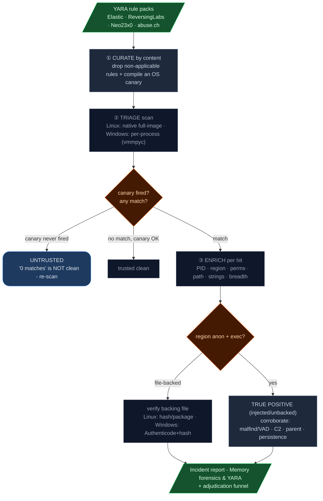

# YARA Findings Analysis Workflow (Windows + Linux)

How the IR Toolkit scans memory with YARA, **what context it gathers per hit**, and the explicit
logic - with worked examples - for deciding whether a match is **benign** or a **true positive
without a doubt**. The guiding rule throughout: **context only escalates or annotates, it never
silently clears** (no blindspots). A match is *contextualised*, never *deleted*.

See [readme.md](readme.md) for the adjudication philosophy, [WORKFLOW-LINUX.md](WORKFLOW-LINUX.md)
and [WORKFLOW-WINDOWS.md](WORKFLOW-WINDOWS.md) for the per-platform memory pipelines.

### How to read this guide

This guide answers one question: **a YARA rule matched some bytes in memory - is it actually malware?**
It reads top to bottom as a story:

1. **[The problem](#the-problem-a-raw-yara-hit-is-not-a-verdict)** - why a raw match is not a verdict.
2. **[How the tool gathers context](#how-the-tool-gathers-context-the-scan-pipeline)** - the scan pipeline (curate → triage → enrich).
3. **[How you reach a verdict](#how-you-reach-a-verdict-the-decision-logic)** - the decision logic (five rules, with a flowchart).
4. **[What happens to a confirmed hit](#from-a-true-positive-to-the-eradication-scope)** - pivoting a true positive into the full eradication scope.
5. **[Worked examples](#worked-examples)** + **[quick reference](#quick-reference)** - real benign and true-positive hits, side by side.

It applies to **both Windows and Linux**; differences are called out inline. You don't run anything
here - this is the reasoning the toolkit automates and that you confirm by eye in the report.

---

## The problem: a raw YARA hit is not a verdict

YARA matches **bytes**. A rule named `ELF_Mirai` or `Cobalt_Strike` firing tells you those bytes are
present in memory - **not** that the malware is running. The same bytes legitimately appear in:

- a **loaded library / interpreter** (a compiler holds every CPU-architecture name; Python's string
  table holds "download", "exec", "socket"…),
- a **cached file** sitting in the page cache,
- another **YARA rule's own definition** loaded by a scanner,
- **free/unallocated pages** left over from a long-dead process.

So the toolkit never reports a bare hit. It gathers the **location and nature** of each match and
attaches it to the finding, because *where* a rule matched is what separates noise from a real
implant.

---

## How the tool gathers context: the scan pipeline



The pipeline has three steps - the diagram's ①②③ map to **Curate → Triage → Enrich** below.

### Step 1 - Curate by content + compile a canary
Rules are filtered by **what they reference**, not by filename:

- **Linux** (`linux_yara.py`): drop rules importing `pe`/`dotnet`/`macho` or built from
  Windows-API/registry strings → ~9,600 packs become ~400 genuinely-Linux rules (`--yara-broad`
  re-adds generic ones). Externals (`filename`, `filepath`, …) are declared so file-scan rules
  compile instead of failing the whole set.
- **Windows** (`memory_yara.py`): drop non-Windows rules; declare externals; compile with `yarac64`.

A **canary rule** is compiled in (ELF magic on Linux, MZ/DOS-stub on Windows). If the canary never
matches, the engine never inspected memory - so **"0 matches" is reported as UNTRUSTED, not clean**.
This is the single most important integrity check: it makes a silent scan failure loud.

> Historical bug this prevents: passing raw rule source to Volatility's `--yara-file` compiled with
> *no* externals, so one rule referencing `filename` failed the **entire** compile → the scanner ran
> with **zero** rules → reported a false "clean." The canary turns that into an explicit UNTRUSTED.

### Step 2 - Triage scan
- **Linux native (default):** `yara-python` mmaps the whole image, one pass - **full physical
  coverage** (kernel + free pages), fast, but no PID yet.
- **Windows:** MemProcFS (`vmmpyc`, C-backed) scans **per-process** directly - fast + already
  attributed.

### Step 3 - Enrich per hit (the disambiguator)
For every match the toolkit records:

| Field | Linux source | Windows source | What it tells you |
|---|---|---|---|
| **PID + process** | per-process worker (`vmayarascan` via library) | vmmpyc per-process | attribution |
| **Region** | VMA `anon` vs `file` | VAD `Private` vs `Image`/`Mapped` | unbacked/injected vs mapped-from-disk |
| **Perms** | `vma.get_protection()` → `rwx`/`r-x`/`r--` | VAD protection → `RWX`/`RX`/`R` | **W+X / exec = injection territory** |
| **Backing path** | `LinuxUtilities.path_for_file` | mapped image path | *which* on-disk file (verify it) |
| **Matched strings** | `match.strings[*].identifier` | same | generic anchor vs specific behaviour |
| **Breadth** | distinct PIDs per rule | distinct PIDs per rule | shared-lib bytes vs injection campaign |

On Linux this is a **two-phase** flow: the fast triage says *what* is present, then a per-process
worker (Volatility driven as a library - init the image once, loop tasks in-process) **follows up
automatically on the hits** to attribute + enrich them. Windows is already per-process so it enriches
in the single pass. Both stream a rolling `_yara_results_<stamp>.jsonl` and write a
`_yara_results_<stamp>.json` summary, surfaced in the report's **Memory forensics & YARA** section.

---

## How you reach a verdict: the decision logic

Apply these five rules **in order**. The point is to **earn** a verdict from the context gathered
above, and to be honest about when you can't reach "without a doubt."

```
                      ┌─────────────────────────────────────────────┐
   YARA hit ─────────▶│ canary fired for this scan/process?         │
                      └───────────────┬─────────────────────────────┘
                              no │            │ yes
                                 ▼            ▼
                       UNTRUSTED        ┌───────────────────────────────┐
                    (re-scan; do not    │ region == anon AND perms exec?│
                     treat as clean)    └──────┬────────────────────────┘
                                          yes  │           │ no
                                               ▼           ▼
                                   ┌────────────────┐  ┌───────────────────────────────┐
                                   │ TRUE POSITIVE  │  │ region == file/image (on disk)│
                                   │  (injected/    │  └──────┬────────────────────────┘
                                   │  unbacked exec)│         │
                                   └───────┬────────┘  ┌──────▼─────────────────────────┐
                                           │           │ verify backing file:           │
                              corroborate  │           │  hash/package (Linux)          │
                              (malfind/VAD,│           │  Authenticode+hash (Windows)   │
                               C2, parent, │           └───────────┬────────────────────┘
                               persistence)│         clean         │   tampered/unsigned/unknown
                                           ▼           ▼           ▼
                                     TP - DECLARE    BENIGN-     SUSPICIOUS - escalate,
                                                     with-       keep investigating
                                                     context
```

### Rule A - Trust gate (always first)
If the canary did **not** fire for the scan (Linux global) or for the process (per-process), the
result is **UNTRUSTED**. "0 matches" means nothing. Raise the timeout / fix the engine / re-scan.

### Rule B - Anonymous + executable ⇒ true positive *without a doubt*
A match in **unbacked, executable** memory has no legitimate on-disk origin - it is code that was
**written into memory at runtime**: process injection, reflective DLL/`.so` loading, a Cobalt Strike
beacon, shellcode. This is automatically **escalated to Critical** and typed *"Injected Code (memory
YARA)"*. The combination *region=anon/Private + perms include `x` + a malware-family rule* is as close
to certain as memory forensics gets.

> Make it airtight by **corroborating** on the same PID: `linux.malfind` / Windows VAD-injection
> already flags anon-exec regions; add external C2 (`sockstat`/netstat), an anomalous parent, or a
> persistence hook and you have an undeniable, multi-signal true positive. On Windows the toolkit
> ranks every hit by **true-positive confidence** and writes a dedicated `YARA_Pivot_Report.md` - see
> [From a true positive to the eradication scope](#from-a-true-positive-to-the-eradication-scope).

### Rule C - File-backed ⇒ verify the file, don't assume
A match in a **file-backed** region (`file` on Linux, `Image`/`Mapped` on Windows) means the rule hit
the bytes of a file on disk. That is *usually* benign (a rule grazing a loaded library) **but not
always** - a **trojanised binary** or a **patched DLL** is exactly a real attack that lives in a
file-backed mapping. So the rule is: **identify the file and verify it.**

- **Linux:** is the path a packaged file? `dpkg -S <path>` / `rpm -qf`, compare against the package's
  hash. `/usr/bin/python3.13`, `/usr/lib/.../libLLVM.so` owned by an installed package and unmodified
  → benign.
- **Windows:** is the image **Authenticode-signed** by the expected vendor and its hash known-good?
  Signed Microsoft/`%SystemRoot%` DLL, valid signature → benign. Unsigned, in `%TEMP%`, hash unknown,
  or signature invalid → **suspicious**, keep going.

### Rule D - Matched-string specificity
Look at **which strings fired**. Generic *anchors* (ELF magic `$elf_magic`, MZ header, CPU-arch names
`$arch`, broad keyword strings) → the rule is matching structure/common text → low-confidence on its
own. **Specific** strings (a hard-coded C2 URL, a unique mutex, a known key schedule, a builder
watermark) → high-confidence, even before location analysis.

### Rule E - Breadth
One rule matching **many unrelated processes** usually means it matched **shared bytes** (a library or
interpreter loaded everywhere) → likely benign - **but** an `LD_PRELOAD` / AppInit / injected-into-
everything campaign also looks like this, so it is a *note*, never a clearance. One rule in **one
unusual** process is more concerning than the same rule across every GUI app.

---

## From a true positive to the eradication scope

Identifying *which* PID is a true positive is only half the job - eradication has to remove the implant's
**entire footprint**, or it comes back. On Windows the toolkit does this in two automatic stages.

**Stage 1 - rank by true-positive confidence (`YARA_Pivot_Report.md`).** Every YARA-hit PID is scored on
*hit quality*, not raw signal-count: a **named malware/tool-family signature** (a family/tool name, not a
generic technique rule), **multiple distinct rules** on one PID, or a hit in **injected/unbacked memory**
each raise confidence; a lone generic/LOLBin rule - even alongside an FP-prone signal like a device-path
"path-spoof" - stays *investigate*. True positives lead the report; **nothing is suppressed**, lower-
confidence hits are only ranked below. This is what stops a flood of benign `svchost`s from burying the
one real implant.

**Stage 2 - extract the full footprint (`Memory_Enrichment_*.json`, auto-run during `-Adjudicate`).** For
each true positive, `memory_enrich.py` pulls from the image everything that PID touched:

| Pulled from memory | Eradication use |
|---|---|
| **Handles → files** (`%TEMP%`/Public drops) | files to delete |
| **Handles → registry** (Run/Winlogon/AppInit, IFEO-with-image, Service ImagePath) | persistence to remove |
| **Handles → mutexes** (bare high-entropy = implant lock) | host-survey IOC + lock to clear |
| **Injected exec regions** | **carved to `_region_<pid>_<addr>.bin`** + extracted **decode candidates** (base64/hex/high-entropy) for offline **capa** (capabilities/ATT&CK) and **CyberChef** (encodings vary per case - base64, hex, gzip, XOR, RC4, custom) |
| **Network** | C2 endpoints to block |
| **Lineage** (parent + children) | the rest of the foothold |

Output: `Memory_Enrichment_*.json` + an analyst work sheet `Memory_Enrichment.md` (capa capabilities per
carved region, plus the **decode candidates to paste into CyberChef**). **capa** auto-runs over each carved
region when staged (`Build-OfflineToolkit.ps1 -IncludeCapa` → `tools/capa/`); otherwise the report prints
the exact offline command. The eradication artifacts are merged into `IOCs.json`, and a detailed chain is
appended to `Attack_Graph.md`.

> A registry/IFEO **handle being open is not persistence** - every process's loader opens the IFEO root,
> and a service host holds hundreds of `Services\*` config handles. Only specific autostart vectors are
> flagged; persistence *values* are corroborated by the dedicated persistence snapshot. Same lesson as the
> path-spoof FP: an *open handle* or an *unnormalised path* is not a verdict. The enrichment **extracts**
> encoded blobs but does not decode them, and it does not manufacture candidates from DLL/identifier
> runs - when a benign process's region holds nothing encoded, it correctly reports nothing.

The recovered files / keys / mutexes / C2 / implicated-PID chain are merged into **`IOCs.json`** so
`Invoke-Eradication.ps1` blocks the C2 and surfaces the removal scope (analyst-gated; nothing auto-deletes).

**Optional - carve the injected regions for Binary Ninja.** Run the memory analysis with
`Analyze-Memory.ps1 -Carve` (see [WORKFLOW-WINDOWS.md Phase 3](WORKFLOW-WINDOWS.md#phase-3---memory-analysis-analyst-machine))
and every YARA hit in a **Private + executable (injected) VAD** is dumped as raw `.bin` + a JSON
sidecar (base address, perms, `injected`, matched rules, arch) into `tools\binja\data\<stamp>\`. These
are the same true-positive regions ranked above - now in a form you can reverse-engineer. The carve is
**inert** (raw bytes, never executed); analyze it only in the isolated `irtoolkit-binja` container
(`tools\binja\`). This mirrors the Linux carve below - the sidecar schema is identical, so one Binary
Ninja loader handles both platforms.

### Linux — carve, enrich, capa/FLOSS (end-to-end walkthrough)

The Linux pivot is the same idea on the proven engine, run off-host on the analyst machine (memory
**capture** happens on the target via `Invoke-IRCollection-Linux.sh --capture-memory`; **analysis**
needs symbols, so it runs separately — the air-gapped split):

```bash
playbooks/linux/threat_hunting/Analyze-Memory-Linux.sh \
    --image reports/<host>/memory_<host>.raw --host-folder reports/<host> \
    --yara --carve --adjudicate
```

Step by step, and what each produces:

1. **Triage + per-PID enrichment** — native scan finds *which* signatures are present, then the
   per-process worker attributes each to a PID and adds VMA context (`anon`/`file`, perms, backing
   path, matched strings). → `_yara_results_<stamp>.{jsonl,json}`, report **Memory forensics & YARA**.
2. **Carve** — every injected region (`anon`+exec) is carved to `tools/binja/data/<stamp>/` as
   `pid<PID>_<proc>_0x<addr>.bin` + a JSON sidecar (`base_address`, `perms`, `region`, `matched_rules`).
3. **Enrich (`memory_enrich.py`)** — scans each carved region's strings (ASCII + UTF-16LE) for
   **C2 IPs/domains/URLs, Tor `.onion`, Telegram/Discord exfil, Monero + miner configs/wallets, AWS
   keys, private keys**; **capa** (`-f sc64 -j`) adds capabilities/ATT&CK and **FLOSS** recovers
   **deobfuscated** strings (encoded C2 plain `strings` miss) — which are IOC-swept too. →
   `Memory_Enrichment_<stamp>.{json,md}` (defanged) + common-schema findings.
4. **Adjudicate + report** — findings merge into `Combined_Findings` → verdict ladder → `IOCs.json`
   `c2_endpoints` (so eradication blocks the C2) + `Incident_Report.md`.
5. **Cleanup** — the carved bytes are **potential live malware**, so they are **deleted after
   enrichment**; the extracted IOCs remain. `--carve` **keeps** them for Binary Ninja
   (`tools/binja/launch.sh`).

> **What this proves on a clean host (live run against `reports/ubuntu-main`):** the worker recarved
> 2 regions (`networkd-dispat`/python3.13, `nvidia-powerd`), `memory_enrich` + capa + FLOSS scanned
> them in 9s → **0 IOCs, 0 capabilities** (capa 0 rules, FLOSS 226 *static* but 0 *decoded* strings),
> reports regenerated with **0 C2** — i.e. the full pipeline executes end-to-end on a real image and
> correctly **finds nothing in benign regions** (no FP flood). On a compromised host the same path
> surfaces the implant's C2 in `IOCs.json` and its capabilities in `Memory_Enrichment.md`. The
> extraction itself is proven by `test_37_memory_enrich_linux.py` (synthetic adversary region → full
> catalog; FLOSS-deobfuscated C2 surfaces; benign infra dropped).

### Corroborating a hit to a confirmed verdict (real-world)

The full worked walkthrough - how three benign-looking processes were each confirmed by their
**matched string** (REDLEAVES, a Metasploit task, a coin-miner+Vidar), and how the analyst pieced the
indicators into the chain of events - now lives in the cross-platform analyst guide:

> **[WORKFLOW-INVESTIGATION.md](WORKFLOW-INVESTIGATION.md)** - from toolkit output to the chain of events.

## Worked examples

### Linux - BENIGN (proven), from a real `reports/ubuntu-main` scan
```
ELF_Mirai  - PID 4225 (Xwayland), 4357 (ibus-x11), 4358 (mutter-x11)
   region = file / r-x
   path   = /usr/lib/x86_64-linux-gnu/libLLVM.so.20.1
   strings= $arch $archx $arch3 ...   (CPU-architecture names)
```
**Decision:** Rule B → no (file-backed, not anon). Rule C → `libLLVM.so` is a packaged, unmodified
library. Rule D → only generic *arch-name* strings fired - Mirai checks target CPU arch, and LLVM (a
compiler) literally contains every arch name. Rule E → matched every GUI process because they all load
Mesa/LLVM. **Verdict: benign false positive, with proof** - surfaced and annotated ("verify
hash/package"), not deleted.

```
TH_Generic_MassHunt_Linux_Malware  - PID 1825 networkd-dispat, 2039 firewalld, 2387 unattended-upgr
   region = file / r--    (read-only, NOT executable)
   path   = /usr/bin/python3.13
   strings= $dl1 $exec3 $net1 $priv1 ...   (download/exec/network/priv keywords)
```
**Decision:** read-only, file-backed, in the **Python interpreter** these daemons run on; the rule's
keyword strings matched Python's static string table. **Benign**, proven by location + read-only perms.

### Linux - TRUE POSITIVE shape (what a real hit looks like)
```
Linux_Trojan_Gafgyt - PID 1337 (sh)
   region = anon / rwx          ← unbacked, writable+executable
   path   = (none)
   strings= $c2_host $cmd_handler   ← specific behaviour strings
   + linux.malfind flags the same RWX region · + sockstat shows 1337 → 185.x.x.x:443
```
**Decision:** Rule B fires (anon + exec) → Critical "Injected Code." Corroborated by malfind + external
C2 on the same PID → `Correlated Memory Threat`. **True positive without a doubt - declare and
eradicate.**

### Windows - BENIGN
```
Cobalt_Strike_Beacon - PID 6120 (chrome.exe)
   region = Image / RX
   path   = C:\Program Files\Google\Chrome\Application\chrome.dll  (Authenticode: Google, valid)
   strings= $sleep_pattern  (generic)
```
**Decision:** file-backed Image, **validly signed** Google binary, only a generic string → benign FP.
Annotate ("signed, hash known-good"), do not clear blindly - re-confirm the signature is valid.

### Windows - TRUE POSITIVE
```
Cobalt_Strike_Beacon - PID 5308 (SecHealthUI.exe)
   region = Private / RWX        ← injected, no backing image
   path   = (none)
   strings= $beacon_config $checkin_uri   ← specific
   + VAD-injection flag on the same region · + parent is winword.exe · + beacon to relay.example-c2:443
```
**Decision:** Private+RWX (injected) + specific Cobalt config strings + injected-VAD + macro-style
parent + C2 = undeniable. **True positive - declare.**

### A real-world run, end to end

The full real-world walkthrough (104 matches across 102 processes collapsing to a few in-memory
implants, then reconstructed into the attack story) is in
**[WORKFLOW-INVESTIGATION.md](WORKFLOW-INVESTIGATION.md)**.

## Quick reference

| Signal | Benign-leaning | TP-leaning |
|---|---|---|
| **Region** | `file` / `Image` / `Mapped` | `anon` / `Private` |
| **Perms** | `r--`, `r-x` (non-writable) | `rwx` / `W+X` |
| **Backing file** | packaged + unmodified / signed + known hash | none, or unsigned/tampered/`%TEMP%` |
| **Matched strings** | generic anchors (magic, arch, keywords) | specific (C2 URL, mutex, config) |
| **Breadth** | one rule across many shared-lib loaders | one rule in one unusual process |
| **Corroboration** | no other signal on the PID | malfind/VAD-inject + C2 + parent + persistence |
| **Canary** | fired (trusted) | fired (trusted) - *never trust a hit from an UNTRUSTED scan* |

**Bottom line:** anonymous executable memory + a specific malware-family string + at least one
corroborating signal on the same PID = **true positive without a doubt**. File-backed + generic strings
+ a verified-clean packaged/signed file = **benign** - but always *verified*, never *assumed*, and
always still surfaced with its context for the adjudicator and analyst.