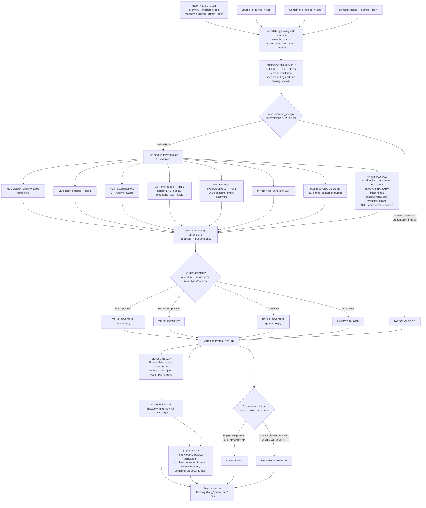

# Linux Investigation Engine

Second-pass, cross-collector correlation on top of the primary Linux IR
workflow. It re-examines what `edr_hunt.py`, `analyze_memory_linux.py`,
`journal_analysis.py`, `container_hunt.py`, `remote_access_triage.py`, and
`memory_enrich.py`/`c2_config_extract.py` already gathered, and holds every
PID (or the host itself, for kernel/persistence/account findings that have
no owning process) to a combined evidentiary standard before calling
anything a true positive.

This engine does not replace `adjudicate.py`. It is the QA pass: an
objective second opinion, structured the same way as the companion
[Windows investigation engine](../../windows/investigation/README.md) so
findings read consistently across platforms, but built around Linux's own
detection surface and its own trust anchor (package ownership + integrity,
not Authenticode).

## Why this exists

A single collector can be fooled. An adversary hiding in `/dev/shm`, running
via `memfd`, or shipping a userland rootkit that lies to `ps`/`lsmod` may
look unremarkable in any one script's output. The combination is where the
deception breaks down: a `Process Running Deleted Binary` in a temp dir,
paired with an `External Connection` from that same PID, paired with a
`Cron Persistence` entry that relaunches it, is a different animal than any
one of those findings alone. This engine's job is to hold every PID (and
the host itself) to that combined standard: **3+ independent structural or
behavioral dimensions before calling something a true positive** -- unless
a single dimension is *structurally unforgeable* (a hidden kernel module, a
second UID-0 account, a keyutils/network capability mismatch), in which
case one is enough. Below that floor, it stays UNDETERMINED and says
exactly what evidence would close the gap.

Detection here is mechanism-based, not signature-based, throughout --
including in `c2_config_extract.py`'s family-specific parsers: a YARA hit
matters because it fired in an anonymous executable region, not which named
rule matched; a Mirai-class botnet hit matters because a single-byte-XOR
string table structurally exists, not because a specific attack-string
vocabulary was found; an Ebury-class backdoor hit matters because a
keyutils-shaped object imports network syscalls it has no legitimate reason
to need, not because a filename or version string matched. An unnamed
implant produces the same structural signal as a famous one.

## Logic flow



## Current-state features

**Per-module investigation (`engine.py`, `modules/`)**
19 modules covering deleted/memfd/writable-path execution, hidden processes
(DKOM), injected/anonymous-executable memory (JIT-runtime aware), shell/
offensive tooling, kernel rootkit signals (hidden LKM, IDT/netfilter/VFS/
timer/thread hooks, `modprobe_path`/`uevent_helper`/`core_pattern` hijack),
credential override & privesc residue, eBPF/`io_uring` anti-EDR surface,
namespace escape & container breakout, persistence, network triage, SSH key
& account hygiene, YARA/capa classification, linker/library hijack, process
masquerade, anti-forensics, ptrace attachment, SUID/capability abuse,
recovered C2 configuration, and remote-access tooling. Each emits typed
`Dimension` objects (positive/negative, tiered, with rationale) rather than
a bare verdict.

**Host-scope findings get a real verdict, not a dropped one.** Kernel
integrity signals, persistence files, SSH/account hygiene, and anti-forensics
findings have no owning PID (`Target` is a path, module name, `IDT[idx]`, or
username -- not `PID N`). Rather than discarding these or forcing them onto
an arbitrary PID, they route to `HOST_SCOPE_PID` (0) and get their own
`Verdict`, `CorrelationVerdict`, attack chain, and TTP-pattern eligibility --
a hidden kernel module is exactly as actionable as a compromised process, and
the engine treats it that way.

**Tiered evidence model (`verdict.py`)** -- identical rules to the Windows
engine (see its `Tier` docstring for the full rationale), but Linux modules
use Tier 1 (DEFINITIVE) from day one instead of waiting for a future
migration: a hidden process (psscan-vs-pslist or `/proc` asymmetry), a
kernel-structure rootkit signal read out-of-band from a memory image, a
credential override (`cred != real_cred`), a second UID-0 account, an empty-
password account, and a mechanism-gated C2 config recovery (BPFDoor magic
sequence, Ebury-class keyutils/network capability mismatch) are all
structurally unforgeable and settle TRUE_POSITIVE on their own.

**Mechanism-based C2/beacon config extraction (`c2_config_extract.py`,
wired into `memory_enrich.py`)** -- the structured counterpart to
`memory_enrich.py`'s generic IOC sweep. Covers cross-platform frameworks with
real Linux agent builds (Sliver, Mythic, Merlin, Havoc, AdaptixC2, Pupy) and
Linux/Unix-native families that have no Windows equivalent at all (BPFDoor,
Mirai/Gafgyt-class botnets, Ebury-class SSH backdoors, an unnamed-Go-C2
structural heuristic), plus a Linux-specific XMRig-class miner-config parser
and an SMTP-exfil credential extractor. Every non-trivial family check is a
genuine mechanism, not a brand-name string match (the same rule the Sliver/
Mythic mwcp parsers this module is modeled on already follow):
- **Mirai/Gafgyt**: detects the actual single-byte-XOR string-table
  obfuscation mechanism (tries every byte key, scores printable-token
  density) -- not a fixed attack-string vocabulary. A known-word match is
  kept only as corroborating context.
- **Ebury-class**: flags an object that EXPORTS the keyutils API (`keyctl`/
  `add_key`/`request_key` as defined dynamic symbols) and ALSO IMPORTS
  network syscalls (`connect`/`getaddrinfo`/`socket` as undefined dynamic
  symbols) -- a capability mismatch no genuine `libkeyutils.so` can produce.
  Confirmed via a small stdlib-only ELF dynamic-symbol-table parser
  (`elf_dynamic_symbols()` -- section-header path, falling back to walking
  the PT_DYNAMIC segment for stripped binaries or a raw memory-mapped
  image), not a substring search: checking network imports alone would
  false-positive on ordinary system binaries that link networking symbols
  unconditionally without ever calling them, so the export-side gate
  (keyutils API present) is required alongside the import-side gate (network
  syscalls present). Falls back to raw-byte substring search only when the
  input isn't parseable as ELF at all (e.g. a truncated carve), and tags
  that result `verified: False` so it's weighted lower than a structurally-
  confirmed match. Never checks for the string "ebury" or a version-pinned
  filename.
- **BPFDoor**: keys on the magic-packet trigger byte sequence itself (the
  wire-protocol shared secret between the trigger packet and the kernel-side
  BPF filter), not generic strings a packet-capture tool would also contain.

**Deterministic noise filter (`models/noise_filter.py`)** -- stdlib only, no
ML dependency (Linux's own collectors already emit typed, largely
pre-interpreted findings, unlike Windows' raw byte-distribution memory
signals). Closes a known system daemon running from its expected path with
only benign-on-daemon finding types (`Process Preload`, `io_uring In Use
(verify)` on a documented user, `Listening Service`, `Memory Capabilities
(capa)` alone) -- never a global allowlist, since the same finding Type on
an unrecognised process still routes to full module investigation.

**Multi-source correlation (`correlator.py`)** -- unlike the Windows
engine (which reconciles genuinely different schemas: mwcp hits, EDR
behavioral events, parsed event log entries), every Linux collector already
emits the same `{Timestamp, Severity, Type, Target, Details, MITRE}` schema
by design. The correlator's job is merging already-compatible finding lists
and tagging provenance, not schema translation -- cross-source strength
shows up naturally when a PID accumulates independent module dimensions
from findings that came from different collectors.

**Process lineage (`process_tree.py`)** -- builds ancestor/descendant chains
from a dedicated snapshot when present, or `adjudicate.py`'s own enriched
`ParentPid`/`ParentName`/`CommandLine`/`Owner` fields (real top-level fields
from `/proc` reads at adjudication time, not text embedded in a free-form
Details string) as a fallback -- typically more complete than the Windows
engine's equivalent fallback in practice.

**Chain-of-events reconstruction (`chain_builder.py`)** -- lineage, spawned
children with their own evidence, and a time-ordered timeline tagged with
kill-chain stages, for every TP and every UNDETERMINED PID (or the host
itself) with positive weight.

**Named TTP pattern matching (`ttp_patterns.py`)** -- recognizes technique
shapes independent of the generic TP/UNDETERMINED threshold: miner+rootkit
deployment (Kinsing/`kdevtmpfsi`-class -- the dominant real-world Linux
compromise per `WORKFLOW-INVESTIGATION-LINUX.md`), BPFDoor magic-packet
activation (static config recovery AND live kernel-hook correlation both
present), SSH-backdoor-with-persistence (Ebury-class + a planted
`authorized_keys`/forced-command), fileless-beacon (deleted/memfd execution
+ anonymous-executable memory in a non-JIT process), and container-
breakout-to-host. Three of these five patterns span **two different
verdicts** (a kernel-module or file-path finding has no owning PID, while
the paired finding does) -- `match_patterns()` resolves the host-scope
verdict once and threads it into those matchers rather than only checking
one verdict's own dimensions.

**Objective second opinion, both directions (`live_runner.py`)** -- same
Potential-Misses / Unconfirmed-Prior-TPs comparison as the Windows engine,
adapted to `adjudicate.py`'s five-level verdict ladder (`False Positive` <
`Likely False Positive` < `Indeterminate` < `Likely True Positive` <
`True Positive`) rather than the three/four-level Windows scheme.

## Known gaps

- **Cross-scope TTP patterns are matched pairwise, not transitively.** A
  matcher checks the current PID's verdict plus the single host-scope
  verdict; it does not chase a third hop (e.g., PID A's finding
  corroborating PID B's finding via a shared host-scope fact that also
  touches PID C). Extend if a real investigation needs it.
- **No cross-host correlation.** Each report directory is analyzed
  independently, same as the Windows engine.
- **No temporal/beacon-interval analysis.** Findings are treated as
  simultaneous within a chain's ordering by timestamp string; detecting a
  beacon by check-in cadence isn't implemented.
- **Process tree coverage depends on `adjudicate.py`'s per-finding `/proc`
  reads** when no dedicated `ProcessTree_*.json` snapshot exists -- a
  process with no adjudicated finding of its own has no lineage entry at
  all, unlike a dedicated ps-shaped snapshot which would cover every PID.
- **`c2_config_extract.py`'s XOR-table scan is bounded to the first 64KB**
  of a region for cost reasons; a Mirai-class table located later in a very
  large carved region would be missed. Carved regions from this toolkit's
  YARA/malfind pipeline are small in practice, so this has not been an
  issue, but a future large-region source could need the window raised.
- **mwcp is not used or staged for Linux at all** (Build-OfflineToolkit-Linux.sh
  never installs it) -- `c2_config_extract.py` is a deliberate, permanent
  stdlib-only substitute, not a stopgap pending an mwcp port.

## End-state goal

Given any incident's collected Linux artifacts, the engine should
reconstruct the full attack chain without an analyst manually
cross-referencing five scripts' output by hand, and answer:

1. **Which process (or kernel-level fact) is the implant?** (engine verdict,
   corroborated across collectors)
2. **How did it get there?** (process lineage + persistence/journal
   reconstruction)
3. **What did it do?** (C2 connections, recovered beacon config, spawned
   children, persistence installed -- the chain timeline)
4. **What else is compromised?** (cross-host correlation, not yet
   implemented)
5. **What did `adjudicate.py` miss, and why?** (Potential Misses)
6. **What should the analyst verify next?** (a ranked second-look queue)

## Usage

```bash
# Run the lab test suite (unit + integration, no live data required)
pytest test/linux/lab_investigation/ -v

# Run against a live report directory
python -m playbooks.linux.investigation.live_runner reports/<hostname>
```

Output (`Investigation_<hostname>_<timestamp>.{json,md,csv}`) is written
alongside the existing reports in `reports/<hostname>/`.
