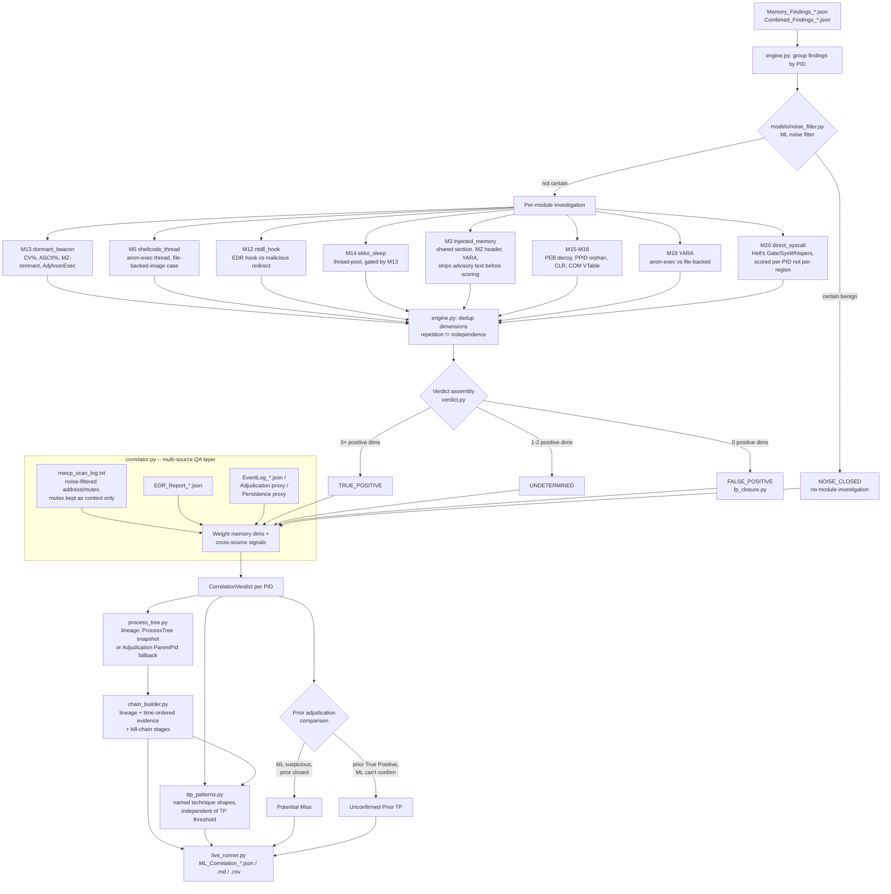

# Windows Investigation Engine

Second-pass, cross-source correlation on top of the primary Windows IR
workflow. It re-examines what `memory_forensic.py` (and the rest of the
collection stack) already gathered, closes background noise without wasting
analyst time, and -- deliberately -- goes looking for what the primary
adjudication got wrong in *either* direction: things it closed that look
suspicious, and things it called True Positive that memory evidence alone
can't independently support.

This engine does not replace the primary workflow. It is the QA pass: an
objective second opinion built to disagree with the first pass when the
evidence says so.

## Why this exists

A single detection source can be fooled. An adversary blending into normal
admin activity may look clean in memory, clean in EDR, and clean in the event
log -- individually. The combination is where the deception breaks down. This
engine's job is to hold every PID to that combined standard: **3+ independent
structural or behavioral dimensions, from possibly multiple sources, before
calling something a true positive.** Below that, it stays UNDETERMINED and
says exactly what evidence would close the gap.

Detection here is mechanism-based, not signature-based: a YARA hit matters
because it fired in an anonymous executable region (code running outside any
loaded module), not because of which named family matched. An unnamed
implant produces the same structural signal as a famous one.

## Logic flow



## Current-state features

**Per-module investigation (`engine.py`, `modules/`)**
10 modules covering dormant-beacon memory analysis, shellcode threads,
ntdll hooking, sleep-obfuscation (Ekko/Foliage), injected memory regions,
PPID spoofing, PEB command-line tampering, CLR execute-assembly, COM
VTable hijacking, and direct-syscall (Hell's Gate/SysWhispers) detection.
Each emits typed `Dimension` objects (positive/negative, with rationale)
rather than a bare verdict, so the reasoning is auditable.

**Advisory text is not evidence.** `memory_forensic.py` sometimes appends
instructional text to a finding -- e.g. *"corroborate via YARA match or
shellcode thread start in same address range"* on JIT-consistent regions.
Naive regex matching against the full Details string reads that sentence as
if the corroboration had already happened. Confirmed on live data: this
fabricated cross-module corroboration for a real process on this machine (a
PowerShell subprocess with zero actual Shellcode Thread findings still got
scored as if one existed). `injected_memory.py` now strips text after
`"corroborate via"` before running its evidence regexes; `shellcode_thread.py`
has the analogous fix for file-backed-VAD advisory text. Any new module
reading free-text Details should assume the same risk exists.

**Repetition is not independence -- score per-PID, not per-finding, when one
finding Type naturally recurs many times per behavior.** `direct_syscall.py`
(Module 20) was first written to score once per syscall-region finding, like
every other module. Live testing immediately broke it: one JIT-heavy
PowerShell process had 93 syscall-region findings, producing 93 dimensions
(combined weight 286) and false-positiving that process plus two unrelated
ones (another PowerShell instance and a legitimate Windows service). Fixed by
aggregating all of a PID's syscall findings into exactly one dimension via
`investigate_pid()` instead of the usual per-finding `investigate()`. Before
routing a new finding Type into the engine, check whether it's naturally
single-instance-per-PID (most current modules) or many-instances describing
one behavior (Module 20's case) -- the dimension dedup in `engine.py` only
collapses byte-identical dimensions, it does not solve this.

**ML noise prefilter (`models/`)**
5D feature vector (name entropy, path depth, ASCII%, CV%, AdjAnonExec flag)
scored by an IsolationForest. Closes normal Windows background (task
scheduler work items, COM infrastructure, audio buffers, security-process key
material) without running module logic. Calibrated from two sources: a
synthetic baseline authored from the investigation guide's worked examples,
plus (`calibrate_baseline.py`) real feature vectors harvested from live
report data -- but only findings that *independently* pass a deterministic,
non-ML benign check, so calibration can't become circular self-training.

**Dimension deduplication**
Identical evidence repeated across N findings (the same region scanned twice,
a scanner emitting duplicate events) collapses to one dimension with an
`[observed in N findings]` count, not N dimensions. Repetition is not
independence.

**Multi-source correlation (`correlator.py`)**
Layers memory dimensions with mwcp config-extraction hits, EDR behavioral
events, and event-log-shaped signals (process creation, service install,
network logon). mwcp's generic parsers are noise-filtered before scoring:
observed on real data, running mwcp against decoded PowerShell/.NET memory
produces CLR namespace strings reported as "address" and WinAPI import names
reported as "mutex" -- both are filtered out rather than trusted at face
value.

**Process lineage (`process_tree.py`)**
Builds ancestor/descendant chains from a dedicated `ProcessTree_*.json`
snapshot when present, or the partial `ParentPid`/`ParentName` fields already
embedded in adjudication entries as a fallback. Cycle-safe (PID reuse can
create parent loops).

**Chain-of-events reconstruction (`chain_builder.py`)**
For every TP and every UNDETERMINED PID with positive weight: lineage,
spawned children with their own evidence, and a time-ordered timeline tagged
with kill-chain stages (execution, injection, defense-evasion, persistence,
command-and-control, ...). Answers not just *which* process is suspicious but
*how it got there and what it did*.

**Named TTP pattern matching (`ttp_patterns.py`)**
Recognizes specific technique shapes -- Cobalt-Strike-style beacon-in-uniform-
region, Ekko/Foliage sleep obfuscation, WMI persistence-to-execution, LOLBin-
as-loader, PPID spoofing paired with execution, LSASS credential access --
independent of the generic TP/UNDETERMINED threshold. A pattern match on a
below-threshold PID is itself a second-look signal.

**Objective second opinion, both directions (`live_runner.py`)**
- **Potential Misses**: ML says suspicious (TP, or UNDETERMINED with positive
  weight), prior adjudication says closed (FP/Benign/Noise, or "not
  escalated" per the `Memory_Enrichment` fallback for old-format adjudication
  files). Second-look candidates the primary workflow may have closed too
  early.
- **Unconfirmed Prior TPs** (the inverse check): prior adjudication says True
  Positive, but the ML engine can't independently reach that verdict from
  memory evidence alone. Not an accusation that the prior call was wrong --
  it may rest on evidence outside memory (event log, EDR, analyst judgment)
  -- but it flags TP calls that aren't yet memory-grounded, worth documenting
  either way.

**Live data adapters (`live_runner.py`)**
Auto-discovers and format-converts whatever the primary workflow already
collected: `Memory_Findings`, `Combined_Findings`, `EDR_Report`,
`Adjudication` (both current and old schema), `YARA_Pivot_TP`,
`Persistence_Findings`, `EventLog_*` (when collection produces them), and
`mwcp_scan_log.txt`. Output (`ML_Correlation_*.json/.md/.csv`) lands
alongside the existing reports in the same directory.

## Known gaps

- **mwcp carved-region output**: only the text-log format
  (`mwcp_scan_log.txt`) is ingested; a structured carved-file discovery path
  for other output shapes doesn't exist yet.
- **No cross-host correlation**: each report directory is analyzed
  independently. Same malware family across two hosts, shared C2
  infrastructure, or lateral-movement timing correlation all require a
  manifest linking report directories to hosts and a cross-host pass that
  doesn't exist yet.
- **Event log collection gap**: the engine can consume `EventLog_*.json` when
  present, but the primary collection script does not yet emit it. Until
  4688/7045/4624 collection is added, event-log-shaped signals mostly come
  from proxies (Adjudication CommandLine/Network fields, Persistence
  findings) rather than authoritative event data.
- **No temporal/beacon-interval analysis**: findings are treated as
  simultaneous. Detecting a beacon by its check-in cadence, or sequencing
  persistence -> execution -> C2 by timestamp across multiple collection
  passes, isn't implemented.
- **Process tree is often partial**: without a dedicated `ProcessTree_*.json`
  snapshot, lineage comes from whatever `ParentPid`/`ParentName` happened to
  be captured in adjudication entries -- frequently 0% to 20% coverage on
  historical reports that predate this fallback.
- **Unaudited finding Types**: `memory_forensic.py` emits some finding Types
  with no engine routing at all (e.g. `Process Hollowing Indicator`,
  `RemoteAccess_Findings_*.json` content). Before routing any of these, check
  whether the Type is naturally many-instances-per-PID describing one
  behavior -- see Module 20's per-PID-aggregation lesson above -- or it will
  repeat the same false-positive-by-volume failure.

See `planning/ml-correlation-engine-plan.md` for the full gap analysis,
required collection additions, and phased refinement plan.

## End-state goal

Given any incident's collected artifacts, the engine should reconstruct the
full attack chain without an analyst manually cross-referencing sources by
hand, and answer:

1. **Which process is the implant?** (ML verdict, corroborated across
   sources)
2. **How did it get there?** (process lineage + event-log reconstruction)
3. **What did it do?** (C2 connections, spawned children, persistence
   installed -- the chain timeline)
4. **What else is compromised?** (cross-host correlation, once implemented)
5. **What did the primary workflow miss, and why?** (Potential Misses, with a
   root-cause explanation, not just a flag)
6. **What should the analyst verify next?** (a ranked second-look queue, not
   a wall of findings)

The operating principle throughout: assume every finding is a false positive,
then ask what combination of *independent* evidence would force it not to be.
Single-source findings stay UNDETERMINED. Multi-source corroboration with
temporal and structural consistency is what earns a TRUE_POSITIVE label --
and the engine is built to find its own blind spots as readily as the primary
workflow's.

## Usage

```bash
# Run the lab test suite (unit + integration, no live data required)
pytest test/windows/lab_investigation/ -v

# Run against a live report directory
python -m playbooks.windows.investigation.live_runner reports/<hostname>

# Calibrate the noise-filter baseline from live report data
python -m playbooks.windows.investigation.calibrate_baseline reports/<hostname> [...]
```

Output (`ML_Correlation_<hostname>_<timestamp>.{json,md,csv}`) is written
alongside the existing reports in `reports/<hostname>/`.
