# IR Toolkit — Offline Incident Response Workflow

Single-command incident response for **Windows**, **Linux**, and **Cloud** (AWS / Azure / GCP).

---

## Executive summary

This toolkit is purpose-built to **steer incident responders and forensic analysts to the right path** — not to make the call for them.

Every collection phase casts the widest possible net. Raw findings from process memory, event logs, file entropy, network connections, registry keys, Amcache/ShimCache execution history, and YARA signatures are gathered without pre-filtering — tens of thousands of data points on a typical host. The subsequent analysis phases then refine that down to the handful of findings that have real investigative value:

1. **Collection** — snapshot everything without judgment. Processes, drivers, network state, event logs, memory, execution history (Amcache/ShimCache), files, persistence keys. Nothing is excluded at collection time.
2. **Detection** — score-based alerting across all collected data. Each detector uses thresholds (LOLBin score ≥3, entropy ≥7.2, process hidden from standard API, execution from user-writable paths) to distinguish signal from baseline noise. Detection logic is never suppressed by publisher or vendor name — a Microsoft-signed binary in `AppData\Roaming` is still flagged.
3. **Adjudication** — on-host context enrichment. Every raw finding is verified against its concrete artifact: Authenticode signature chain, file existence, install path, and binary hash. The verdict ladder is **False Positive → Likely False Positive → Indeterminate → Likely True Positive → True Positive**. A validly signed binary in a user-writable path (Temp, AppData) earns **Indeterminate** — not clearance. Only System32-resident, chain-valid, Microsoft-signed files reach False Positive automatically.
4. **"Likely True Positive" is the actionable signal.** The adjudicator surfaces findings where the evidence pattern is anomalous but a final call requires analyst context: a deleted executable, an unsigned binary from a staging path, a process hidden from standard APIs. These are what the analyst investigates. The toolkit tells you *what to look at* — the analyst confirms whether it is a threat.
5. **Refinement loop** — findings flow from detectors → adjudication → reports → eradication. The attack graph clusters TP-class findings into a renderable kill chain (12–15 nodes max) rather than a raw list. Evidence bundles are written for every TP-class finding so the analyst has the artifact, not just the alert.

The result: on a clean developer workstation, 97% of raw signals are resolved by the adjudicator, leaving only genuine anomalies and Indeterminate findings that need a human decision. On a compromised host, the pipeline surfaces the threat path with full evidence bundles and explicit pivot instructions (*"check 4688 parent process, correlate with install history"*).

**Design principle for filtering:** Only exclude things that are physically impossible threat vectors. Everything else surfaces with context and confidence level. The analyst makes the call — the toolkit ensures they are looking in the right place.

**No network dependency during collection.** Everything runs offline — tools, YARA rules, and dependencies are staged to USB in advance. The target host is never contacted by the toolkit.

---

One invocation runs the whole chain:

```
collection  →  analysis  →  reporting  →  memory forensics  →  eradication  →  restoration
```

Collection is read-only and offline. Eradication is dry-run by default and writes a
rollback journal so every change is reversible.

---

## End-to-end workflow

```mermaid
flowchart TD
    A1["Build-OfflineToolkit.ps1
    -IncludeMemory -IncludeYaraRules
    -IncludeVolatility -IncludeMemProcFS"]:::prep
    A1 --> A2[/"tools/ staged: go-winpmem · yara64 · vol.exe
    MemProcFS · Python 3.12 · Sysinternals"/]:::artifact

    A2 --> B0(["TARGET HOST — Administrator"]):::phase
    B0 --> B1["Invoke-IRCollection.ps1
    -CaptureMemory -DeepFileScan -ScanYara"]:::tool
    B1 --> B2["① Firewall lockdown — Default-Deny inbound"]:::step
    B2 --> B3["② Forensics · Autoruns · Persistence
    Event log analysis"]:::step
    B3 --> B4{"-CaptureMemory?"}:::decision
    B4 -->|yes| B5["③ go-winpmem → memory_HOST.aff4
    FAT32: auto-redirect to C:"]:::step
    B4 -->|no| B6
    B5 --> B6["④ EDR hunt: processes · drivers · injection
    COM · BITS · Registry · YARA"]:::step
    B6 --> B7["⑤ Remote-access triage
    RMM · browser · ClickFix"]:::step
    B7 --> B8["⑥ Adjudication: TP/FP + Evidence bundles"]:::step
    B8 --> B9[/"IOCs.json · Principals.json
    Incident_Report · Attack_Graph · Timeline"/]:::artifact

    B9 --> C0(["ANALYST MACHINE — post-collection"]):::phase
    C0 --> C1["Analyze-Memory.ps1
    AFF4 → memory_forensic.py via vmmpyc
    RAW/DMP → Volatility 3"]:::tool
    C1 --> C2[/"Memory_Findings.json
    injection · hidden procs · C2 · LOLBin
    BYOVD drivers · Run key persistence"/]:::artifact
    C2 --> C3["Merge → Combined_Findings
    Re-adjudicate · regenerate reports"]:::step

    C3 --> D0(["TARGET HOST — Administrator"]):::phase
    D0 --> D1["Invoke-Eradication.ps1 -Apply
    dry-run by default"]:::tool
    D1 --> D2["Kill · quarantine · unregister
    Disable accounts · block C2 egress"]:::step
    D2 --> D3[/"Firewall: known-good minus C2
    sha256-verified restore"/]:::artifact

    classDef prep  fill:#1e3a5f,stroke:#3b82f6,color:#e2e8f0
    classDef phase fill:#1e3a5f,stroke:#60a5fa,color:#e2e8f0,rx:20
    classDef tool  fill:#1e293b,stroke:#64748b,color:#cbd5e1
    classDef step  fill:#0f172a,stroke:#334155,color:#94a3b8
    classDef artifact fill:#14532d,stroke:#22c55e,color:#dcfce7
    classDef decision fill:#451a03,stroke:#f97316,color:#fed7aa
```



---

## What the toolkit looks for — per stage

### Stage 0 · Containment
Immediately enforces Default-Deny inbound firewall, exports the pre-lockdown state as a `.wfw` backup so eradication can restore known-good rules while keeping known-bad C2 blocked.

### Stage 1 · Collection

**Forensics snapshot** (`00_Collect-Forensics.ps1`)
Running processes, network connections, loaded drivers, scheduled tasks, installed software, ARP/DNS cache, prefetch, jump lists, browser history, registry run keys for all users, event log export (Security / System / PowerShell / Sysmon).

**Extended persistence** (Autoruns)
Every autostart location Windows supports: IFEO debuggers, AppInit DLLs, Winlogon Shell/Userinit, LSA packages, BootExecute, netsh helpers, codec hijacks, Active Setup, print processors, font drivers, boot sectors.

**Persistence + security-config snapshot** (`Get-PersistenceSnapshot.ps1`)
IFEO debugger hijacks, Winlogon Shell/Userinit anomalies, AppInit/AppCert DLLs, LSA packages, BootExecute, netsh helpers, WDigest cleartext credential caching, LSASS PPL disabled, UAC disabled, Defender disabled via policy, PowerShell ScriptBlock logging disabled. Raw evidence: full `.evtx` exports, every scheduled task XML, firewall rules, audit policy, Defender detection history.

**Event log analysis** (`Invoke-EventLogAnalysis.ps1`)
4688 process creation → LOLBin + obfuscation combos; 4625 failed logon burst → brute-force; 4648 explicit credential use → pass-the-hash; 4698/4702 suspicious task created/modified; 4720 new account created; 1102/104 security/system log cleared; 7045 new service in unusual path; 4104 PowerShell script block → encoded commands, Mimikatz, AMSI bypass, shellcode APIs.

**Memory capture** (go-winpmem / FTK Imager / Magnet RAM Capture)
Full physical memory image for post-collection offline analysis. AFF4 sparse format (go-winpmem) captures only actual RAM pages. FAT32 output volumes auto-redirect to NTFS for files >4 GiB.

**EDR hunt** (`EDR_Toolkit.ps1` / `EDR_Toolkit_Deploy.ps1`)

| Module | What it looks for |
|---|---|
| Process hunt | Hidden processes (API vs WMI mismatch); LOLBin score ≥ 3 (encoded cmds, IEX, WebClient, mshta, certutil); high-risk parent multiplier |
| Injection scan | Reflective DLL injection; unsigned modules in signed processes; DLLs loaded from Temp/AppData |
| Driver hunt | BYOVD — loaded drivers checked against built-in list + live/offline loldrivers.io feed |
| COM hijacking | HKCU InProcServer32 shadows existing HKLM CLSID AND points to unsigned/user-writable DLL |
| BITS jobs | Transfer jobs not matching Microsoft/Windows-Update/vendor updater naming patterns |
| ETW/AMSI tamper | ETW autologger sessions disabled; AMSI provider registry keys missing or renamed |
| Registry | WMI event subscriptions; PendingFileRenameOperations; services running from Temp/AppData; IFEO debugger hijacks; AppInit DLLs |
| Scheduled tasks | Score-based: encoded commands, IEX, WebClient download, hidden window, mshta in task action |
| File hunt (optional) | Epoch/impossible timestamps (pre-2003 — timestomping); entropy ≥7.2 in non-image/non-script files; Alternate Data Streams in high-risk paths; YARA scan (1,773 rules: Elastic + ReversingLabs + Neo23x0) |

**Remote-access triage** (`Get-RemoteAccessTriage.ps1`)
Installed and running RMM agents (60+ signatures); ClickFix / CAPTCHA-lure PowerShell drops; browser history for RMM download pages; RunMRU for suspicious command execution; msiexec/installer logs for silent RAT installs.

**Amcache + ShimCache execution history** (`Invoke-AmcacheParser.ps1`)
Parses two Windows execution-history artifacts into findings and feeds them into the adjudication pipeline:

| Artifact | What it is | How collected |
|---|---|---|
| `amcache_parsed.csv` | Application Compatibility Cache — every executable run, with path, SHA1, publisher, and link date. Survives process exit and deletion. | `Get-PersistenceSnapshot.ps1` copies the locked `Amcache.hve` via `robocopy /B` (backup privilege), loads it offline, exports to CSV |
| `shimcache.bin` | AppCompatCache — kernel-level execution record, binary blob from registry. Records files executed since last boot cycle. | `Get-PersistenceSnapshot.ps1` reads directly from `HKLM\...\AppCompatCache` (no lock) |

Detection logic — flags executables that:
- Ran from user-writable or staging paths (`AppData\Roaming`, `Temp`, `Downloads`, `Desktop`, `Public`, `ProgramData` non-Microsoft sub-paths)
- Are known LOLBin names (`mshta`, `rundll32`, `certutil`, `bitsadmin`, `regsvr32`, etc.) found outside `System32`
- Ran from network shares (`\\server\share\...`)

Each finding includes a pivot hint: *"Check Amcache for SHA1, Event 4688 for cmdline."* The adjudicator resolves the file path on-host, verifies the Authenticode chain, and assigns a verdict — Microsoft-signed installer temporaries clear as False Positive; LOLBins staged in Temp fail the path/hash check and become True Positive / High.

Findings flow into `Combined_Findings` → adjudication on every collection run.

### Stage 2 · Analysis

**Adjudication** (`Get-FindingContext.ps1 -Live`)
Every raw finding is enriched with on-host context: Authenticode signature chain (publisher, timestamp, revocation); file owner and install path; hash against known-good baselines; whether the binary is in Program Files vs Temp/AppData. Verdict ladder: `False Positive` → `Indeterminate` → `Likely True Positive` → `True Positive`. Evidence bundles written for every TP-class finding.

**IOC extraction** — C2 endpoints, file hashes, ATT&CK techniques, implicated principals, Defender exclusion tampering.

### Stage 3 · Memory analysis (analyst machine, post-collection)

`Analyze-Memory.ps1` + `memory_forensic.py` via MemProcFS vmmpyc Python API. Runs against the AFF4 image with no system changes (no driver install required).

| Check | What it detects |
|---|---|
| LOLBin cmdlines | Processes with encoded commands, IEX, WebClient downloads, mshta — same scoring as live EDR hunt but from memory |
| Hidden processes | DKOM / PEB-unlink artifacts flagged by MemProcFS state field |
| Injected memory | Executable private VAD regions with no backing file — classic shellcode/reflective DLL footprint |
| External network | Established/listening connections to non-RFC1918 IPs present at capture time (C2 dwell) |
| Shellcode threads | User-mode threads whose start address falls outside every loaded module in that process |
| Parent-child anomalies | High-risk child processes (powershell, cmd, wscript, mshta, regsvr32) spawned from unexpected parents — macro/exploit chain indicator |
| Process path spoofing | Well-known system binaries (lsass, svchost, smss, etc.) running from a path other than System32 |
| Known offensive tooling | Process names / cmdlines matching Mimikatz, Cobalt Strike, Meterpreter, BloodHound, Rubeus, PsExec, etc. |
| Suspicious listeners | User processes listening on high ports (>1024) on non-loopback interfaces |
| BYOVD drivers | Loaded kernel drivers matching known vulnerable driver names |
| Registry Run keys | LOLBin commands in Run/RunOnce keys from the live registry hive in memory |
| **YARA memory scan** | **1,775 staged rules (Elastic + ReversingLabs + Neo23x0) scanned per-process, 15s abort timeout per process, noise-rule suppression** |

### Stage 4 · Eradication
Kills malicious processes, quarantines implants (sha256-verified), unregisters persistence (tasks, COM, WMI, services), disables/revokes implicated accounts, blocks C2 egress via firewall. Every action is dry-run by default and written to a rollback journal.

### Stage 5 · Restoration
Restores firewall to pre-lockdown known-good state while keeping C2 IPs blocked. Recovers quarantined files only after sha256-verifying them against the rollback journal.

`IOCs.json` is emitted in the **analysis** stage (not reporting) so eradication's C2 re-block never depends on reports being generated. Every orchestrator writes a uniform `_status.json` (`COMPLETED` / `PARTIAL` / `FAILED` + per-phase results + `tp_count`) for SOAR gating.

---

## AV / EDR compatibility

### Why antivirus flags this toolkit

This toolkit performs the same low-level operations that attackers use — by design.
Incident response requires reading process memory, enumerating logged-on sessions,
copying forensic hive files, scanning files for high entropy, and running tools like
Autoruns, YARA, and Sigcheck. These operations match the behavioral signatures of
information-stealing malware and credential-harvesting tools.

**The toolkit is not malicious.** Every action is read-only during collection, every
change during eradication is journaled and reversible, and nothing is sent off-host.
The AV detections are false positives caused by heuristic pattern-matching on
legitimate forensic operations.

This is a well-known problem in the IR industry. KAPE, Velociraptor, FTK Imager, and
Sysinternals tools all trigger the same detections and require the same exclusions.

---

### Windows Defender — required setup before running

Windows Defender with **Tamper Protection** enabled silently blocks all programmatic
attempts to add exclusions or disable real-time protection, even from an Administrator
account. The only way to configure Defender on a Tamper-Protected system is through
the Windows Security GUI.

**Option A — Automated setup script (recommended)**

Run this once on the target machine. It opens Windows Security to the right page,
polls until you toggle the switch, adds all exclusions automatically, and guides
Tamper Protection back on:

```powershell
powershell.exe -ExecutionPolicy Bypass -NoProfile -File .\Invoke-PrepareDefender.ps1
```

The only manual steps are two GUI clicks — TP off, then TP back on. Everything else
(folder exclusion, process exclusions, verification) runs automatically.

**Option B — Manual setup**

**Do this once on the target machine before running the toolkit:**

#### Step 1 — Disable Tamper Protection

> Windows Security → Virus & threat protection → Manage settings →
> scroll to **Tamper Protection** → toggle **OFF** → confirm UAC prompt

This allows the toolkit's pre-flight to call `Set-MpPreference` and temporarily
suspend real-time monitoring during the collection run. It is re-enabled automatically
when the run finishes (the `finally` block always runs, even on crash or Ctrl+C).

#### Step 2 — Add a folder exclusion

> Windows Security → Virus & threat protection → Manage settings →
> scroll to **Exclusions** → **Add or remove exclusions** →
> **Add an exclusion** → **Folder** → select or paste:
> `C:\path\to\IR_Toolkit`

This exclusion must cover the entire toolkit folder and persists across reboots.
It stops Defender's AMSI provider from blocking the PowerShell scripts at load time.

> **Note on elevated processes:** Windows Defender applies stricter AMSI scanning to
> processes running as Administrator, and path exclusions may not apply to elevated
> child processes without Tamper Protection disabled. Disabling Tamper Protection
> (Step 1) is required for the exclusion to take full effect in an admin-level run.

#### Step 3 — Re-enable Tamper Protection after the run

Once the toolkit completes, turn Tamper Protection back on:

> Windows Security → Virus & threat protection → Manage settings →
> **Tamper Protection** → toggle **ON**

The toolkit's `finally` block re-enables real-time monitoring automatically, but
Tamper Protection itself must be restored manually.

---

### Other AV / EDR products

The toolkit's pre-flight automatically detects running security products and logs
the exact paths that need to be excluded. Check `_runtime_*.log` after the first run
for the specific paths and process names flagged on your system.

General guidance by product:

| Product | Exclusion type needed | Where to configure |
|---|---|---|
| **Trend Micro Apex One / Max Security** | Folder + Process + Script Protection approved list | Apex One console → Agents → Script Protection |
| **CrowdStrike Falcon** | IOA exclusion + sensor visibility exclusion | Falcon console → Configure → Exclusions |
| **SentinelOne** | Path exclusion + process exclusion | S1 console → Sentinels → Exclusions |
| **Carbon Black** | Approved list / watchlist exclusion | CBC console → Enforce → Approved List |
| **Elastic Security / Elastic Agent** | Trusted application | Fleet → Integrations → Endpoint → Trusted Apps |
| **Trellix (McAfee/FireEye)** | Access Protection exclusion + On-Access exclusion | ePolicy Orchestrator → Policy Catalog |
| **Cortex XDR (Palo Alto)** | Hash allow list + process exclusion | Cortex console → Security → Exceptions |
| **Sophos Intercept X** | Excluded applications + global exclusions | Sophos Central → Policies → Exclusions |
| **Cybereason** | Allowlist by path or hash | Cybereason console → Policies → Allow List |
| **ESET Endpoint** | Exclusion by path | ESET PROTECT → Policies → Exclusions |
| **Kaspersky** | Trusted zone / exclusion by path | Kaspersky Security Center → Policies |
| **Bitdefender GravityZone** | Exclusion by path + process | GravityZone console → Policies → Exclusions |

**Minimum exclusions required for any product:**

```
Folder  (recursive): C:\path\to\IR_Toolkit\
Process:             IR_Toolkit\tools\autorunsc64.exe
Process:             IR_Toolkit\tools\yara64.exe
Process:             IR_Toolkit\tools\winpmem.exe
Process:             IR_Toolkit\tools\procdump64.exe
Process:             IR_Toolkit\tools\sigcheck64.exe
Process:             IR_Toolkit\tools\strings64.exe
Script:              IR_Toolkit\playbooks\windows\*.ps1  (Script Protection / AMSI)
```

For products with behavioral monitoring (CrowdStrike, SentinelOne, Carbon Black),
also add a **process execution exclusion** for `powershell.exe` when launched from
the `IR_Toolkit\` folder — these products monitor parent-child process chains and
will block or alert on PowerShell spawned by the orchestrator.

---

## Windows

### Step 0a — Build the offline toolkit (once, on an internet-connected analyst machine)

This step runs on your **analyst machine**, not the target. It downloads staged depth tools
into `tools\`. Copy the entire `IR_Toolkit\` folder (with `tools\`) to a USB drive or
network share for deployment to an isolated host.

```powershell
# Core: Sysinternals (Autoruns, Sigcheck, Handle, ListDlls, PsTools, TCPView, Strings)
#       + LOLDrivers offline vulnerable-driver cache
.\Build-OfflineToolkit.ps1

# + WinPmem memory acquisition + ProcDump
.\Build-OfflineToolkit.ps1 -IncludeMemory

# + 1,773 YARA rules (Elastic, ReversingLabs, Neo23x0/Florian Roth)
.\Build-OfflineToolkit.ps1 -IncludeYaraRules

# Everything at once — recommended before any USB deployment
.\Build-OfflineToolkit.ps1 -IncludeMemory -IncludeYaraRules
```

Do **not** run `Build-OfflineToolkit.ps1` on the target host — it requires internet access
and the target may be isolated. The core collection workflow runs entirely offline without
any staged tools; they only enable optional depth (memory capture, YARA, extended persistence).

### Step 0b — Prepare Defender on the target (first run only)

If Windows Defender Tamper Protection is on, the orchestrator automatically launches
`Invoke-PrepareDefender.ps1` which opens Windows Security to the correct page and
guides you through two GUI clicks (TP off → exclusions added → TP back on). You can
also run it manually before your first collection:

```powershell
powershell.exe -ExecutionPolicy Bypass -NoProfile -File .\Invoke-PrepareDefender.ps1
```

Exclusions persist across reboots. You do not need to run this again unless the toolkit
is moved to a new path.

### Step 1 — Collection (run on the TARGET machine as Administrator)

Output is written to `reports\<HOSTNAME>\` next to the toolkit. Directories are created
automatically — no flags needed for normal use.

```powershell
# Minimum — process/registry/persistence/event-log hunt, no file scan
# Output: reports\MAIN-SYS\
powershell.exe -ExecutionPolicy Bypass -NoProfile -File .\Invoke-IRCollection.ps1

# Recommended — adds file scan (QuickMode ~5-10 min) + YARA + memory image
# Output: reports\MAIN-SYS\
powershell.exe -ExecutionPolicy Bypass -NoProfile -File .\Invoke-IRCollection.ps1 `
    -DeepFileScan -ScanYara -CaptureMemory

# Exhaustive — full file scan with no age or directory filtering (~45+ min)
powershell.exe -ExecutionPolicy Bypass -NoProfile -File .\Invoke-IRCollection.ps1 `
    -FullScan -ScanYara -CaptureMemory

# Tune QuickMode to only scan files touched in the last 30 days
powershell.exe -ExecutionPolicy Bypass -NoProfile -File .\Invoke-IRCollection.ps1 `
    -DeepFileScan -QuickModeDaysBack 30 -ScanYara

# Restrict the file scan to a single high-risk directory
powershell.exe -ExecutionPolicy Bypass -NoProfile -File .\Invoke-IRCollection.ps1 `
    -DeepFileScan -ScanTarget "C:\Users" -ScanYara

# Remote collection over WinRM — keep port 5985 open during firewall lockdown
powershell.exe -ExecutionPolicy Bypass -NoProfile -File .\Invoke-IRCollection.ps1 `
    -DeepFileScan -AllowInboundPort 5985

# Override the output location (e.g. USB drive)
powershell.exe -ExecutionPolicy Bypass -NoProfile -File .\Invoke-IRCollection.ps1 `
    -DeepFileScan -OutputRoot "E:\Evidence"
```

---

### Step 1b — Memory analysis (run on the ANALYST machine after copying evidence back)

Memory analysis runs **off the target** — copy the collected `memory_<HOST>.raw` from
`reports\<HOST>\` back to your analyst machine, then run:

```powershell
# Stage Volatility 3 on the analyst machine (internet required — run once)
.\Build-OfflineToolkit.ps1 -IncludeVolatility

# If the analyst machine is also air-gapped, pre-stage the Windows symbol pack (~500 MB)
.\Build-OfflineToolkit.ps1 -IncludeVolatility -StageSymbols

# Run memory analysis against the copied image
# Output: Memory_Findings_<stamp>.json next to the image
.\playbooks\windows\threat_hunting\Analyze-Memory.ps1 `
    -ImagePath ".\reports\HOSTNAME\memory_HOSTNAME.raw" `
    -OutputDir ".\reports\HOSTNAME"

# Skip specific plugins (e.g. skip hashdump if LSASS was not accessible)
.\playbooks\windows\threat_hunting\Analyze-Memory.ps1 `
    -ImagePath ".\reports\HOSTNAME\memory_HOSTNAME.raw" `
    -SkipPlugins "hashdump,ldrmodules"
```

**What it checks (concerning findings only — no noise output):**

| Plugin | Findings emitted |
|---|---|
| `windows.pslist` + `windows.psscan` | Hidden processes (DKOM rootkit — in psscan but not pslist) |
| `windows.malfind` | Injected memory regions with execute permission (Critical if PE header present) |
| `windows.cmdline` | LOLBin command lines in process memory (same scoring as live hunt) |
| `windows.netscan` | Established/listening connections to external IPs at capture time |
| `windows.hashdump` | NTLM hashes recovered (count only — raw hashes in plugin log for OpSec) |
| `windows.svcscan` | Running services with non-system binary paths |
| `windows.ldrmodules` | DLLs unlinked from PEB loader lists (injection artifact) |

**Integrate findings with the rest of the evidence:**
```powershell
# Merge Memory_Findings into the Combined_Findings and re-adjudicate
$combined = Get-Content ".\reports\HOSTNAME\Combined_Findings_*.json" | ConvertFrom-Json
$memory   = Get-Content ".\reports\HOSTNAME\Memory_Findings_*.json"   | ConvertFrom-Json
($combined + $memory) | ConvertTo-Json -Depth 5 |
    Out-File ".\reports\HOSTNAME\Combined_Findings_WithMemory.json" -Encoding UTF8

.\playbooks\windows\threat_hunting\Get-FindingContext.ps1 `
    -HostFolder ".\reports\HOSTNAME" `
    -ReportPath ".\reports\HOSTNAME\Combined_Findings_WithMemory.json" `
    -Live
```

**Why it runs separately:** The target host is air-gapped and runs entirely offline.
Volatility 3 requires internet access to fetch Windows debug symbols (PDB files from
Microsoft's symbol server) on first run. Separating analysis from collection means the
offline host never needs internet, and the analyst machine can be fully set up in advance.

> **IMPORTANT:** Only analyze a `.raw` image where the filename does NOT start with `INVALID_`.
> The collector renames truncated/failed captures to `INVALID_memory_<HOST>.raw`.
> A truncated image will cause Volatility to fail or produce incomplete results.

---

### Invoke-IRCollection.ps1 — full parameter reference

#### Output and identity

| Parameter | Type | Default | Description |
|---|---|---|---|
| `-OutputRoot` | string | `reports\` (next to toolkit) | Root directory under which `<HOSTNAME>\` is created automatically. Default keeps all evidence in `reports\` alongside the toolkit. Override to write to a USB drive or network share (`-OutputRoot "E:\Evidence"`). |
| `-IncidentId` | string | `<HOST>_<timestamp>` | Overrides the auto-generated incident ID used in all artifact filenames. |

#### File scanning

| Parameter | Type | Default | Description |
|---|---|---|---|
| `-DeepFileScan` | switch | off | Recursive scan of `-ScanTarget` for high-entropy files, cloaked files, timestomped files, and ADS. **QuickMode is ON** — skips `System32`, `SysWOW64`, `Program Files`, browser caches, and files older than `-QuickModeDaysBack`. Target runtime: **~5-10 min** on C:\. |
| `-FullScan` | switch | off | Same as `-DeepFileScan` but **QuickMode is OFF** — scans every file regardless of age or location (except hard tarpits like WinSxS). Target runtime: **~45+ min** on C:\. Use when you suspect a long-dwell attacker or need complete coverage. |
| `-ScanTarget` | string | `C:\` | Directory scanned by `-DeepFileScan` or `-FullScan`. Override to restrict the scan (e.g. `C:\Users`, `D:\`) and reduce runtime. |
| `-QuickModeDaysBack` | int | `90` | QuickMode age filter. Only files with `LastWriteTime` or `CreationTime` newer than this many days back are scanned. Set lower (e.g. `30`) for recent incidents; higher (e.g. `365`) if dwell time is unknown. Only applies when `-DeepFileScan` is used (not `-FullScan`). |

**QuickMode exclusions (always skipped in `-DeepFileScan`):**
- `Windows\System32`, `Windows\SysWOW64`, `Windows\WinSxS`, `Windows\servicing`
- `Windows\assembly`, `Windows\Microsoft.NET`, `Windows\DriverStore`, `Windows\catroot`
- `Program Files`, `Program Files (x86)`
- Browser caches (Chrome, Edge, Firefox), UWP package caches
- `node_modules`, `.git\objects`, `__pycache__`
- AV/EDR self-defense tarpits (Defender Scans, WMI RtBackup, CrowdStrike, SentinelOne, etc.)

#### Detection modules

| Parameter | Type | Default | Description |
|---|---|---|---|
| `-ScanProcesses` | switch | **on** | Hidden process detection (API vs WMI mismatch). Context-aware LOLBin scoring — flags encoded commands, IEX, WebClient downloads; multiplies score when spawned by Office/browser/Java. Threshold: score >= 3. |
| `-ScanFileless` | switch | **on** | WMI event subscriptions, suspicious Registry Run key values. |
| `-ScanRegistry` | switch | **on** | Expanded registry persistence: IFEO debugger hijacks, AppInit_DLLs, services running from Temp/AppData. |
| `-ScanTasks` | switch | **on** | Scheduled task detection with score-based LOLBin matching. Tasks using PowerShell from System32 are not flagged unless obfuscation indicators are present. |
| `-ScanDrivers` | switch | **on** | Loaded kernel drivers checked against built-in BYOVD list and (with `-AutoUpdateDrivers`) the live loldrivers.io feed or offline cache. |
| `-ScanInjection` | switch | **on** | Reflective DLL injection and unsigned modules loaded into processes. |
| `-ScanBITS` | switch | **on** | BITS transfer jobs that don't match Microsoft/Windows Update naming. |
| `-ScanCOM` | switch | **on** | COM hijacking via HKCU InProcServer32 overrides. |
| `-ScanETWAMSI` | switch | **on** | ETW autologger sessions disabled and AMSI provider tampering. |
| `-ScanPendingRename` | switch | **on** | PendingFileRenameOperations (MoveEDR-style EDR kill at next boot). |
| `-ScanADS` | switch | off | Alternate Data Stream scan in high-risk paths (Temp, AppData, Downloads, Public). Enabled automatically with `-DeepFileScan`/`-FullScan`. |
| `-ScanYara` | switch | off | Two-phase YARA scan: (1) reads prior findings to select the minimal relevant rule subset (Elastic/ReversingLabs/Neo23x0), (2) scans only flagged files rather than the whole directory. Requires staged `tools\yara64.exe` and `tools\yara_rules\`. |
| `-AutoUpdateDrivers` | switch | off | Fetch latest vulnerable driver list from loldrivers.io before driver scan. Falls back to `tools\loldrivers.json` offline cache if unreachable. |

#### Output filtering

| Parameter | Type | Default | Description |
|---|---|---|---|
| `-SeverityFilter` | string[] | `Critical,High,Medium,Low` | Only record findings at these severity levels. Example: `-SeverityFilter Critical,High` to suppress Medium/Low noise. |
| `-OutputFormat` | string[] | `All` | Report formats to generate: `All`, `CSV`, `JSON`, `HTML`. |
| `-Quiet` | switch | off | Suppress per-finding console output. Only the final summary and phase logs are written. Recommended for WinRM deployments to keep the stream clean. |

#### Collection control

| Parameter | Type | Default | Description |
|---|---|---|---|
| `-CaptureMemory` | switch | off | Acquire a raw physical memory image via staged `tools\winpmem.exe` before the hunt. Required for memory analysis (Volatility, etc.). Large output — ensure sufficient disk space. |
| `-SkipForensics` | switch | off | Skip the forensics collection phase (phases 1/1b/1c/1e). Use for hunt-only re-runs against already-collected evidence. |
| `-SkipHunt` | switch | off | Skip the EDR hunt and all downstream phases. Use for forensics-only collection. |
| `-SkipReports` | switch | off | Skip automated report generation (Incident_Report, Attack_Graph, IOCs, Principals). IOC and Principal extraction still runs so eradication is not blocked. |

#### Containment

| Parameter | Type | Default | Description |
|---|---|---|---|
| `-NoFirewallLockdown` | switch | off | Skip the default-deny inbound firewall lockdown that runs as the first act. Not recommended on a live incident — the lockdown prevents new inbound C2/lateral movement sessions during collection. |
| `-AllowInboundPort` | int[] | `@()` | Keep specific inbound ports open during lockdown (e.g. `-AllowInboundPort 5985` for WinRM, `-AllowInboundPort 3389` for RDP). |
| `-AllowInboundRemoteAddress` | string[] | `@()` | Restrict the pinhole ports to specific source IPs (e.g. your analyst IP). |
| `-PostRunExecutionPolicy` | string | `RemoteSigned` | Execution policy restored after the run. Options: `Restricted`, `AllSigned`, `RemoteSigned`. |

### Step 1 (alt) — WinRM remote deployment of the EDR hunt only

```powershell
# Build the monolithic single-file payload (analyst machine)
.\playbooks\windows\threat_hunting\dev\Build-Toolkit.ps1

# Deploy over WinRM — adjust target and flags as needed
Invoke-Command -ComputerName TARGET_HOST `
    -FilePath .\playbooks\windows\threat_hunting\dev\Release\EDR_Toolkit_Deploy.ps1 `
    -ArgumentList @(
        "-ScanProcesses", "-ScanFileless", "-ScanTasks", "-ScanDrivers",
        "-ScanInjection", "-ScanRegistry", "-ScanETWAMSI", "-ScanPendingRename",
        "-ScanBITS", "-ScanCOM",
        "-ReportPath", "C:\Windows\Temp",
        "-OutputFormat", "JSON",
        "-Quiet"
    )
```

### Step 4 — Eradication

```powershell
# Dry-run (preview only, nothing changed)
.\Invoke-Eradication.ps1 -HostFolder .\<HOSTNAME> -MinVerdict "Likely True Positive"

# Apply
.\Invoke-Eradication.ps1 -HostFolder .\<HOSTNAME> -MinVerdict "Likely True Positive" -Apply
```

### Step 5 — Restoration

```powershell
.\playbooks\windows\06_Restore-Host.ps1
```

### Analyze a collected run standalone

```powershell
# Baseline-tune an EDR report (suppress OS noise, export CSV for SIEM)
.\playbooks\windows\threat_hunting\Analyze-EDRReport.ps1 `
    -ReportPath .\<HOSTNAME>\EDR_Report_*.json -ExportCSV

# Parse event-log CSVs into findings (re-run without full orchestration)
.\playbooks\windows\threat_hunting\Invoke-EventLogAnalysis.ps1 `
    -InputDir .\<HOSTNAME> -OutputDir .\<HOSTNAME>
```

### Run the Windows test suite (Pester)

```powershell
# Install Pester 5 if needed, then run all 16 tests in test\windows\
.\playbooks\windows\threat_hunting\dev\Run-Tests.ps1
```

> **AV note:** Add `IR_Toolkit\` and `%TEMP%` to your AV exclusion list before running tests.
> Trend Micro and similar products may quarantine `.ps1` stub files created in temp during test runs.

- Hunt scripts: `playbooks/windows/threat_hunting/`
- Containment: `playbooks/windows/Enforce-StrictFirewall.ps1 -FullInboundLockdown`
- Reports: `playbooks/reporting/generate_reports.ps1` (native PowerShell, no Python dependency)

## Linux

### Step 0 — Build the offline toolkit (once, internet-connected machine)

```bash
chmod +x ./Build-OfflineToolkit-Linux.sh

# Core tools + LOLDrivers cache
./Build-OfflineToolkit-Linux.sh

# + AVML memory acquisition tool
./Build-OfflineToolkit-Linux.sh --include-memory
```

### Step 1 — Collection (run on TARGET as root)

```bash
# Standard full run
sudo ./Invoke-IRCollection-Linux.sh

# With memory capture
sudo ./Invoke-IRCollection-Linux.sh --capture-memory

# Full deep filesystem scan + memory
sudo ./Invoke-IRCollection-Linux.sh --deep --capture-memory

# Custom incident ID and output location
sudo ./Invoke-IRCollection-Linux.sh \
    --incident-id "CASE-$(date +%Y%m%d)" \
    --output-root /mnt/usb/evidence
```

| Flag | Effect |
|---|---|
| `--deep` | Full filesystem scan |
| `--capture-memory` | Live memory image via staged AVML |
| `--skip-forensics` | Hunt-only re-run |
| `--skip-hunt` | Forensics-only |
| `--skip-reports` | Skip automated reports |
| `--incident-id ID` | Override auto-generated ID |
| `--output-root DIR` | Write to specific directory |

### Step 4 — Eradication

```bash
sudo ./Invoke-Eradication-Linux.sh --host-folder ./<HOSTNAME>          # dry-run
sudo ./Invoke-Eradication-Linux.sh --host-folder ./<HOSTNAME> --apply  # apply
sudo ./playbooks/linux/07_revoke_credentials.sh \
    --principals-file ./<HOSTNAME>/Principals.json                      # credential revocation
```

### Step 5 — Restoration

```bash
./playbooks/linux/06_restore.sh
```

### Run the Linux/cloud test suite (pytest)

```bash
cd test/
pip install -r requirements.txt
pytest -v                    # all 111+ tests
pytest -v -k "collection"   # specific module
./run_tests.sh               # full suite with coverage
```

- Hunt tools: `playbooks/linux/threat_hunting/` (edr_hunt.py, remote_access_triage.py, adjudicate.py)
- Reports: `playbooks/reporting/generate_reports.py` (canonical, cross-platform)
- Run as root for full visibility (shadow, all /proc, every cron)

## Cloud (AWS / Azure / GCP)

```bash
# 1. Collection (cloud telemetry + report generation, in the project dir)
./Invoke-IRCollection-Cloud.sh --provider aws --target 10.0.0.5 \
    --c2-ips 45.66.77.88 --c2-domains evil.test [--contain]

# 4/5. Eradication + restoration (dry-run by default)
./Invoke-Eradication-Cloud.sh --provider aws --target 10.0.0.5 \
    --host-folder ./aws-10_0_0_5 --apply --restore
```

- Playbooks: `playbooks/cloud/` (forensics, contain, eradicate process/persistence, block C2, restore).
  Provider auto-detected from `--provider`; uses the `aws` / `az` / `gcloud` CLIs.
- Known-bad C2 supplied via `--c2-ips/--c2-domains` (or read from `IOCs.json`) stays blocked
  by `04_block_c2.sh` across restoration.

---

## Reports

The report generator (`playbooks/reporting/generate_reports.{py,ps1}`) reads the per-host folder
and emits:

- **`Incident_Report.md`** — severity, ATT&CK chain, true-positive findings, adjudication funnel,
  remediation, IOC appendix.
- **`Attack_Graph.md`** — Mermaid graph reconstructing the **full chain of events** from the
  findings: each true-positive finding is a node, ordered along the ATT&CK kill chain (and by
  time where known), coloured by tactic, with C2 endpoints branching off. It is built from
  whatever findings exist, so a cryptominer, webshell, cloud-IAM compromise, and a RAT each
  render a different graph (not a fixed template).
- **`Retrospective.md`** — objective post-incident review with **kill-chain coverage and gap
  analysis** (tactics with no evidence collected, indeterminate findings, missing memory image).
- **`Timeline.md`** — chronological events, labelling **activity** time (process/event start) vs
  **detection** time (when the pipeline observed it).
- **`IOCs.json`** — C2 endpoints, file hashes, tools, ATT&CK techniques (emitted in analysis,
  consumed by eradication).

It tolerates PowerShell's UTF-8 BOM and works on Windows, Linux, and cloud finding shapes.

### Cross-host campaign correlation

`playbooks/reporting/correlate_campaign.py --root <dir-of-host-folders>` scans every host
folder's `IOCs.json`, finds indicators shared by more than one host, and emits
`Campaign_Report.md` (shared-IOC table + a Mermaid graph linking hosts through shared C2/hashes/
tools) and `campaign.json`.

## Offline toolkit (optional depth tools)

Run on an internet-connected machine before deploying to an isolated host:

- **Windows** — `Build-OfflineToolkit.ps1 [-IncludeMemory] [-IncludeSysmon]` stages Sysinternals
  (Autoruns, Sigcheck, Handle, …), WinPmem (memory), and the LOLDrivers list into `tools/`.
- **Linux** — `Build-OfflineToolkit-Linux.sh [--include-memory] [--include-cloud] [--check-only]`
  stages **AVML** (Linux memory acquisition, used by the collector's `--capture-memory`) and the
  LOLDrivers list, and **records** the `aws`/`az`/`gcloud` versions the cloud workflow requires
  (too large to bundle — missing ones are flagged, not silently ignored).

Both write a sha256 `tools/STAGED_MANIFEST.json`. The core workflow runs offline without any of
these; they only enable optional depth (e.g. memory capture).