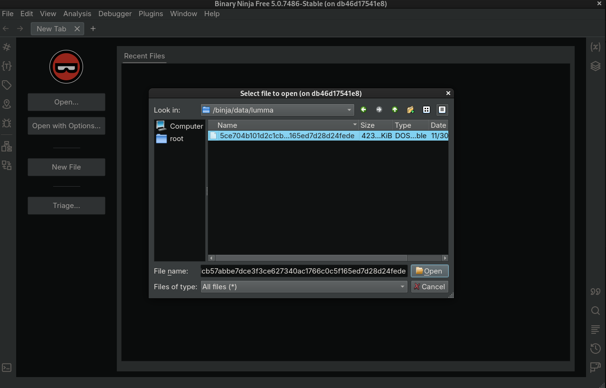
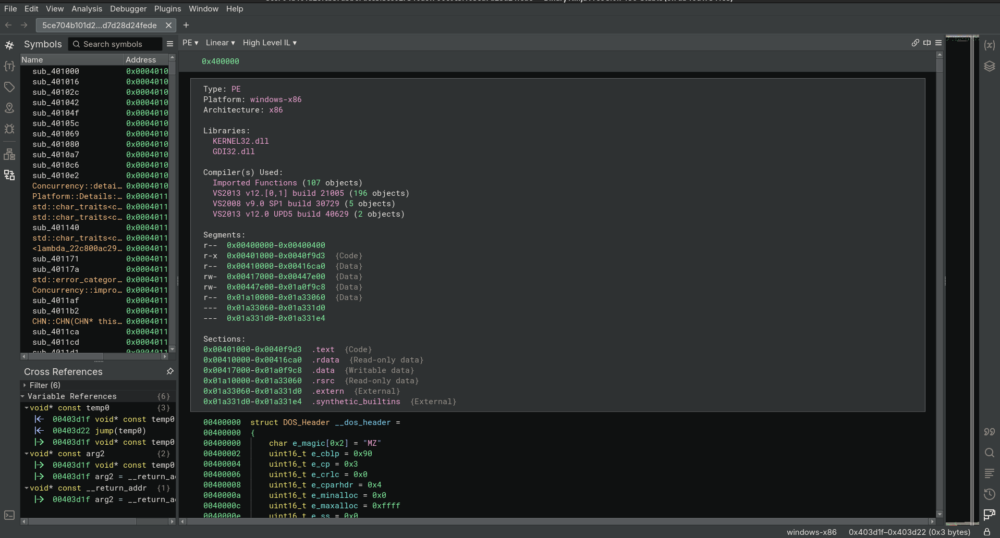
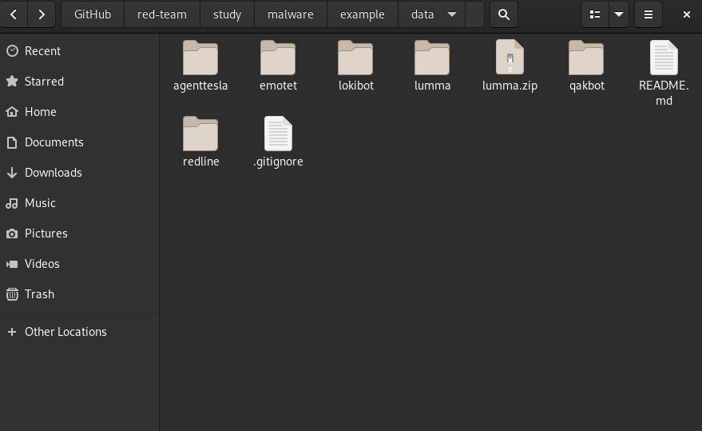
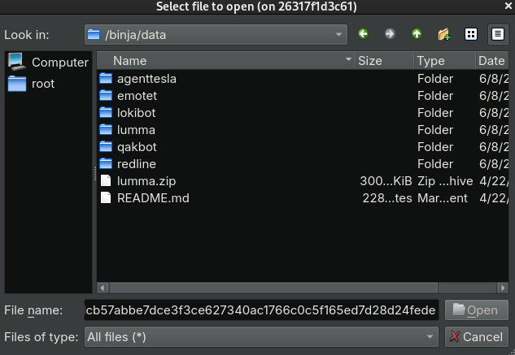
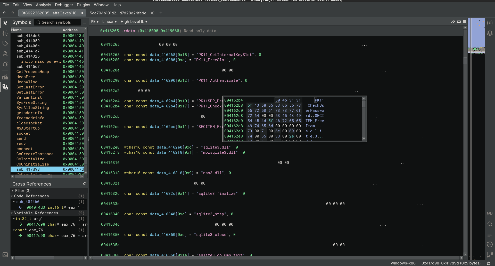
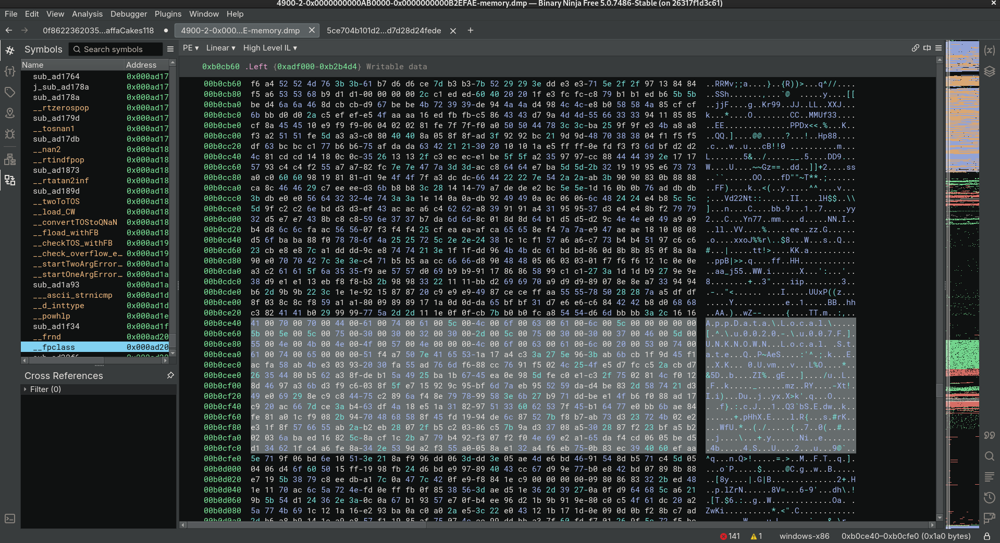

## Binary Ninja

Static & Behavioral Analysis:

https://tria.ge/250608-xbtrmsyyav/behavioral1

> [!NOTE]
>
> Notice that static analysis picked up nothing.  Traditional anti-malware won't pick up much of anything these days.

## Decompile, Disassemble, Debug

Use the portable launcher — it builds the image if needed and **dynamically** handles what differs
across distros/sessions (podman vs docker, X11 vs Wayland/XWayland, the X cookie, SELinux relabel,
and running as the unprivileged `binja` user since Binary Ninja refuses to run as root):

```sh
./launch.sh                 # open EVERY carved region (data/**/*.bin) in Binary Ninja
./launch.sh data/<incident>/pid<PID>_<proc>_0x<addr>.bin   # open one specific region
./launch.sh --build         # force a rebuild (re-download Binary Ninja)
./launch.sh --shell         # shell in the container to debug the mount / X
./launch.sh --stop          # stop + remove the running container
# (Binary Ninja free shows an account prompt on first launch — select cancel.)
```

Carved regions come from the memory analyzer's `--carve` (see `data/README.md`). A carved `.bin` is
raw memory, not a file format — open it as **Raw**, then set the arch + **base address** from the
`.json` sidecar so BN's addresses line up with the original process.

<details><summary>Manual equivalent (if you'd rather not use the launcher)</summary>

```sh
podman build -t irtoolkit-binja -f binja.Dockerfile .
xhost +local:
podman run -d --name irbinja --net=host \
    -v /tmp/.X11-unix:/tmp/.X11-unix \
    -v ./data:/binja/data:Z \
    -e DISPLAY="$DISPLAY" \
    irtoolkit-binja ./binaryninja /binja/data/<file>.bin
# select cancel on prompt
```
</details>

##

Load lumma stealer binary example:

<p align="center">
  
</p>

##

Analyze with binja:

<p align="center">
  
</p>

##

Load samples into ./data directory and reverse your heart away.

<p align="center">
  
</p>

##

Select malware to have a looksies.

<p align="center">
  
</p>

##

Now pretend you are with the NSA.

<p align="center">
  
</p>

##

<p align="center">
  
</p>